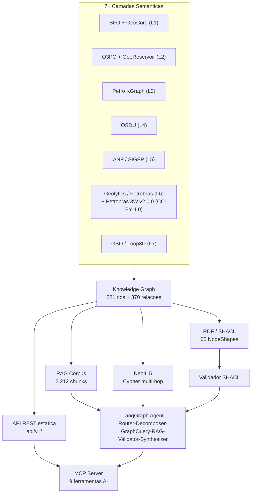

# GeoBrain

Ontologia semantica do dominio de **Exploracao & Producao (E&P) de petroleo e gas natural no Brasil**, derivada do modulo Dicionario da plataforma Geolytics. Dados oficiais da **ANP/SEP — SIGEP**, organizados como JSON estatico, grafo de entidades e corpus pronto para RAG.

A motivacao central e que RAG vetorial puro falha em perguntas multi-hop de O&G (quatro saltos entre poco → bloco → bacia → regime contratual), em disambiguacoes estruturais (PAD como contrato ANP vs. drilling pad) e em verificacao de consistencia regulatoria (SPE-PRMS nao reconhece "4P"). Este repositorio prove a base semantica — ontologia em camadas, grafo tipado, SHACL shapes e agente LangGraph com validador deterministico — para superar essas limitacoes. Ver [docs/GRAPHRAG.md](docs/GRAPHRAG.md) para a receita completa.

**Visualizacao interativa:** https://thiagoflc.github.io/geobrain

**📖 Wiki didatica:** https://github.com/thiagoflc/geolytics-dictionary/wiki — fontes em [`wiki/`](wiki/)

**Documentacao tecnica completa:** [docs/INDEX.md](docs/INDEX.md)

---

## Arquitetura



A arquitetura de camadas, o pipeline ETL e o fluxo de perguntas pelo agente estao documentados em [docs/ARCHITECTURE.md](docs/ARCHITECTURE.md).

---

## Estrutura do repositorio

| Caminho                            | Conteudo                                                       |
| ---------------------------------- | -------------------------------------------------------------- |
| `data/glossary.json`               | 23 termos ANP enriquecidos                                     |
| `data/entity-graph.json`           | Grafo de 170 entidades + 80 relacoes                           |
| `data/ontopetro.json`              | Ontologia formal — 6 modulos                                   |
| `data/taxonomies.json`             | 13 enumeracoes canonicas (litologia, SPE-PRMS, AVO...)         |
| `data/full.json`                   | Merge de todos os modulos                                      |
| `data/geomechanics*.json`          | Modulo MEM P2.7 + fraturas                                     |
| `data/seismic-*.json`              | Modulo sismico P2.8 — aquisicao, processamento, inversao       |
| `data/cgi-lithology.json`          | 437 conceitos CGI Simple Lithology (GeoSciML OWL, Layer 1b)    |
| `data/cgi-osdu-lithology-map.json` | Crosswalk bilateral CGI ↔ OSDU LithologyType (152 mapeamentos) |
| `data/witsml-rdf-crosswalk.json`   | 25 classes WITSML 2.0 mapeadas para `geo:`                     |
| `data/prodml-rdf-crosswalk.json`   | 15 classes PRODML 2.x mapeadas para `geo:`                     |
| `data/geolytics-shapes.ttl`        | 65 NodeShapes SHACL                                            |
| `data/sweet-alignment.json`        | 66 alinhamentos SKOS com SWEET (NASA/ESIPFed)                  |
| `data/gso-*.json`                  | 213 classes GSO/Loop3D (Layer 7)                               |
| `data/acronyms.json`               | 1.102 siglas O&G PT/EN categorizadas                           |
| `data/systems.json`                | 8 sistemas corporativos Petrobras                              |
| `api/v1/`                          | Endpoints publicos (GitHub Pages)                              |
| `ai/rag-corpus.jsonl`              | 2.683 chunks para embedding                                    |
| `ai/system-prompt-ptbr.md`         | System prompt PT-BR (~800 tokens)                              |
| `ai/text2cypher-fewshot.jsonl`     | 80 exemplos few-shot Text2Cypher                               |
| `scripts/generate.js`              | Pipeline ETL: regenera `data/`, `api/`, `ai/`                  |
| `scripts/semantic-validator.js`    | Validador semantico deterministico                             |
| `mcp/geobrain-mcp/`                | MCP Server TypeScript (11 ferramentas)                         |
| `examples/langgraph-agent/`        | Agente LangGraph multi-no                                      |
| `notebooks/`                       | 4 notebooks Jupyter didaticos                                  |
| `python/`                          | Pacote Python `geobrain`                                       |
| `docs/`                            | Documentacao completa — ver [docs/INDEX.md](docs/INDEX.md)     |

---

## Python Package

```bash
pip install geobrain
```

```python
from geolytics_dictionary import Dictionary, KnowledgeGraph, Validator, SweetExpander

d = Dictionary()
d.lookup("Pre-sal")          # list[Term]
d.acronym("BOP")             # list[Acronym]

kg = KnowledgeGraph.from_local()
kg.entity("poco")
kg.shortest_path("poco", "reservatorio")

v = Validator()
v.validate("Reserva 4P do Campo de Buzios")  # SPE_PRMS_INVALID_CATEGORY
```

Ver `python/README.md` para documentacao completa.

---

## Graph database (Neo4j)

```bash
node scripts/build-neo4j.js
docker compose up
```

Browser: http://localhost:7474 — login `neo4j` / senha `geolytics123`.

```cypher
MATCH (e:Operational) WHERE e.petrokgraph_uri IS NULL
RETURN e.id, e.label, e.geocoverage ORDER BY e.label
```

O modelo de entidades completo esta em [docs/ENTITIES.md](docs/ENTITIES.md).

---

## MCP Server

```bash
cd mcp/geobrain-mcp && npm install && npm run build
```

11 ferramentas AI: `lookup_term`, `expand_acronym`, `get_entity`, `get_entity_neighbors`, `validate_claim`, `cypher_query`, `search_rag`, `list_layers`, `crosswalk_lookup`, `lookup_lithology`, `lookup_geologic_time`. Ver `mcp/geobrain-mcp/README.md`.

---

## Validacao semantica

```bash
# Validador deterministico (JavaScript)
node scripts/validate-cli.js "Reserva 4P do Campo de Buzios"

# SHACL formal (Python + pyshacl)
pip install -r scripts/requirements.txt
python scripts/validate-shacl.py

# Testes
node --test tests/validator.test.js
```

Ver [docs/SHACL.md](docs/SHACL.md) para as 65 NodeShapes e como adicionar novas.

---

## Regenerando os dados

```bash
node scripts/generate.js           # regenera data/, api/v1/, ai/
node scripts/build-ontology-doc.js # regenera docs/ONTOLOGY.md
bash scripts/check-regen.sh        # verifica se ha diff apos regen
```

---

## Como usar os dados

Via raw GitHub:

```
https://raw.githubusercontent.com/thiagoflc/geobrain/main/data/glossary.json
https://raw.githubusercontent.com/thiagoflc/geobrain/main/ai/rag-corpus.jsonl
```

Via GitHub Pages:

```
https://thiagoflc.github.io/geobrain/api/v1/index.json
https://thiagoflc.github.io/geobrain/data/full.json
```

Para carregar o corpus RAG em LangChain, LlamaIndex ou usar o system prompt, ver a secao "Como usar os dados" em [docs/GRAPHRAG.md](docs/GRAPHRAG.md).

---

## Licenca

- **Codigo** (`scripts/`, `index.html`): MIT.
- **Dados** (`data/`, `api/`, `ai/`): derivados de informacoes publicas da ANP/SEP. Uso livre para fins educacionais, de pesquisa e desenvolvimento, mantendo a atribuicao a fonte original.
