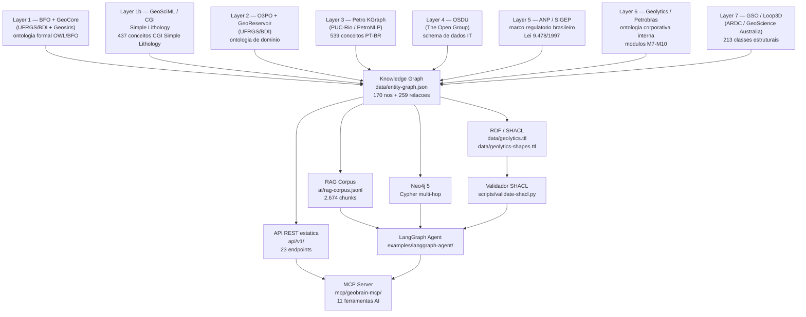
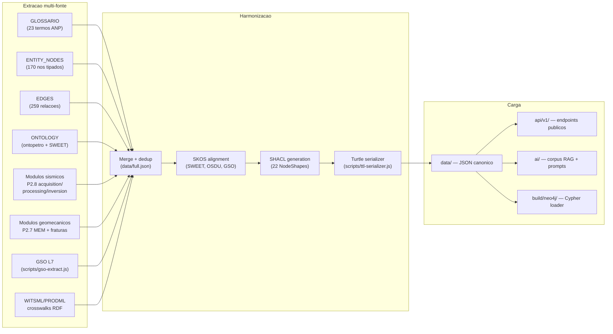
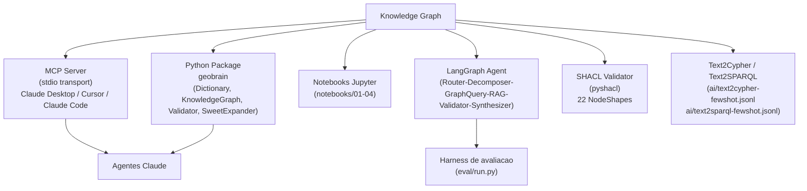
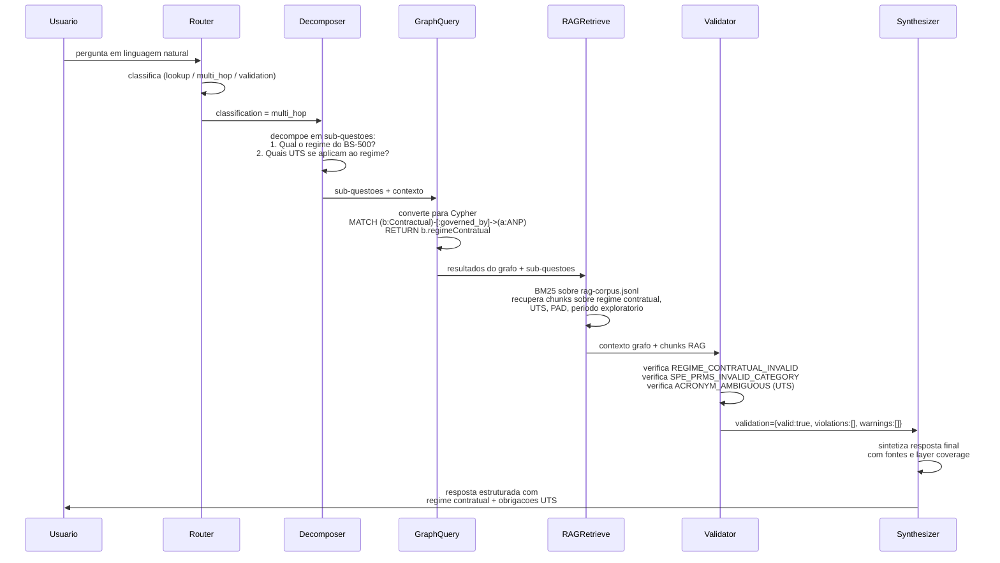

# Arquitetura do GeoBrain

Documentacao da arquitetura semantica, pipeline ETL e topologia do agente GraphRAG.

---

## Visao geral das camadas semanticas

O GeoBrain organiza o conhecimento de E&P em 8 camadas semânticas independentes e complementares. Cada termo carrega o campo `geocoverage` indicando em quais camadas possui cobertura formal.

---

## Pipeline ETL semantico

O script `scripts/generate.js` executa o pipeline de transformacao completo:

---

## Consumo downstream

---

## Fluxo de uma pergunta no agente GraphRAG

Diagrama de sequencia para a pergunta: "Qual o regime contratual do Bloco BS-500 e quais obrigacoes de trabalho minimo se aplicam?"

---

## Arquivos-chave

| Componente | Arquivo |
|---|---|
| Grafo de entidades | `data/entity-graph.json` |
| Ontologia formal | `data/ontopetro.json` |
| Mapa de camadas | `ai/ontology-map.json` |
| Pipeline ETL | `scripts/generate.js` |
| Agente LangGraph | `examples/langgraph-agent/agent.py` |
| MCP Server | `mcp/geobrain-mcp/src/index.ts` |
| SHACL shapes | `data/geolytics-shapes.ttl` |
| Vocabulario OWL | `data/geolytics-vocab.ttl` |

Veja tambem: [GRAPHRAG.md](GRAPHRAG.md) — receita completa do agente GraphRAG.

---

## Notas de extensao recentes

**GWML2 WellConstruction (layer1b)**: o modulo `gwml2` adiciona 9 classes para componentes fisicos de pocos (Casing, Screen, Sealing, Filtration, BoreCollar, BoreInterval, WellPump, CasingString, WellConstruction). Arquivo `data/gwml2.json`.

**SOSA/QUDT alignment**: 17 mnemonics de perfis de poco (GR, RHOB, NPHI, DT, UCS, etc.) mapeados a `sosa:Observation` com unidades QUDT em `data/sosa-qudt-alignment.json`. Triples emitidos em `data/geobrain.ttl`.
