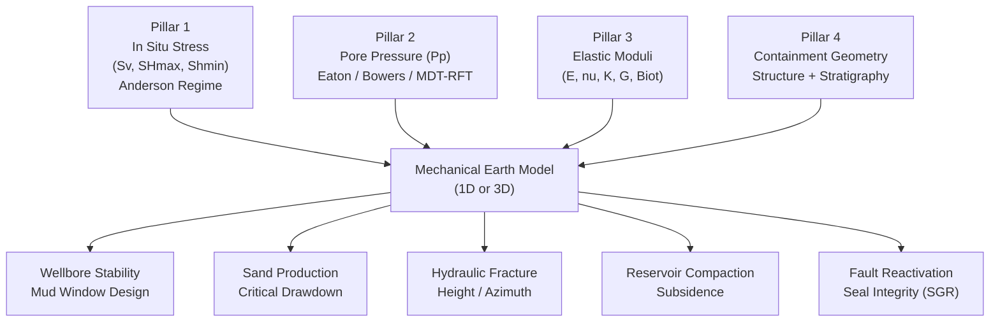
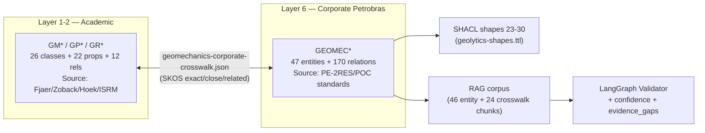

# Geomechanics / MEM — P2.7 Module Documentation

## Overview

The Mechanical Earth Model (MEM) is the core deliverable of petroleum geomechanics. It is a quantitative description of the mechanical state of a formation — the subsurface geometry, pore fluid pressure, in situ stresses, and elastic and strength properties of the rock. The MEM is the starting point for every geomechanical application: wellbore stability analysis, sand production prediction, hydraulic fracture design, reservoir compaction modelling, and fault reactivation risk.

This documentation covers three artifacts:

- `data/geomechanics.json` (26 classes, 22 properties, 12 relations, 6 instances) — **academic L1-L2 backbone** (Fjaer/Zoback/Hoek/ISRM).
- `data/geomechanics-fractures.json` (17 fracture classes, 7 properties, 8 GSO crosswalk mappings) — fractures sub-module.
- `data/geomechanics-corporate.json` (47 entities, 170 relations) + `data/geomechanics-corporate-crosswalk.json` — **corporate L6 module** (Petrobras-internal standards). See [Layer 6 — Petrobras Corporate Module](#layer-6--petrobras-corporate-module) below.

---

## The Four Pillars of the MEM

A valid 1D or 3D MEM must integrate all four pillars. Missing one pillar makes the model incomplete and the downstream predictions unreliable.



### Pillar 1 — In Situ Stress

Three principal stresses act at every point in the subsurface:

| Symbol | Name | Measurement Method |
|---|---|---|
| Sv | Vertical (overburden) stress | Density log integration |
| SHmax | Maximum horizontal stress | Breakout azimuth, DITF, offset wellbore analysis |
| Shmin | Minimum horizontal stress | LOT / XLOT / mini-frac closure pressure |

Anderson (1951) defined three stress regimes based on which principal stress is largest:

- **Normal faulting** (NF): Sv > SHmax > Shmin — passive margins, rift basins
- **Strike-slip** (SS): SHmax > Sv > Shmin — transform boundaries
- **Reverse faulting** (RF): SHmax > Shmin > Sv — fold-thrust belts

The Santos Basin (Buzios/pre-salt) is predominantly a normal-faulting regime.

### Pillar 2 — Pore Pressure

Pore pressure (Pp) controls effective stress via the Biot-Terzaghi principle:

```
sigma_effective = sigma_total - alpha * Pp
```

where alpha is the Biot coefficient (0 to 1). Normal pore pressure gradient is 0.433-0.465 psi/ft. Overpressure (> 0.6 psi/ft) requires elevated mud weight and narrows the drilling window.

Calibration sources: RFT/MDT direct measurements, formation pressures from DST, drilling events (kicks, mud weight changes), seismic velocity inversion (Eaton method).

### Pillar 3 — Elastic and Strength Properties

Key rock mechanical properties and their units:

| Property | Symbol | Unit | Typical Range |
|---|---|---|---|
| Uniaxial Compressive Strength | UCS | MPa | 5 - 600 |
| Young's Modulus | E | GPa | 1 - 100 |
| Poisson's Ratio | nu | dimensionless | 0.0 - 0.5 |
| Bulk Modulus | K | GPa | 2 - 80 |
| Shear Modulus | G | GPa | 1 - 40 |
| Biot Coefficient | alpha | dimensionless | 0.5 - 1.0 |

**Critical distinction**: Static properties (from laboratory triaxial tests) and dynamic properties (derived from sonic velocities Vp/Vs) differ by 20-40% for UCS and 10-30% for Young's modulus. Dynamic values must not be used for engineering design without a static-dynamic calibration.

### Pillar 4 — Containment Geometry

Structural and stratigraphic geometry defines the 3D boundaries within which the MEM is built: fault locations, formation tops, layer geometries, dipping horizons. This pillar is the link to the seismic interpretation and geological model.

---

## JSON Structure Mapping to MEM Pillars

The JSON files map to the MEM pillars as follows:

```
data/geomechanics.json
  classes
    GM001  StressTensor             -> Pillar 1
    GM002  PrincipalStress          -> Pillar 1
    GM003  ShearStress              -> Pillar 1
    GM004  PorePressure             -> Pillar 2
    GM005  MudWindow                -> downstream application (Wellbore Stability)
    GM007-009  FailureCriterion     -> Pillar 3 (strength)
    GM010-012  MechanicalEarthModel -> integration of all 4 pillars
    GM013-019  RockMechProperty     -> Pillar 3 (elastic moduli)
    GM020-022  RockMassRating/GSI/RQD -> Pillar 3 (rock mass quality)
    GM023  Anisotropy               -> Pillar 3 (directional dependence)
    GM024  Brittleness              -> Pillar 3 (failure style)
    GM025  AndersonStressRegime     -> Pillar 1 (regime classification)
    GM026  Wellbore                 -> observation point for calibration

  properties
    GP001-010  elastic moduli + principal stresses  -> Pillar 1 + 3
    GP004      porePressureGradient                 -> Pillar 2
    GP020-021  mudWeightLower/Upper                 -> downstream: Mud Window
    GP022      stressRegime                         -> Pillar 1

  relations
    GR002, GR007  controls_mud_window / bounds_drilling_window  -> Pillar 2 -> Mud Window
    GR008  calibrated_by                            -> Pillar 1/2/3 calibration

  instances
    mem-buzios-1d           -> full 1D MEM example (Santos Basin pre-salt)
    failure-mohr-coulomb    -> Pillar 3 strength example
    hoek-brown-carbonate    -> Pillar 3 rock mass example
    normal-faulting-regime  -> Pillar 1 stress regime
    mud-window-depleted     -> downstream: depleted reservoir mud window

data/geomechanics-fractures.json
    fracture classes        -> Pillar 4 (structural/containment geometry)
    anderson regimes        -> Pillar 1
    fracture_to_gso.json    -> alignment to GSO Layer 7
```

---

## Downstream Applications

### Mud Weight Prediction (Wellbore Stability)

The mud weight window is bounded by:
- **Lower bound**: pore pressure gradient (prevent kick/influx)
- **Upper bound**: fracture gradient (prevent lost circulation)

Collapse pressure may be higher than pore pressure in weak or highly stressed formations, further narrowing the window.

### Sand Production Prediction

Sand production risk is evaluated by comparing the near-wellbore stress concentration against rock strength (UCS). The critical drawdown pressure below which sand is mobilized is computed from the MEM using Mohr-Coulomb or similar criteria.

### Fault Reactivation / Seal Integrity

The Shale Gouge Ratio (SGR) is computed along fault surfaces using the stress state and lithological column. SGR > 18-20% indicates potentially sealing; below that, the fault may be conductive to flow. Computed in TrapTester (Badley Geoscience) at Petrobras.

### Reservoir Compaction and Surface Subsidence

Depletion of reservoir pressure (Pp decrease) causes the effective stress to increase, leading to compaction (reduction of porosity and permeability) and potentially surface subsidence. Governed by Young's modulus and Biot coefficient from Pillar 3.

---

## Layer 6 — Petrobras Corporate Module

The repository ships a second geomechanics module, `data/geomechanics-corporate.json`, that captures the Petrobras-internal operationalization of the academic concepts above. It is not a competing ontology — it is the corporate counterpart that names internal standards, owners, datastores, and tools, and is linked to the academic L1-L2 module via `data/geomechanics-corporate-crosswalk.json`.



### Module inventory

| Path | Content |
|---|---|
| `data/geomechanics-corporate.json` | 47 entities (GEOMEC001-045 + 026A/B), 170 relations, schema-normalized snake_case, deprecation handled |
| `data/geomechanics-corporate-crosswalk.json` | 47 SKOS mappings to L1-L2: 8 exactMatch + 4 closeMatch + 12 relatedMatch + 23 noMatch |
| `data/sources/geomechanics-corporate/` | Original raw inputs preserved for audit (5 concatenated JSON blocks v1.0-1.4 + patch v1.5) |
| `scripts/geomec-corporate-to-ttl.py` | JSON → Turtle serializer for SHACL validation |
| `scripts/validate-geomec-corporate.py` | End-to-end SHACL runner (PT-BR output) |
| `tests/test_geomec_corporate_shacl.py` | 1 conformance + 9 violation-injection tests |

### Schema and governance fields

Each L6 entity carries fields beyond the academic schema:

| Field | Purpose |
|---|---|
| `confidence` (low / medium / high) | Reliability of the documented evidence behind the entity. Drives the LangGraph Validator's PROVISIONAL flag (see below). |
| `evidence_gaps` (list) | Explicit documentation gaps known by the curator. SHACL Shape 25 enforces: `confidence=low` ⇒ at least one gap. |
| `owner_department` | Petrobras gerência responsible (RES, POÇOS/SPO/PEP/PROJ-PERF, AGP, etc.). Currently a backlog item — pending backfill. |
| `official_datastore` | Authoritative store of record (SIRR, SIGEO, BDIEP, OpenWells, BDP). Backlog. |
| `internal_tools` | Petrobras software (GeomecBR, GERESIM, SIGEO, SEST TR). Backlog. |
| `internal_standards` | PE-2RES/POC document codes that govern the entity. Backlog. |
| `out_of_scope_flag` | Marks entities that belong to a different module (e.g. GEOMEC026A QPG → Geologia de Locação Exploratória). SHACL Shape 30 requires `in_scope_for_module`. |
| `formula.expression` + `variables` | For Formula-category entities (currently only GEOMEC036 ECD). SHACL Shape 28 requires expression. |

### Deprecation lifecycle

`GEOMEC026` was originally a single entity covering both QPG and Laudo Geomecânico. Patch v1.5 split it:

- `GEOMEC026A` — **QPG (Quadro de Previsões Geológicas)** — flagged `out_of_scope_flag.in_scope_for_module = "geologia-locacao-exploratoria"`. Kept here for traceability; will migrate when that module exists.
- `GEOMEC026B` — **Laudo Geomecânico** — active replacement for the geomechanics-scope half.
- `GEOMEC026` — kept as `deprecated.replaced_by = [026A, 026B]` for audit. All previously active references (`GEOMEC025 PRODUCES`, `GEOMEC027 ENABLES`) were re-routed to `GEOMEC026B`. SHACL Shape 27 prevents new active refs to deprecated ids.

### Crosswalk to academic module

The crosswalk enables multi-hop reasoning. Each L6 entity has at most one mapping to a `GM*` class (and optionally a property-level `GP*` reference). Match kinds follow SKOS: `exactMatch`, `closeMatch`, `broadMatch`, `narrowMatch`, `relatedMatch`, `noMatch`.

Examples (full table in `data/geomechanics-corporate-crosswalk.json`):

| Corporate (L6) | Academic (L2) | Match | Why |
|---|---|---|---|
| GEOMEC001 Pressão de Poros | GM004 PorePressure (+ GP004 porePressureGradient) | exactMatch | Same physical concept; unit conversion needed (lb/gal vs psi/ft) |
| GEOMEC002 Tensão Mín Horizontal | GM002 PrincipalStress (Shmin) + GP013 shmin | closeMatch | L6 coalesces Shmin physics with FractureGradient operational meaning |
| GEOMEC031 XLOT | GR008 calibrated_by | relatedMatch | Calibration method for Shmin, with PE-2POC-01495 details |
| GEOMEC035 Modelo Geomecânico 3D | GM012 MechanicalEarthModel3D | exactMatch | Direct equivalence |
| GEOMEC028 GeomecBR | — | noMatch | Corporate-only software tool; L2 has no `Software` class |

The crosswalk also documents 15 academic classes that have no corporate counterpart (`l2_unmapped_in_l6`), most notably `GM020-022` (RMR/GSI/RQD — geotechnical metrics not used in E&P at Petrobras).

### SHACL governance (shapes 23-30)

Beyond the structural shapes 1-22 of the wider dictionary, eight new shapes target the corporate module:

| Shape | Rule |
|---|---|
| 23 GeomechCorporateEntityShape | id pattern `GEOMEC\d{3}[A-Z]?`, label_pt + definition_pt + category required, confidence enum |
| 24 GeomechCorporateRelationShape | relation_type in SNAKE_CASE_UPPER, target_entity is IRI |
| 25 GeomechLowConfidenceMustHaveGapShape | `confidence=low` ⇒ ≥1 evidence_gap |
| 26 GeomechDeprecatedEntityShape | `isDeprecated true` ⇒ ≥1 replacedBy |
| 27 GeomechActiveRefToDeprecatedShape | No active relation may target a deprecated entity |
| 28 GeomechFormulaCategoryShape | `category=Formula` ⇒ formulaExpression present |
| 29 GeomechRelationTargetExistsShape | target_entity must be a declared GeomechCorporateEntity |
| 30 GeomechOutOfScopeShape | `isOutOfScope true` ⇒ in_scope_for_module declared |

Run end-to-end:

```bash
python scripts/validate-geomec-corporate.py
# ✓ CONFORME — 47 entidades, 170 relações, 0 violações.
python -m unittest tests.test_geomec_corporate_shacl -v
# 10 tests OK
```

### LangGraph Validator integration

The reference agent at `examples/langgraph-agent/` extends the deterministic validator with three new severity-aware rules driven by the L6 metadata:

- **CORPORATE_LOW_CONFIDENCE_PROVISIONAL** (`severity=provisional`) — when retrieved RAG chunks supporting the answer are exclusively `confidence=low`, the answer is marked PROVISORIA and evidence_gaps are surfaced. Does not invalidate the answer.
- **GEOMEC_DEPRECATED_REFERENCE** (`severity=warn`) — flags `GEOMEC026` mentions and points to GEOMEC026B.
- **GEOMEC_OUT_OF_SCOPE_REFERENCE** (`severity=warn`) — flags `GEOMEC026A` mentions and redirects to the Geologia de Locação Exploratória module.

The synthesizer renders the three severities in distinct sections so users can distinguish blocking errors from provisional answers and informational warnings.

### RAG corpus exposure

`scripts/generate.js` emits two new chunk types into `ai/rag-corpus.jsonl`:

- `geomec_corporate_entity` — 46 chunks (deprecated GEOMEC026 skipped). Text carries `[confiança: …]`, definition, formula, relations, evidence_gaps, out-of-scope marker. Metadata carries `layer=L6`, confidence, governance fields, OSDU mapping.
- `geomec_corporate_crosswalk` — 24 chunks (one per non-noMatch mapping) with metadata `layer_pair=L2-L6`, enabling the agent's router to bridge corporate↔academic queries.

### Open backlog

Tracked inside `data/geomechanics-corporate.json` under `meta.recommended_next_backlog`:

- Backfill `confidence` + `definition_en` for legacy entities GEOMEC001-035.
- Backfill `sources/owner_department/official_datastore/internal_tools/internal_standards` for GEOMEC036-045.
- Migrate GEOMEC026A (QPG) to a future Geologia de Locação Exploratória module.
- Resolve overlap between GEOMEC036.formula.variables and GEOMEC038/039 (variable vs first-class entity).
- Review relation directionality flagged in patch v1.5 cards: GEOMEC042/043/045 `MEASURED_BY` semantics.

---

## Key Disambiguation Notes

| Term | Module | Definition |
|---|---|---|
| Janela de Lama | M9 Geomechanics | Safe mud weight range between collapse and fracture pressure. Unit: ppg or g/cm3. |
| Janela de Geracao | M7 Geochemistry | Kerogen maturation window based on vitrinite reflectance Ro%. Completely different concept. |
| UCS estatico | M9 | UCS from laboratory triaxial test — the authoritative value for engineering design. |
| UCS dinamico | M9 | UCS estimated from sonic DTC/DTS logs via empirical correlation. Differs 20-40% from static; requires calibration before use. |
| SGR (Shale Gouge Ratio) | M9 | Fault sealing proxy (%). Not to be confused with SAR (geochemistry) or SGR (gas). |
| QPG (Quadro de Previsões Geológicas) | Geologia de Locação Exploratória (out-of-scope here) | Geological prognosis chart for exploratory prospects. Listed in the L6 corporate file as GEOMEC026A with `out_of_scope_flag` for traceability — the geomechanics deliverable is the Laudo Geomecânico (GEOMEC026B), not the QPG. |
| GEOMEC026 (deprecated) | L6 corporate | Old aggregate of QPG + Laudo. Replaced by GEOMEC026A and GEOMEC026B. New code/queries must not reference 026 directly. |

---

## Sources

- Fjaer E., Holt R.M., Horsrud P., Raaen A.M., Risnes R. — *Petroleum Related Rock Mechanics*, 2nd ed. Elsevier 2008 (ISBN 978-0-444-50260-5)
- Zoback M.D. — *Reservoir Geomechanics*, Cambridge University Press 2010 (ISBN 978-0-521-14619-7)
- Hoek E., Brown E.T. — The Hoek-Brown Failure Criterion and GSI: 2018 Edition. *Journal of Rock Mechanics and Geotechnical Engineering* 11(3):445-463, 2019
- Anderson E.M. — *The Dynamics of Faulting*, Oliver & Boyd 1951
- Bieniawski Z.T. — *Engineering Rock Mass Classifications*, Wiley 1989
- ISRM — *The Complete ISRM Suggested Methods for Rock Characterization, Testing and Monitoring 1974-2006*
- Plumb R. et al. — The Mechanical Earth Model Concept and its Application to High-Risk Well Construction Projects. SPE/IADC 65118, 2000
- Caine J.S., Evans J.P., Forster C.B. — Fault zone architecture and permeability structure. *Geology* 24(11):1025-1028, 1996
- Brodaric B., Richard S. — Geoscience Ontology (GSO) v1.0.2. GSC Open File 8796, DOI 10.4095/328296, 2021
