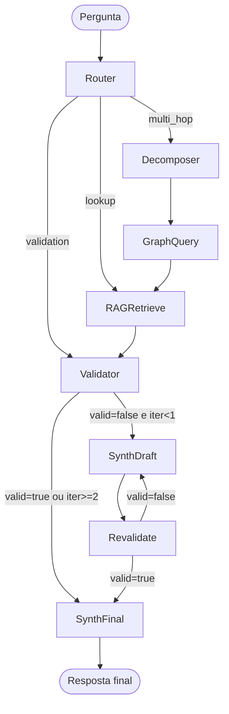

# GraphRAG — Receita completa

Documentacao do agente LangGraph multi-no para perguntas sobre E&P brasileiro.

---

## Motivacao: limitacoes do RAG vetorial puro

RAG vetorial tradicional recupera chunks de texto por similaridade semantica e os entrega como contexto para o LLM. Isso e suficiente para perguntas de lookup simples ("O que e BOP?"), mas falha em cenarios tipicos do dominio de O&G:

- **Perguntas multi-hop**: "Quais operadores atuam em blocos de regime Partilha de Producao na Bacia de Santos?" requer atravessar quatro nos (operador -> bloco -> regime -> bacia) — nenhum chunk individual contem toda a cadeia.
- **Desambiguacao por contexto estruturado**: "PAD" pode ser Plano de Avaliacao de Descobertas ou drilling pad. A resposta correta depende do tipo de entidade do no adjacente no grafo, nao de similaridade de texto.
- **Verificacao de consistencia**: Um LLM pode afirmar "Reserva 4P do pre-sal de Santos" sem ter como saber, por vetor, que 4P nao existe na hierarquia SPE-PRMS.
- **Crosswalk entre padroes**: "Qual o OSDU kind equivalente a geo:FaultZone do GSO?" e uma pergunta de mapeamento que depende de triplas RDF, nao de proximidade semantica.

O agente GraphRAG do Geolytics ancora a recuperacao no grafo de entidades antes de consultar o corpus vetorial, e adiciona um validador deterministico como guardrail semantico.

---

## Topologia do DAG LangGraph

O codigo completo esta em `examples/langgraph-agent/`. O DAG e compilado em `agent.py`:



---

## Nos do DAG — descricao detalhada

### Router (`nodes/router.py`)

Classifica a pergunta em uma de tres categorias:

| Categoria | Criterio | Exemplo |
|---|---|---|
| `lookup` | Busca de definicao ou sigla de um unico termo | "O que e BOP?" |
| `multi_hop` | Requer traversal de multiplos nos ou relacoes | "Quais campos operam em regime Partilha na Bacia de Santos?" |
| `validation` | Usuario faz uma afirmacao que precisa de checagem semantica | "A Reserva 4P do Campo de Buzios e tecnicamente recuperavel?" |

Em modo offline (`--no-llm`), o Router usa um classificador heuristico por palavras-chave. Com LLM disponivel, usa prompt de zero-shot classification.

### Decomposer (`nodes/decomposer.py`)

Recebe perguntas `multi_hop` e as decompoe em sub-questoes que podem ser respondidas individualmente pelo GraphQuery. Escreve `sub_questions: list[str]` no estado.

Exemplo: "Qual o regime contratual do bloco BS-500 e quais operadores ja atuaram nele?"
Decompoe em:
1. "Qual o regime contratual do bloco BS-500?"
2. "Quais operadores ja atuaram no bloco BS-500?"

### GraphQuery (`nodes/graph_query.py`)

Converte sub-questoes em queries Cypher e as executa contra o Neo4j (quando `NEO4J_URI` esta configurado) ou faz lookup direto em `data/entity-graph.json`. Retorna `graph_results: list[dict]` no estado.

Usa os few-shots de `ai/text2cypher-fewshot.jsonl` (80 exemplos) como contexto para a conversao Text2Cypher.

### RAGRetrieve (`nodes/rag_retrieve.py`)

Recupera chunks relevantes de `ai/rag-corpus.jsonl` (2.683 entradas) usando BM25. Os resultados do grafo sao concatenados como contexto adicional. Quando `use_embeddings=True`, usa sentence-transformers para recuperacao densa.

Escreve `retrieved_chunks: list[str]` no estado.

### Validator (`nodes/validator.py`)

No deterministico — nunca chama LLM. Verifica o texto acumulado (pergunta + draft) contra as taxonomias canonicas. Regras ativas:

| Rule ID | Severidade | O que detecta |
|---|---|---|
| `SPE_PRMS_INVALID_CATEGORY` | error | Mencao a "4P", "5P" ou outros codigos SPE-PRMS inexistentes |
| `RESERVA_AMBIENTAL_CONFUSION` | warning | "Reserva" em contexto de O&G junto com termos REBIO/RPPN/APA |
| `REGIME_CONTRATUAL_INVALID` | error | Regime contratual fora do conjunto {Concessao, Partilha de Producao, Cessao Onerosa} |
| `TIPO_POCO_ANP_INVALID` | error | Prefixo de codigo de poco ANP invalido (deve ser 1, 2, 3, 4, 6 ou 7) |

O validador escreve `validation: {valid, violations}` no estado e determina o proximo no via edge condicional.

### Synthesizer (`nodes/synthesizer.py`)

Gera a resposta final em portugues usando o LLM, com o contexto do grafo e os chunks RAG. Quando chamado como `synthesizer_draft` (apos violacao), inclui as correcoes sugeridas pelo Validator no prompt.

---

## Validator como guardrail — exemplo trabalhado

**Pergunta de entrada**: "A empresa afirmou ter Reserva 4P de 500 MMboe no Campo de Tupi. Isso e correto?"

**Estado apos Router**: `classification = "validation"`

**Estado apos RAGRetrieve**: chunks sobre SPE-PRMS, Campo de Tupi, pre-sal Santos.

**Validator executa**:

```python
text_to_check = "A empresa afirmou ter Reserva 4P de 500 MMboe..."
violations = _check_spe_prms_invalid_category(text_to_check)
# violations = [{
#   "rule": "SPE_PRMS_INVALID_CATEGORY",
#   "evidence": "Mencao a '4P' no texto.",
#   "suggested_fix": "A classificacao SPE-PRMS nao reconhece '4P'. "
#                    "Categorias validas para Reservas: 1P, 2P, 3P."
# }]
validation = {"valid": False, "violations": violations}
```

**Roteamento**: `valid=False, iteration=0` -> `synthesizer_draft`

**Synthesizer draft** gera:
> "A afirmacao contem um erro semantico: '4P' nao e uma categoria valida no sistema SPE-PRMS. O sistema SPE-PRMS reconhece apenas 1P (Provadas), 2P (Prováveis) e 3P (Possiveis) para Reservas, e C1C/C2C/C3C para Recursos Contingentes. A empresa pode ter reportado volumes de categoria 3P (Possiveis), que e a mais incerta dentro das Reservas."

**Revalidate**: texto agora nao contem "4P" como afirmacao positiva -> `valid=True` -> `synthesizer_final`.

---

## Tabela de decisao: quando usar o que

| Situacao | Abordagem recomendada |
|---|---|
| Definicao de sigla ou termo unico (ex.: "O que e FPSO?") | Vector-only RAG — lookup no `rag-corpus.jsonl` via BM25 |
| Pergunta sobre propriedades de uma entidade especifica (ex.: "Qual a bacia do Campo de Buzios?") | Vector-only RAG — a resposta esta em um unico chunk |
| Pergunta multi-hop (ex.: "Qual operador tem mais blocos em regime Partilha na Bacia de Campos?") | GraphRAG — necessita traversal Cypher + contexto RAG |
| Verificacao de afirmacao regulatoria (ex.: "A reserva 4P foi certificada") | GraphRAG com Validator — o Validator captura o erro antes do LLM sintetizar |
| Crosswalk entre padroes (ex.: "Qual OSDU kind mapeia para geo:FaultZone do GSO?") | GraphRAG — depende das triplas SKOS em `data/osdu-gso-crosswalk.json` |
| Validacao de arquivo WITSML (ex.: "Este XML tem TVD > MD?") | SHACL — use `scripts/validate-shacl.py` ou a ferramenta MCP `validate_claim` |
| Verificacao de consistencia de shapes RDF (ex.: "geo:Poco sem tipoPoco") | SHACL — `data/geolytics-shapes.ttl` com 22 NodeShapes |

---

## Executando o agente

```bash
cd examples/langgraph-agent
pip install -r requirements.txt

# Modo offline (sem LLM, sem Neo4j)
python run_demo.py --no-llm

# Com LLM Anthropic
ANTHROPIC_API_KEY=sk-... python run_demo.py

# Com Neo4j local
NEO4J_URI=bolt://localhost:7687 NEO4J_USER=neo4j NEO4J_PASSWORD=geolytics123 \
  python run_demo.py
```

```python
from agent import invoke

result = invoke("Qual o regime contratual do Bloco BS-500?")
print(result["answer"])
print(result["validation"])
```

---

## Harness de avaliacao

O diretorio `eval/` contem um harness para comparar os runners:

```bash
python eval/run.py --runner vector_only --offline --limit 30
python eval/run.py --runner graphrag_validator --offline --limit 30
python eval/report.py
```

Os resultados sao salvos em `eval/results/` e comparados contra `eval/baseline.json`. O CI falha se o score composto regredir mais de 5%.

---

## Referencias de codigo

| Arquivo | Funcao |
|---|---|
| `examples/langgraph-agent/agent.py` | Compilacao do DAG, logica de edges condicionais |
| `examples/langgraph-agent/state.py` | Definicao de `AgentState`, `ValidationResult`, `Violation` |
| `examples/langgraph-agent/nodes/router.py` | Classificador de perguntas |
| `examples/langgraph-agent/nodes/decomposer.py` | Decomposicao multi-hop |
| `examples/langgraph-agent/nodes/graph_query.py` | Text2Cypher e lookup no grafo |
| `examples/langgraph-agent/nodes/rag_retrieve.py` | BM25 sobre rag-corpus.jsonl |
| `examples/langgraph-agent/nodes/validator.py` | Validacao deterministica |
| `examples/langgraph-agent/nodes/synthesizer.py` | Geracao da resposta final |
