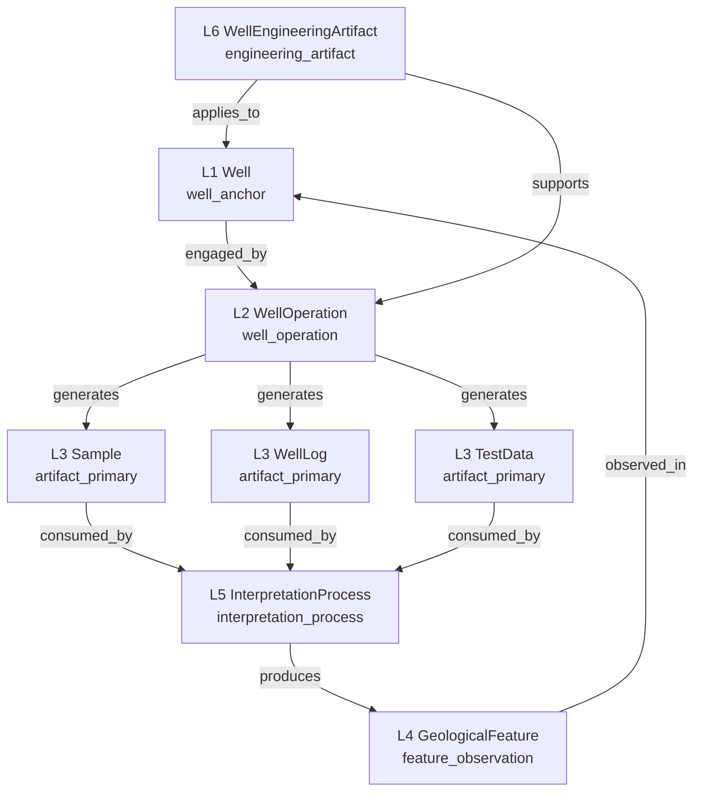

# Ontologia de Camadas (L1–L6) — GeoBrain

Especificação normativa do modelo de seis camadas ontológicas que organiza o grafo de conhecimento [data/entity-graph.json](data/entity-graph.json). Este documento define o eixo `ontological_role` e seu relacionamento com os eixos preexistentes `type` (perspectiva organizacional), `geocoverage` (proveniência por fonte L1–L7) e `processing_levels` (estágio do dado, em [data/ontology-types.json](data/ontology-types.json)).

Para a topologia geral do GeoBrain, ver [docs/ARCHITECTURE.md](docs/ARCHITECTURE.md). Para entidades, ver [docs/ENTITIES.md](docs/ENTITIES.md). Para SHACL, ver [docs/SHACL.md](docs/SHACL.md).

---

## 1. Regra de ouro

O Poço (`Well`) é uma **âncora física e temporal**, não um contêiner semântico. Tudo que "vem do poço" — amostras, perfis, dados de teste, observações geológicas, interpretações, projetos de engenharia — passa por uma operação explícita ou implícita, modelada como `WellOperation`. O Poço fornece localização (`is_location_of`) e contexto temporal (`engaged_by`), mas não classifica diretamente artefatos analíticos, datasets ou módulos. Toda classificação semântica acontece nas camadas L2–L5; a camada L6 expressa artefatos de engenharia em paralelo ao Poço, não dentro dele.

---

## 2. Visão consolidada

Linhas de leitura:

- **Camada física e temporal** (L1) — apenas o Poço (e seu irmão Furo, ver §3).
- **Camada de processo** (L2) — operações situadas no poço.
- **Camada de artefato primário** (L3) — produtos materiais ou digitais imediatos da operação.
- **Camada de observação** (L4) — features geológicas reconhecidas/inferidas.
- **Camada cognitiva** (L5) — processos de interpretação que consomem L3 e produzem L4 ou produtos derivados.
- **Camada de engenharia** (L6) — artefatos de design que governam ou são aplicados ao Poço/Operação.

---

## 3. As seis camadas

### L1 — Well (e Borehole paralelo)

**Definição.** Entidade física perfurada com finalidade petrolífera (`Well`) ou não-petrolífera (`Borehole`, irmão de Well). Carrega coordenadas, datums, identificadores ANP/operadora, programa de atividades, fases de ciclo de vida.

**`ontological_role`.** `well_anchor` (subtipo opcional: `borehole`).

**Exemplos no grafo.**

- `poco` ("Poço"), `wellbore` ("Trecho Perfurado"), `wellbore-architecture`, `wellbore-trajectory`, `wellbore-marker-set` — ver [data/entity-graph.json](data/entity-graph.json).

**Predicados canônicos.**

- Saída: `engaged_by → WellOperation`, `is_location_of → *` (inferido).
- Entrada: `applies_to ← WellEngineeringArtifact`, `observed_in ← GeologicalFeature`.

**O que L1 NÃO faz.** Não classifica datasets nem módulos diretamente (ver §7).

---

### L2 — WellOperation

**Definição.** Processo (BFO `process`) executado no contexto do poço, com início, fim e papéis definidos. Inclui: drilling, sampling, logging, well-test, completion, production, intervention.

**`ontological_role`.** `well_operation`.

**Exemplos no grafo.**

- `drilling-activity` ("Atividade de Perfuração"), `coring` ("Testemunhagem"), `wireline-logging` ("Perfilagem a Cabo"), `mudlogging` ("Mudlogging"), `cuttings-sampling` ("Coleta de Calha"), `sidewall-sampling` ("Amostragem Lateral SWC"), `formation-testing` ("Teste de Formação"), `wireline-run`, `core-run`, `completacao`.

**Predicados canônicos.**

- Entrada: `engaged_by ← Well`, `executes ← ServiceContract`, `performed_by ← Sonda`.
- Saída: `generates → Sample | WellLog | TestData`, `occurs_in → Well`, `produces → *`.

**Mapeamento Axon Petrobras.** Subassuntos "Operação de Perfilagem", "Operação de Testemunhagem", "Operações de Mudlogging", "Avaliação final de poço", "Operações em amostras de fluido/rocha" do Domínio "Aquisição de dados geológicos" mapeiam diretamente para subtipos de `WellOperation`.

---

### L3 — Artefatos primários (Sample, WellLog, TestData)

**Definição.** Produto material ou informacional imediatamente gerado por uma `WellOperation`, antes de qualquer interpretação. Inclui:

- **Sample** — amostra física: testemunho, plugue, calha, SWC, fluido.
- **WellLog** — curva ou perfil registrado no tempo/profundidade (sosa:Result + iao:information artifact).
- **TestData** — séries temporais e tabelas de teste de formação/produção.

**`ontological_role`.** `artifact_primary`.

**Exemplos no grafo.**

- Sample: `core-sample`, `sidewall-core-sample`, `cuttings-sample-detailed`, `core-plug`, `fluid-sample`, `amostra-fluido`, `testemunho`.
- WellLog: `perfil-poco`, `log-curve-type`, `mudlogging-time-series`, `pag` ("Perfil de Acompanhamento Geológico"), `perfil-composto`.
- TestData: `teste-formacao`, `formation-testing` (operação) — o resultado em si está implícito hoje e deve ser materializado em fase futura.

**Predicados canônicos.**

- Entrada: `generated_by ← WellOperation` (inverso de `generates`), `acquired_from → Well` (somente WellLog e TestData), `derived_from → *`.
- Saída: `consumed_by → InterpretationProcess` (preferido) ou `is_input_for → *`, `stored_in → DataStore`.

**Relação com `processing_levels`.** Artefatos primários são `processing_levels.primario` em [data/ontology-types.json](data/ontology-types.json). Quando o mesmo identificador também é interpretado, o resultado pertence a L4/L5 — não reusar o id de L3.

---

### L4 — GeologicalFeature (observation)

**Definição.** Feature geológica reconhecida pelo intérprete sobre artefatos primários: breakouts, DITFs (drilling-induced tensile fractures), fraturas naturais, acamamento/bedding, contatos litológicos, unidades estratigráficas, superfícies de correlação. Em BFO, são `fiat object part` ou `site` projetados sobre o trecho perfurado.

**`ontological_role`.** `feature_observation`.

**Exemplos no grafo.**

- `litologia` ("Litologia"), `formacao` ("Formação"), `idade-geologica`, `sistema-deposicional`, `ambiente`, `presal`. Features estruturais (breakout, DITF, fratura natural) ainda não estão materializadas como nós próprios e devem ser adicionadas em fase F4 quando os módulos geomecânicos L6 forem religados ao componente principal — ver §8.

**Predicados canônicos.**

- Entrada: `produced_by ← InterpretationProcess` (inverso de `produces`), `derived_from → Sample | WellLog`.
- Saída: `observed_in → Well`, `correlated_with → GeologicalFeature`, `intersects → Wellbore`.

---

### L5 — InterpretationProcess

**Definição.** Processo cognitivo (BFO `process` / IAO `planned process`) que consome artefatos L3 e produz features L4 ou produtos derivados. Inclui interpretação litológica, estratigráfica, petrofísica, geomecânica e de image-log.

**`ontological_role`.** `interpretation_process`.

**Exemplos no grafo.**

- `mudlogging-time-series` é fronteira (artefato/processo); processos puros como "interpretação litológica de calha", "interpretação petrofísica", "construção de MEM 1D", "interpretação de image-log" devem aparecer como nós dedicados (parcialmente cobertos em [data/geomechanics-corporate.json](data/geomechanics-corporate.json) v1.6.2 — image-log feature/process split). Subassuntos do Axon Petrobras "Interpretação Exploratória" e Domínios "Avaliação de formações e petrofísica" e "Geomecânica" alimentam esta camada.

**Predicados canônicos.**

- Entrada: `consumes ← Sample | WellLog | TestData`, `based_on ← Standard`, `requires_input ← *`.
- Saída: `produces → GeologicalFeature | InterpretedDataset`, `estimates → *`, `interpreted_into → *`.

**Distinção fina com `processing_levels`.** A camada L5 é o **processo cognitivo**; o resultado material (mapa, dataset, classificação) tem `processing_levels = interpretado` em [data/ontology-types.json](data/ontology-types.json). Os dois eixos são complementares: L5 nomeia o "como"; `processing_levels` qualifica o "estado" do artefato resultante.

---

### L6 — WellEngineeringArtifact

**Definição.** Artefato de design ou plano de execução **paralelo** ao Poço, não contido nele: well design, casing program, mud program, BHA, completion design, programas de fluido, esquemas de qualidade. Em BFO, são `iao:plan specification` ou `iao:directive information entity`.

**`ontological_role`.** `engineering_artifact`.

**Exemplos no grafo.**

- `casing-design`, `well-activity-program`, `well-activity-phase-type`, `wellbore-architecture`, `janela-lama` ("Janela de Lama"), `cementing-fluid`, `annular-fluid-type`, `drilling-parameters`, e a ilha `geomec_corporate` (`GEOMEC001` "Pressão de Poros" … `GEOMEC089`) que cobre o portfólio Petrobras corporate, incluindo modelos MEM 1D, esquemas de qualidade WSM 2025 (`GEOMEC084`) e processos de interpretação geomecânica.

**Predicados canônicos.**

- Saída: `applies_to → Well`, `supports → WellOperation`, `constrains → WellOperation`.
- Entrada: `governed_by ← Standard | RegulatoryAnchor`, `is_input_for → *`.

---

## 4. Eixos ortogonais

Quatro eixos coexistem em cada nó. Eles não competem; cada um responde a uma pergunta diferente.

| Eixo | Pergunta que responde | Origem | Status |
|---|---|---|---|
| `type` | Que perspectiva organizacional/de domínio? (operational, contractual, analytical, instrument, geological, equipment, geomec_corporate, actor, governance_*) | Curadoria histórica do dicionário | **Mantido** |
| `ontological_role` | Que papel BFO-like o nó cumpre? (`well_anchor`, `well_operation`, `artifact_primary`, `feature_observation`, `interpretation_process`, `engineering_artifact`, `regulatory_anchor`, `organizational_actor`, `domain_anchor`, `well_attribute_concept`, `equipment`) | Esta especificação | **Novo, ortogonal** |
| `geocoverage` | Em quais standards/fontes o conceito tem cobertura formal? (`layer1` BFO+GeoCore, `layer1b` GeoSciML/CGI, `layer2` O3PO, `layer3` Petro KGraph, `layer4` OSDU, `layer5` ANP/SIGEP, `layer6` Geolytics/Petrobras corp, `layer7` GSO) | Pipeline ETL [scripts/generate.js](scripts/generate.js) | **Mantido** |
| `processing_levels` | Em que estágio o dado se encontra? (`primario`, `interpretado`, `curado`) | [data/ontology-types.json](data/ontology-types.json) | **Mantido**, complementa L3/L5 |

`type` é cultural/operacional; `ontological_role` é normativo. Um mesmo nó pode ter `type=instrument` (perspectiva da operadora) e `ontological_role=well_operation` (papel formal). Eles **não** se substituem.

`geocoverage` é proveniência por fonte (de onde o conceito vem), enquanto `ontological_role` é função (o que o conceito é). Um termo pode aparecer em `layer3` (Petro KGraph) e `layer6` (Petrobras corporate) sem mudar seu papel ontológico.

---

## 5. Outros papéis ontológicos (fora das seis camadas)

Para nós que não pertencem ao eixo Poço → Operação → Artefato → Feature → Interpretação → Engenharia, define-se:

| `ontological_role` | Descrição | Exemplos no grafo |
|---|---|---|
| `regulatory_anchor` | Marcos regulatórios fixos (entidade reguladora, lei, sistema) | `anp`, `sigep`, `sep`, `uts` |
| `organizational_actor` | Ator organizacional (operadora, regulador, terceirizado, comitê) | actores em `type=actor`, `type=governance_committee` |
| `domain_anchor` | Super-tópico do tipo Domínio Axon Petrobras (Geomecânica, Geologia, Geofísica…) — usado como nó de organização, não como entidade física | A ser materializado em F4 quando a hierarquia Axon for importada |
| `well_attribute_concept` | Valor de vocabulário controlado de atributo do Poço (Categoria 1–10, regime de Lâmina d'água, Tipo de poço) | Carregado de [data/anp-poco-categoria.json](data/anp-poco-categoria.json), [data/anp-poco-tipo.json](data/anp-poco-tipo.json), [data/anp-uf.json](data/anp-uf.json) |
| `equipment` | Equipamento físico ou peça de fundo de poço (mantém o conceito existente) | `mud-pump`, BHA, Xmas-tree do `type=equipment` |
| `event_observation` | Evento operacional discreto observado em produção (kick, hidrato, slugging severo, vazamento de gas-lift…) — distinto de `feature_observation` (estado contínuo) por ser **discreto e datado**. Introduzido em F11 a partir do dataset Petrobras 3W v2.0.0. | `event_normal`, `event_bsw_increase`, `event_severe_slugging`, `event_hydrate_production`, etc. (10 nós `event_*` no grafo) |
| `signal_concept` | Identificador de canal/sinal de medida (mnemônico de sensor 3W ou curva de log) — distinto de `well_attribute_concept` (atributo formal do poço como Categoria/Sigla) por ser **fluxo de dado contínuo** com unidade física e quantidade observável. Introduzido em F11 a partir do dataset Petrobras 3W v2.0.0. | `sensor_p_pdg`, `sensor_t_pdg`, `sensor_aber_ckgl`, etc. (~25 nós `sensor_*` no grafo) |

---

## 6. Mapeamento Axon Petrobras → camadas

O export hierárquico Petrobras Domínio → Assunto → Subassunto → Termo valida o modelo. Cada nível tem destino canônico:

| Nível Axon | Destino L1–L6 / `ontological_role` |
|---|---|
| Domínio (ex.: "Geomecânica", "Geologia", "Geofísica", "Geodésia", "Avaliação de formações e petrofísica", "Interpretação Exploratória", "Acervo e movimentação de amostras", "Aquisição de dados geológicos", "Blocos e Parcerias") | `domain_anchor` (super-tópico) |
| Assunto (ex.: "Operação de Perfilagem", "Operação de Testemunhagem", "Operações de Mudlogging", "Operações em amostras de fluido/rocha", "Avaliação final de poço", "Planejamento das operações geológicas em poços") | L2 `well_operation` ou L5 `interpretation_process` conforme natureza |
| Subassunto | Subtipo da camada do Assunto pai, herda role |
| Termo (folha, ex.: "amostra") | L3 `artifact_primary`, L4 `feature_observation`, ou L6 `engineering_artifact` conforme semântica |

Casos de teste validados pelo curador:

- "Acervo e movimentação de amostras" + Termo "amostra" + Assunto "Operações em amostras de fluido/rocha" → fluxo L1 `engaged_by` L2 (Operações em amostras) `generates` L3 (Sample / "amostra").
- "Aquisição de dados geológicos" → conjunto de L2 (Operação de Perfilagem, Testemunhagem, Mudlogging) + L5 (Avaliação final de poço, Planejamento).
- "Geomecânica" → `domain_anchor` super-tópico que indexa L4 features (breakout, DITF) e L5/L6 (interpretação geomecânica, MEM 1D, esquema WSM 2025 `GEOMEC084`).

---

## 7. Atributos do Poço (decisão Q8/c)

Atributos do Poço seguem regra híbrida:

- **Atributos com vocabulário controlado** viram **nós no grafo** com `ontological_role = well_attribute_concept` e `geocoverage = layer5` (ANP) ou `layer6` (corporate). Padrão idêntico aos arquivos existentes [data/anp-poco-categoria.json](data/anp-poco-categoria.json) (Categoria 1–10), [data/anp-poco-tipo.json](data/anp-poco-tipo.json) (Tipo de poço), [data/anp-uf.json](data/anp-uf.json). Inclui regimes de Lâmina d'água (raso/profundo/ultraprofundo), Tipo de poço, Resultado, Status OSDU mapeado em [data/anp-osdu-wellstatus-map.json](data/anp-osdu-wellstatus-map.json).

- **Atributos puramente formato** (Sigla ANP, DATUM, MC, Sidetrack, coordenadas, profundidade total) **não** viram nós. Migram para arquivo separado `data/well-attributes.json` (a ser criado em fase F4) com SHACL constraints em [data/geolytics-shapes.ttl](data/geolytics-shapes.ttl). O `Well` referencia o atributo como propriedade datatype, não como aresta.

A regra evita inflação de nós sem ganho semântico e preserva a regra de ouro (§1): valores de formato pertencem ao Poço; valores controlados são entidades classificatórias com vida própria.

---

## 8. O que o Poço NÃO classifica (anti-padrão)

Hoje, o nó `poco` carrega o campo `joined_by_modules` apontando para módulos analíticos como OGEOMEC, FRX, DRX. Isto é um **anti-padrão** segundo a regra de ouro: o Poço não classifica datasets. O dataset/módulo é gerado por uma `SamplingOperation` (L2) sobre amostras coletadas no Poço; o vínculo natural é `SamplingOperation → generates → Sample → consumed_by → InterpretationProcess (OGEOMEC)`.

**Plano de migração (F4).**

1. Identificar cada `joined_by_modules` em `poco`.
2. Substituir por aresta `generates`/`acquired_during` entre a `WellOperation` correspondente e o módulo, ou por `consumed_by` entre o `Sample` e o módulo `InterpretationProcess`.
3. Remover o campo `joined_by_modules` de `poco` e materializar a relação no [data/entity-graph.json](data/entity-graph.json).

Nenhuma alteração desta especificação modifica dados em `data/`. A migração é tarefa de fase futura.

---

## 9. Snapshot de status

Estado de [data/entity-graph.json](data/entity-graph.json) na data desta especificação (2026-05-04):

- 334 nós, 684 arestas.
- 7 componentes conectados:
  - Componente 0 (principal, 245 nós) — operacional, contratual, analítico, instrumento, geológico, equipamento, ator, regulatório.
  - Componente 1 (84 nós) — ilha `geomec_corporate` (L6 corporate), totalmente desconectada do principal: 0 arestas atravessam a fronteira.
  - Componentes 2–6 — 5 nós isolados puros: `GEOMEC046` (Subsidência — Faixas de Risco), `GEOMEC076` (HAZI — Azimute do Poço), `GEOMEC084` (Esquema de Qualidade WSM 2025), `GEOMEC086` (Inversão de Slip de Falha Geológica), `GEOMEC087` (Alinhamento de Vents Vulcânicos).
- Distribuição por `type`: `geomec_corporate` 89, `instrument` 59, `analytical` 49, `operational` 33, `equipment` 29, `contractual` 28, `geological` 15, `actor` 8, `lifecycle_state` 5, demais < 5.

A ausência de arestas entre o componente principal e a ilha L6 motiva o trabalho de F4: introdução das arestas `applies_to`, `supports`, `constrains` (ver [docs/ONTOLOGY_PREDICATES.md](docs/ONTOLOGY_PREDICATES.md) §3) que reconectam L6 a L1/L2 e dos isolados puros ao restante do grafo via `governed_by`, `is_specialization_of` e `derived_from`.

---

## 10. Referências cruzadas

- Predicados (vocabulário relacional canônico): [docs/ONTOLOGY_PREDICATES.md](docs/ONTOLOGY_PREDICATES.md).
- Arquitetura geral e pipeline ETL: [docs/ARCHITECTURE.md](docs/ARCHITECTURE.md).
- Entidades: [docs/ENTITIES.md](docs/ENTITIES.md).
- SHACL e validação: [docs/SHACL.md](docs/SHACL.md), [data/geolytics-shapes.ttl](data/geolytics-shapes.ttl).
- Standards externos por camada `geocoverage`: [docs/EXTERNAL_STANDARDS.md](docs/EXTERNAL_STANDARDS.md).
- Geomecânica corporativa (L6, ilha atual): [docs/GEOMECHANICS.md](docs/GEOMECHANICS.md), [data/geomechanics-corporate.json](data/geomechanics-corporate.json).
