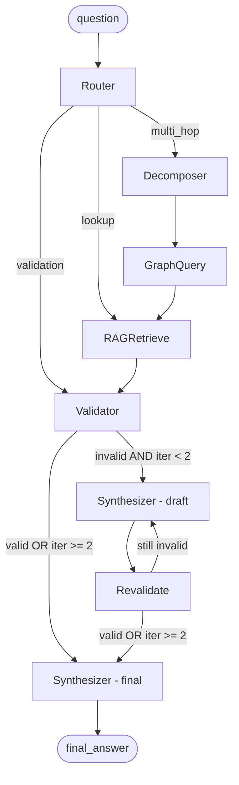

# Geolytics LangGraph Reference Agent

A runnable LangGraph agent that answers questions about the Brazilian O&G
semantic dictionary. It combines graph traversal, BM25 retrieval, and
deterministic semantic validation — and works fully offline with `--no-llm`.

## DAG diagram



## Node descriptions

| Node | Role |
|------|------|
| **Router** | Classifies the question as `lookup`, `multi_hop`, or `validation` using an LLM call (or a keyword heuristic in `--no-llm` mode). |
| **Decomposer** | For `multi_hop` questions, breaks the question into atomic sub-queries that each target a single entity or relation. |
| **GraphQuery** | Executes the sub-queries against an in-memory NetworkX graph loaded from `data/entity-graph.json`. Includes a commented stub for Neo4j/Bolt. |
| **RAGRetrieve** | Retrieves the top-5 relevant chunks from `ai/rag-corpus.jsonl` using BM25 (default) or sentence-transformer cosine similarity (optional). |
| **SemanticValidator** | Deterministic rule-based checks against `data/taxonomies.json`. Never calls an LLM. See rules below. |
| **Synthesizer** | Composes the final answer with citations to entity ids and source layers, incorporating any validation corrections. |

### Validation rules

1. **SPE_PRMS_INVALID_CATEGORY** — "Reserva 4P" is invalid. Only 1P, 2P, 3P
   (Reservas) and C1C, C2C, C3C (Recursos Contingentes) exist in SPE-PRMS.

2. **RESERVA_AMBIENTAL_CONFUSION** — "Reserva" (SPE-PRMS petroleum volumes)
   must not be confused with "Reserva Ambiental" (REBIO/RPPN/APA), which is
   an environmental protection area governed by SNUC (Lei 9.985/2000).

3. **REGIME_CONTRATUAL_INVALID** — The contract regime must be one of
   Concessao (Lei 9.478/1997), Partilha de Producao (Lei 12.351/2010), or
   Cessao Onerosa (Lei 12.276/2010).

4. **TIPO_POCO_ANP_INVALID** — ANP well codes must start with a canonical
   prefix: `1-` (Exploratorio), `2-` (Avaliacao), `3-` or `7-` (Desenvolvimento),
   `4-` or `6-` (Especial).

## Setup

```bash
cd examples/langgraph-agent
pip install -r requirements.txt
```

For sentence-transformer embeddings (optional):

```bash
pip install sentence-transformers
```

### Environment variables

| Variable | Default | Description |
|----------|---------|-------------|
| `LLM_PROVIDER` | `anthropic` | `anthropic` or `openai` |
| `ANTHROPIC_API_KEY` | — | Required when provider is `anthropic` |
| `OPENAI_API_KEY` | — | Required when provider is `openai` |
| `ANTHROPIC_MODEL` | `claude-sonnet-4-6` | Anthropic model id |
| `OPENAI_MODEL` | `gpt-4o-mini` | OpenAI model id |
| `USE_EMBEDDINGS` | `0` | Set to `1` to enable sentence-transformer retrieval |

## Running the demo

```bash
# Online (requires API key)
python run_demo.py "O que e um bloco exploratorio?"

# Offline — no API key needed; LLM nodes use deterministic stubs
python run_demo.py "Reserva 4P do Campo de Buzios" --no-llm

# Verbose: print full intermediate state at each transition
python run_demo.py "Qual a relacao entre poco e bloco?" --no-llm --verbose
```

## Running the tests

```bash
# From the repo root
pytest examples/langgraph-agent/tests/ -v

# Or from the agent directory
cd examples/langgraph-agent && pytest tests/ -v
```

## Example questions and expected behaviour

### 1. Simple lookup — passes validation

```
python run_demo.py "O que e uma FPSO?" --no-llm
```

Expected: Router classifies as `lookup`, RAGRetrieve returns relevant chunks
about FPSO (Floating Production Storage and Offloading), Validator finds no
violations, Synthesizer returns a definition with entity citations.

### 2. Multi-hop traversal

```
python run_demo.py "Qual a relacao entre poco e bloco e campo?" --no-llm
```

Expected: Router classifies as `multi_hop`, Decomposer splits the question
into sub-queries (`poco`, `bloco`, `campo`), GraphQuery finds the nodes and
their edges (`drilled_in`, `part_of`, etc.), RAGRetrieve adds ontology
relation chunks, Synthesizer composes a relational answer.

### 3. Validation failure — "Reserva 4P"

```
python run_demo.py "Reserva 4P do Campo de Buzios" --no-llm
```

Expected: Router classifies as `validation`, Validator immediately flags
`SPE_PRMS_INVALID_CATEGORY` because "4P" is not in the SPE-PRMS taxonomy,
Synthesizer incorporates the correction, exits with code 1.

Output includes:

```
AVISO DE VALIDACAO SEMANTICA:
  [SPE_PRMS_INVALID_CATEGORY] Mencao a '4P' no texto.
  Correcao: A classificacao SPE-PRMS nao reconhece '4P'. Categorias validas
  para Reservas: 1P (Provadas), 2P (Provaveis), 3P (Possiveis).
```

## File layout

```
examples/langgraph-agent/
├── README.md
├── requirements.txt
├── agent.py            # LangGraph DAG (compile + invoke)
├── state.py            # AgentState TypedDict
├── data_loader.py      # JSON/JSONL loaders (lru_cache)
├── run_demo.py         # CLI entry point
├── nodes/
│   ├── router.py
│   ├── decomposer.py
│   ├── graph_query.py  # NetworkX + Neo4j stub
│   ├── rag_retrieve.py # BM25 + optional embeddings
│   ├── validator.py    # Deterministic taxonomy checks
│   └── synthesizer.py
└── tests/
    └── test_validator.py
```
