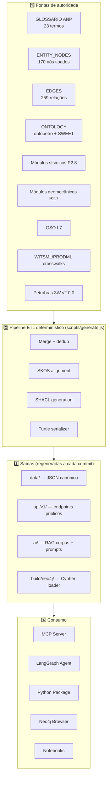
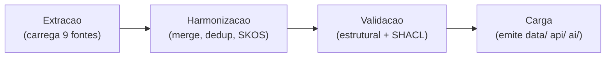
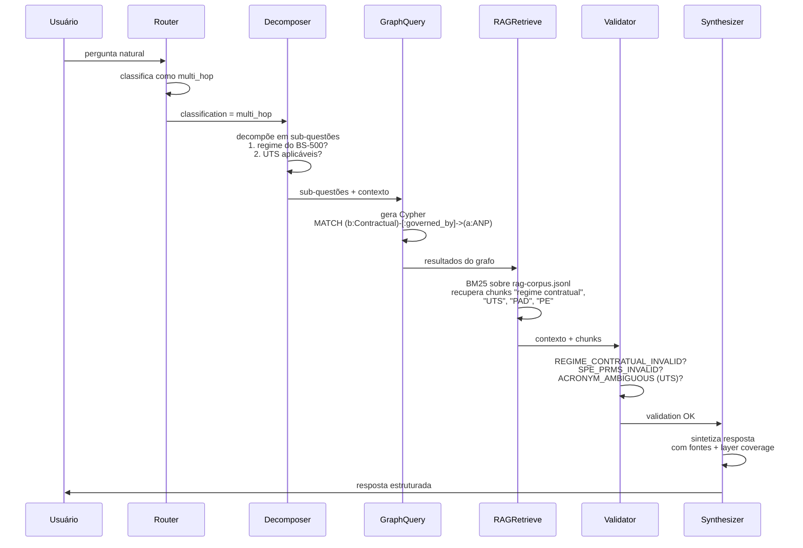

# Arquitetura

> Visão arquitetural do GeoBrain: pipeline ETL, formatos de saída e topologia de consumo. Para diagramas formais e detalhes técnicos completos, consulte [docs/ARCHITECTURE.md](https://github.com/thiagoflc/geolytics-dictionary/blob/main/docs/ARCHITECTURE.md).

---

## Visão em três camadas



---

## 1️⃣ Fontes de autoridade — *single source of truth*

Toda informação semântica origina-se em **arquivos-fonte versionados** (não em bancos de dados ou APIs externas em runtime). Isso garante reprodutibilidade byte-a-byte.

| Fonte                             | Arquivo                                                                                              | Mantido por                       |
| --------------------------------- | ---------------------------------------------------------------------------------------------------- | --------------------------------- |
| Glossário ANP                     | constantes em [`scripts/generate.js`](https://github.com/thiagoflc/geolytics-dictionary/blob/main/scripts/generate.js) (`GLOSSARY`)   | Mantenedor do projeto             |
| Grafo de entidades                | constantes em `scripts/generate.js` (`ENTITY_NODES`, `EDGES`)                                        | Mantenedor                        |
| Ontologia O3PO/Geomec             | [`scripts/ontopetro-data.js`](https://github.com/thiagoflc/geolytics-dictionary/blob/main/scripts/ontopetro-data.js) | Mantenedor + revisão acadêmica    |
| Vocabulários CGI                  | [`data/cgi-*.json`](https://github.com/thiagoflc/geolytics-dictionary/tree/main/data) (cópia)       | CGI/IUGS upstream                 |
| Petrobras 3W                      | [`scripts/threew-data.js`](https://github.com/thiagoflc/geolytics-dictionary/blob/main/scripts/threew-data.js)        | Petrobras (CC-BY 4.0)             |
| GSO/Loop3D                        | [`scripts/gso-extract.js`](https://github.com/thiagoflc/geolytics-dictionary/blob/main/scripts/gso-extract.js)        | Loop3D upstream                   |
| OSDU canonical                    | [`scripts/osdu-canonical.js`](https://github.com/thiagoflc/geolytics-dictionary/blob/main/scripts/osdu-canonical.js)  | The Open Group                    |

> **Princípio:** se você editar um JSON gerado em `data/` à mão, o próximo `node scripts/generate.js` vai sobrescrever sua mudança. **Sempre edite a fonte** (constantes em `scripts/`).

---

## 2️⃣ Pipeline ETL — `scripts/generate.js`

O pipeline é um **único script idempotente** que orquestra ~6.700 linhas de código em quatro estágios:



### Estágio 1: Extração

Carrega as 9 fontes e padroniza schema mínimo:
```js
{ id, label, description, layer, geocoverage, ...attributes }
```

### Estágio 2: Harmonização

- **Dedup** — quando o mesmo conceito aparece em múltiplas camadas, gera uma entidade canônica com lista `geocoverage` e cross-URIs (`petrokgraph_uri`, `osdu_kind`, `geosciml_uri`, `gso_uri`, `bfo_iri`).
- **SKOS alignment** — `loadSweetAlignmentSync()` em [scripts/generate.js:130](https://github.com/thiagoflc/geolytics-dictionary/blob/main/scripts/generate.js#L130) injeta 66 alinhamentos SKOS com SWEET.
- **Resolução de referências** — todo `relations[].to` é checado contra os IDs disponíveis. PR não passa CI se houver dangling reference.

### Estágio 3: Validação estrutural

Roda checagens determinísticas antes de emitir saídas:
- IDs únicos
- Referências resolvíveis
- `geocoverage` válido (valores em L1..L7)
- SHACL conformance (via `pyshacl`, em CI)

### Estágio 4: Carga

Emite **simultaneamente**:
- `data/*.json` — fonte canônica para humanos
- `api/v1/*.json` — endpoints públicos via GitHub Pages (filtrados/otimizados)
- `ai/rag-corpus.jsonl` — chunks pré-processados para embeddings/BM25
- `data/geolytics.ttl` + `data/geolytics-shapes.ttl` — RDF + SHACL

> 🔁 **Reproduzibilidade:** após `node scripts/generate.js`, `git diff` deve ser vazio. Se houver diff inesperado, é bug. CI gate em [.github/workflows/validate.yml](https://github.com/thiagoflc/geolytics-dictionary/blob/main/.github/workflows/validate.yml).

---

## 3️⃣ Saídas — formatos múltiplos para públicos diferentes

| Diretório   | Formato        | Público                       | Ferramentas típicas                                |
| ----------- | -------------- | ----------------------------- | -------------------------------------------------- |
| `data/`     | JSON, TTL      | Desenvolvedores, pesquisadores| `jq`, Python `json`, RDFLib, pyshacl              |
| `api/v1/`   | JSON via Pages | Apps web, agentes IA externos  | HTTP fetch, Postman                               |
| `ai/`       | JSONL, MD      | Engenheiros de IA              | LangChain, LlamaIndex, OpenAI Embeddings, BM25     |
| `build/neo4j/` | Cypher       | DBAs, analistas                | Neo4j Browser, Bloom, Cypher driver                |

---

## 4️⃣ Consumo — pontos de entrada por persona

### Para um agente Claude Desktop / Cursor
→ Configura **MCP Server** ([[MCP Server]]). Acesso instantâneo a 11 ferramentas.

### Para um pipeline de produção que valida claims
→ Usa **Python Package** ([[Python Package]]) com `Validator()`.

### Para um analista que quer fazer perguntas multi-hop
→ Sobe **Neo4j** ([[Neo4j Setup]]) e roda Cypher das `docs/queries/*.cypher`.

### Para construir um agente customizado
→ Usa **LangGraph Agent** ([[LangGraph Agent]]) como ponto de partida.

### Para integrações OSDU/WITSML existentes
→ Lê `data/witsml-rdf-crosswalk.json`, `data/prodml-rdf-crosswalk.json`, `data/cgi-osdu-lithology-map.json`.

---

## Fluxo de uma pergunta no agente GraphRAG

Pergunta: *"Qual o regime contratual do Bloco BS-500 e quais obrigações de trabalho mínimo se aplicam?"*



> Detalhes em [[LangGraph Agent]].

---

## Padrões arquiteturais notáveis

### 🟢 Determinismo > probabilismo

LLMs entram tarde no pipeline. **Validação, decomposição heurística e graph queries são determinísticas.** Isso permite:
- Testes de regressão idempotentes
- CI sem mocks de LLM
- Auditoria pós-resposta

### 🟢 JSON-first, RDF-derived

Mantemos JSON como fonte única — é mais ergonômico para colaboradores não-RDF. O TTL é gerado por `scripts/ttl-serializer.js`. Sem dupla manutenção.

### 🟢 Crosswalks bilaterais

Toda ponte entre camadas tem ida e volta documentadas. Por exemplo, `data/cgi-osdu-lithology-map.json` mapeia em ambas as direções (152 mapeamentos).

### 🟢 Layer coverage explícito

Toda entidade carrega `geocoverage`. Agentes podem decidir em que camada operar (e quando recusar uma pergunta por falta de cobertura).

### 🟢 Guardrails como ferramentas

`Validator` não é "um algoritmo escondido" — é uma ferramenta MCP, um nó LangGraph e uma classe Python. Mesma lógica, três interfaces.

---

## Arquivos-chave

| Componente         | Arquivo                                                                                                                       |
| ------------------ | ----------------------------------------------------------------------------------------------------------------------------- |
| Grafo de entidades | [`data/entity-graph.json`](https://github.com/thiagoflc/geolytics-dictionary/blob/main/data/entity-graph.json)               |
| Ontologia formal   | [`data/ontopetro.json`](https://github.com/thiagoflc/geolytics-dictionary/blob/main/data/ontopetro.json)                     |
| Mapa de camadas    | [`ai/ontology-map.json`](https://github.com/thiagoflc/geolytics-dictionary/blob/main/ai/ontology-map.json)                   |
| Pipeline ETL       | [`scripts/generate.js`](https://github.com/thiagoflc/geolytics-dictionary/blob/main/scripts/generate.js)                     |
| Agente LangGraph   | [`examples/langgraph-agent/agent.py`](https://github.com/thiagoflc/geolytics-dictionary/blob/main/examples/langgraph-agent)  |
| MCP Server         | [`mcp/geobrain-mcp/src/index.ts`](https://github.com/thiagoflc/geolytics-dictionary/blob/main/mcp/geobrain-mcp/src/index.ts) |
| SHACL shapes       | [`data/geolytics-shapes.ttl`](https://github.com/thiagoflc/geolytics-dictionary/blob/main/data/geolytics-shapes.ttl)         |

---

> **Próximo:** entender o [[Knowledge Graph|grafo de conhecimento]] em detalhes ou começar pelo [[Getting Started|guia de início rápido]].
