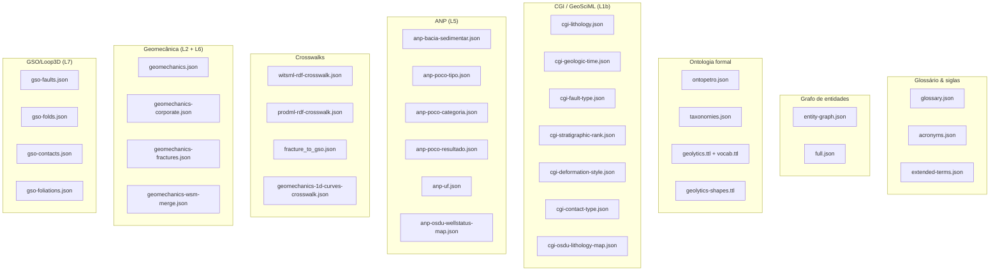

# Data Files

Mapa completo dos arquivos em [`data/`](https://github.com/thiagoflc/geolytics-dictionary/tree/main/data) — o que cada um contém, em qual camada vive, como é gerado e como consumir.

> **Lembrete:** todos os arquivos em `data/` são **gerados** por `scripts/generate.js`. Não edite à mão; edite a fonte. Veja [[ETL Pipeline]].

---

## Mapa rápido por categoria



---

## Catálogo completo

### 🔤 Glossário & siglas

| Arquivo                                | Conteúdo                                                                 | Camada |
| -------------------------------------- | ------------------------------------------------------------------------ | ------ |
| `glossary.json`                        | 23 termos ANP enriquecidos (descrição, layer, normative, sinônimos)      | L5     |
| `acronyms.json`                        | 1.102 siglas O&G PT/EN categorizadas por contexto                        | All    |
| `extended-terms.json`                  | Glossário suplementar (~50 termos extras não-ANP)                         | L3-L6  |

### 🕸️ Grafo de entidades

| Arquivo                                | Conteúdo                                                                 | Camada |
| -------------------------------------- | ------------------------------------------------------------------------ | ------ |
| `entity-graph.json`                    | **Grafo principal**: 221 nós tipados + 370 relações                      | All    |
| `full.json`                            | Vista denormalizada — merge de entity-graph + glossary + ontopetro        | All    |

### 🧠 Ontologia formal

| Arquivo                                | Conteúdo                                                                 | Camada |
| -------------------------------------- | ------------------------------------------------------------------------ | ------ |
| `ontopetro.json`                       | 6 módulos (BFO, geo-base, well, reservoir, geomech, sismic)              | L1-L2  |
| `taxonomies.json`                      | 13 enumerações canônicas (litologia, SPE-PRMS, AVO classes, etc.)         | All    |
| `geolytics.ttl` / `geobrain.ttl`        | RDF/Turtle canônico                                                       | All    |
| `geolytics-vocab.ttl` / `geobrain-vocab.ttl` | Vocabulário OWL (classes + propriedades)                            | All    |
| `geolytics-shapes.ttl` / `geobrain-shapes.ttl` | 65 SHACL NodeShapes                                              | All    |

### 🌍 CGI / GeoSciML (Layer 1b)

| Arquivo                                | Conteúdo                                                                 |
| -------------------------------------- | ------------------------------------------------------------------------ |
| `cgi-lithology.json`                   | 437 conceitos CGI Simple Lithology                                       |
| `cgi-geologic-time.json`               | Escala cronoestratigráfica completa (Pré-Cambriano → Quaternário)        |
| `cgi-fault-type.json`                  | Tipos de falha (normal, transcorrente, inversa…)                          |
| `cgi-stratigraphic-rank.json`          | Hierarquia (Supergrupo → Grupo → Formação → Membro)                       |
| `cgi-deformation-style.json`           | Estilos de deformação                                                     |
| `cgi-contact-type.json`                | Tipos de contato (discordância, intrusivo, etc.)                          |
| `cgi-osdu-lithology-map.json`          | **Crosswalk bilateral** CGI ↔ OSDU LithologyType (152 mapeamentos)       |

### 🇧🇷 ANP / SIGEP (Layer 5)

| Arquivo                                | Conteúdo                                                                 |
| -------------------------------------- | ------------------------------------------------------------------------ |
| `anp-bacia-sedimentar.json`            | Catálogo oficial de bacias sedimentares brasileiras                      |
| `anp-poco-tipo.json`                   | Tipos de poço ANP (exploratório, desenvolvimento, etc.)                   |
| `anp-poco-categoria.json`              | Categorias de poço                                                       |
| `anp-poco-resultado.json`              | Resultados (descobridor, sêco, abandonado, suspenso, etc.)                |
| `anp-uf.json`                          | UFs brasileiras com produção de O&G                                      |
| `anp-osdu-wellstatus-map.json`         | **Crosswalk** status ANP ↔ OSDU well-status                               |

### 🛠️ WITSML / PRODML / OSDU

| Arquivo                                | Conteúdo                                                                 |
| -------------------------------------- | ------------------------------------------------------------------------ |
| `witsml-rdf-crosswalk.json`            | 25 classes WITSML 2.0 mapeadas para `geo:`                                |
| `prodml-rdf-crosswalk.json`            | 15 classes PRODML 2.x mapeadas para `geo:`                                |
| `gsmlbh-properties.json`               | Propriedades GWML2 do poço (boreholeDiameter, drillingMethod, etc.)       |
| `gwml2.json`                           | 9 classes GWML2 WellConstruction                                          |
| `sosa-qudt-alignment.json`             | 17 mnemônicos de logs mapeados a `sosa:Observation` + unidades QUDT       |

### ⚙️ Geomecânica (L2 + L6)

| Arquivo                                | Conteúdo                                                                 |
| -------------------------------------- | ------------------------------------------------------------------------ |
| `geomechanics.json`                    | Módulo MEM P2.7 (4 pilares + curvas)                                      |
| `geomechanics-fractures.json`          | Catálogo de tipos de fraturas (junto a GSO L7)                            |
| `geomechanics-corporate.json`          | Módulo Petrobras GEOMEC* (47 entidades)                                   |
| `geomechanics-corporate-crosswalk.json`| Crosswalk L2 ↔ L6 (Petrobras GEOMEC)                                      |
| `geomechanics-1d-curves-crosswalk.json`| Curvas de pressão 1D vs WITSML curves                                     |
| `geomechanics-wsm-merge.json`          | World Stress Map merge data                                                |
| `fracture_to_gso.json`                 | Crosswalk fraturas → classes GSO formais                                   |

### 🌐 GSO / Loop3D (L7)

| Arquivo                                | Conteúdo                                                                 |
| -------------------------------------- | ------------------------------------------------------------------------ |
| `gso-faults.json`                      | Classes de falha GSO                                                      |
| `gso-folds.json`                       | Classes de dobra                                                          |
| `gso-contacts.json`                    | Classes de contato geológico                                              |
| `gso-foliations.json`                  | Classes de foliação                                                      |

### 📊 Sismicas (P2.8)

| Arquivo                                | Conteúdo                                                                 |
| -------------------------------------- | ------------------------------------------------------------------------ |
| `seismic-acquisition.json`             | Aquisição (offset, fold, geometria)                                        |
| `seismic-processing.json`              | Processamento (migration, deconvolution)                                  |
| `seismic-inversion.json`               | Inversão sísmica + atributos                                               |
| `seismic-avo.json`                     | Classes AVO (Classe I, II, III, IV)                                        |

### 🌊 SWEET (NASA/ESIPFed)

| Arquivo                                | Conteúdo                                                                 |
| -------------------------------------- | ------------------------------------------------------------------------ |
| `sweet-alignment.json`                 | 66 alinhamentos SKOS com SWEET (closeMatch, exactMatch, relatedMatch)     |

### 🏢 Corporativo Petrobras

| Arquivo                                | Conteúdo                                                                 |
| -------------------------------------- | ------------------------------------------------------------------------ |
| `gestao-projetos-parcerias.json`       | Estrutura de projetos e parcerias Petrobras                               |
| `systems.json`                         | 8 sistemas corporativos Petrobras                                         |
| `axon/`                                | Snapshots do glossário Petrobras AXON (não público)                      |

### 📐 Equivalências entre camadas

| Arquivo                                          | Conteúdo                                                       |
| ------------------------------------------------ | -------------------------------------------------------------- |
| `layer1-layer1b-equivalence.json`                | Equivalências BFO/GeoCore (L1) ↔ GeoSciML (L1b)                |
| `cgi-osdu-lithology-map.json`                    | CGI ↔ OSDU                                                     |
| `anp-osdu-wellstatus-map.json`                   | ANP well-status ↔ OSDU                                         |
| `geomechanics-corporate-crosswalk.json`          | Petrobras GEOMEC* (L6) ↔ ontopetro geomec (L2)                 |

### 🔧 Outros

| Arquivo                                | Conteúdo                                                                 |
| -------------------------------------- | ------------------------------------------------------------------------ |
| `datasets.json`                        | Manifesto de versões dos datasets externos (3W, GSO, OSDU, CGI)           |
| `glosis-extraction.md`                 | Notas de extração do GLOSIS                                                |
| `glosis/`                              | Glossário GLOSIS (subdiretório)                                            |

---

## Como ler um arquivo via Python

```python
import json

with open("data/entity-graph.json") as f:
    graph = json.load(f)

# Estrutura típica
graph["nodes"][0]
# → {"id": "poco", "label": "Poço", "type": "Operational", ...}

graph["relations"][0]
# → {"from": "poco", "to": "bloco", "rel": "located_in"}
```

Ou via SDK:

```python
from geolytics_dictionary import KnowledgeGraph
kg = KnowledgeGraph.from_local()  # carrega data/entity-graph.json
```

---

## Como ler via cURL

```bash
# Direto do GitHub raw
curl https://raw.githubusercontent.com/thiagoflc/geolytics-dictionary/main/data/glossary.json

# Via GitHub Pages (otimizado, com cache)
curl https://thiagoflc.github.io/geobrain/api/v1/index.json
```

> Veja [[REST API]] para diferenças entre `data/` e `api/v1/`.

---

## Tamanhos típicos

| Arquivo                       | Tamanho aproximado |
| ----------------------------- | ------------------ |
| `entity-graph.json`           | ~1 MB              |
| `full.json`                   | ~2 MB              |
| `acronyms.json`               | ~260 KB            |
| `cgi-lithology.json`          | ~127 KB            |
| `geomechanics-corporate.json` | ~354 KB            |
| `geolytics.ttl`               | ~411 KB            |
| `geolytics-shapes.ttl`        | ~134 KB            |

Total `data/`: ~6 MB. Cabe num único request HTTP.

---

## Política de versionamento

- Arquivos em `data/` são **commitados** (não-`.gitignore`d). PRs precisam regerar e commit.
- Arquivos em `build/` são `.gitignore`d (gerados localmente para Neo4j).
- Mudança de schema bump major version em `python/geobrain/_version.py`.

---

## Para entender a fonte de cada arquivo

| Arquivo                     | Gerado a partir de                                              |
| --------------------------- | --------------------------------------------------------------- |
| `entity-graph.json`         | `ENTITY_NODES`, `EDGES` (constantes em `scripts/generate.js`)   |
| `glossary.json`             | `GLOSSARY` (constante em `scripts/generate.js`)                 |
| `ontopetro.json`            | `scripts/ontopetro-data.js`                                     |
| `geomechanics-corporate.json` | scripts/backfill-geomec-corporate.py + dados Petrobras       |
| `cgi-*.json`                | Cópia upstream do CGI/IUGS                                      |
| `gso-*.json`                | `scripts/gso-extract.js`                                        |
| `acronyms.json`             | `scripts/acronyms-source.txt` + `scripts/build-acronyms.js`      |
| `*-shapes.ttl`              | Geração declarativa em `scripts/generate.js` + ttl-serializer  |

---

> **Próximo:** ver [[REST API]] (versão otimizada para HTTP) ou [[RAG Corpus]] (formato JSONL para embeddings).
