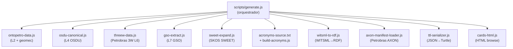

# ETL Pipeline (`scripts/generate.js`)

O pipeline de transformação semântica que regenera **todo** o conteúdo de `data/`, `api/v1/` e `ai/` a partir das fontes de autoridade.

> 📁 Arquivo principal: [`scripts/generate.js`](https://github.com/thiagoflc/geolytics-dictionary/blob/main/scripts/generate.js) (~6.700 linhas, Node.js puro, sem dependências externas)

---

## Princípios

1. **Determinístico** — mesma entrada produz exatamente o mesmo output (byte-a-byte).
2. **Idempotente** — pode ser rodado N vezes sem efeitos colaterais.
3. **Sem dependências de runtime** — Node.js standard library only. Sem `npm install` para rodar.
4. **CI-verificado** — `scripts/check-regen.sh` detecta drift em PRs.

---

## Como rodar

```bash
# Regenera tudo
node scripts/generate.js

# Regenera + verifica que não há diff (CI gate)
bash scripts/check-regen.sh
```

Saída típica:
```
✓ data/glossary.json (23 termos)
✓ data/entity-graph.json (221 nós, 370 relações)
✓ data/ontopetro.json (6 módulos)
✓ data/full.json (merged)
✓ data/taxonomies.json (13 enumerações)
✓ api/v1/*.json (23 endpoints)
✓ ai/rag-corpus.jsonl (2.683 chunks)
✓ data/geolytics.ttl (RDF)
✓ data/geolytics-shapes.ttl (65 NodeShapes)
```

---

## Arquitetura interna

`generate.js` é **um orquestrador** que compõe módulos especializados:



### Módulos por responsabilidade

| Módulo                                | Responsabilidade                                                                                |
| ------------------------------------- | ----------------------------------------------------------------------------------------------- |
| [`ontopetro-data.js`](https://github.com/thiagoflc/geolytics-dictionary/blob/main/scripts/ontopetro-data.js)         | Define classes O3PO, GeoReservoir e geomecânica (L2)                  |
| [`osdu-canonical.js`](https://github.com/thiagoflc/geolytics-dictionary/blob/main/scripts/osdu-canonical.js)         | Lista de OSDU kinds e crosswalks (L4)                                  |
| [`threew-data.js`](https://github.com/thiagoflc/geolytics-dictionary/blob/main/scripts/threew-data.js)               | Petrobras 3W v2.0.0: 27 sensores, 10 eventos, 14 equipamentos          |
| [`gso-extract.js`](https://github.com/thiagoflc/geolytics-dictionary/blob/main/scripts/gso-extract.js)               | Extração das 213 classes GSO/Loop3D (L7)                               |
| [`sweet-expand.js`](https://github.com/thiagoflc/geolytics-dictionary/blob/main/scripts/sweet-expand.js)             | Aplicação dos alinhamentos SWEET (NASA/ESIPFed)                         |
| [`build-acronyms.js`](https://github.com/thiagoflc/geolytics-dictionary/blob/main/scripts/build-acronyms.js)         | Constrói `acronyms.json` a partir de `acronyms-source.txt`             |
| [`witsml-to-rdf.js`](https://github.com/thiagoflc/geolytics-dictionary/blob/main/scripts/witsml-to-rdf.js)           | Crosswalk WITSML 2.0 → `geo:`                                           |
| [`axon-manifest-loader.js`](https://github.com/thiagoflc/geolytics-dictionary/blob/main/scripts/axon-manifest-loader.js) | Lê `data/axon/` (glossário Petrobras)                                |
| [`ttl-serializer.js`](https://github.com/thiagoflc/geolytics-dictionary/blob/main/scripts/ttl-serializer.js)         | Serializa JSON canônico em RDF/Turtle                                  |
| [`cards-html.js`](https://github.com/thiagoflc/geolytics-dictionary/blob/main/scripts/cards-html.js)                 | Gera `index-cards.html` para visualização web                           |

---

## Estágios de processamento

### Estágio 1: Carregamento de fontes

```js
// Pseudocódigo simplificado
const GLOSSARY = [/* 23 termos ANP */];
const ENTITY_NODES = [/* 170 nós */];
const EDGES = [/* 259 relações */];
const ONTOPETRO = require('./ontopetro-data.js');
const OSDU = require('./osdu-canonical.js');
const THREEW = require('./threew-data.js');
// ... etc
```

> Constantes ficam **inline** em `generate.js` para diff legível em PRs. Quando viram complexas demais, migram para módulos próprios.

### Estágio 2: Harmonização

#### 2.1 — Resolução de cross-URIs

A função `alignmentFor(table, id)` ([scripts/generate.js:130+](https://github.com/thiagoflc/geolytics-dictionary/blob/main/scripts/generate.js#L130)) resolve URIs cruzadas:

```js
alignmentFor("entity", "poco") →
{
  petrokgraph_uri: "https://petrokgraph.puc-rio.br/ontology#Poço",
  osdu_kind: "osdu:work-product-component--Wellbore:1.0.0",
  geosciml_uri: null,
  bfo_iri: "http://purl.obolibrary.org/obo/BFO_0000040",
  gso_uri: null
}
```

#### 2.2 — Merge sem perda

Quando o mesmo conceito aparece em múltiplas fontes (ex.: `poço` em ANP e em Petro KGraph), o pipeline **merges** com prioridade:
1. Atributos canônicos da fonte primária ANP
2. Cross-URIs adicionadas das outras camadas
3. Sinônimos consolidados em uma lista única

#### 2.3 — Validação estrutural inline

Após cada merge, verificações:
- `id` único?
- `relations[].to` resolve para algum ID conhecido?
- `geocoverage` ∈ {L1, L1b, L2, L3, L4, L5, L6, L7}?
- `type` ∈ {Operational, Geological, Contractual, Actor, Equipment, Instrument, Analytical}?

Falhas abortam imediatamente o build com mensagem precisa.

### Estágio 3: Emissão de saídas

#### 3.1 — JSON canônico em `data/`

Arquivos JSON formatados (2 espaços, sem trailing newlines), determinísticos:

```bash
data/glossary.json
data/entity-graph.json
data/ontopetro.json
data/taxonomies.json
data/full.json   # merge de todos os módulos
data/geomechanics.json
data/seismic-acquisition.json
# ... etc (~58 arquivos)
```

#### 3.2 — API REST estática em `api/v1/`

Versões otimizadas para consumo HTTP via GitHub Pages:
- Sem campos internos (`debug`, `_temp`)
- Inclui `index.json` com manifesto
- Inclui TTL para validação client-side

#### 3.3 — Corpus RAG em `ai/`

[`ai/rag-corpus.jsonl`](https://github.com/thiagoflc/geolytics-dictionary/blob/main/ai/rag-corpus.jsonl) — 2.683 chunks no formato:

```jsonl
{"id":"glossary-bloco","text":"Bloco (ANP). Unidade administrativa...","type":"glossary","metadata":{"layer":"L5","entity_id":"bloco"}}
{"id":"entity-poco","text":"Poço. Estrutura física...","type":"entity","metadata":{"layer":["L4","L5"],"type":"Operational"}}
```

Pré-otimizado para BM25 e embeddings densos.

#### 3.4 — RDF/Turtle

`scripts/ttl-serializer.js` converte JSON em Turtle 1.1:

```turtle
geo:bloco a geo:Contractual ;
  rdfs:label "Bloco (ANP)"@pt-BR ;
  dcterms:description "Unidade administrativa..."@pt-BR ;
  geo:layer "L5" ;
  geo:governed_by geo:anp ;
  geo:located_in geo:bacia-sedimentar .
```

#### 3.5 — SHACL shapes

Geradas declarativamente a partir das definições de tipo. Cada classe vira uma `sh:NodeShape`:

```turtle
geo:BlocoShape a sh:NodeShape ;
  sh:targetClass geo:Contractual ;
  sh:property [
    sh:path geo:layer ;
    sh:in ("L5") ;
    sh:minCount 1 ;
  ] ;
  sh:property [
    sh:path geo:governed_by ;
    sh:class geo:Actor ;
    sh:minCount 1 ;
  ] .
```

---

## CI: garantia de regeneração

Em [`.github/workflows/validate.yml`](https://github.com/thiagoflc/geolytics-dictionary/blob/main/.github/workflows/validate.yml):

```yaml
- name: Regenerate and check no-diff
  run: |
    node scripts/generate.js
    git diff --exit-code
```

Se algum dev editou `data/glossary.json` à mão e esqueceu de atualizar a fonte em `generate.js`, o `git diff` aparece e o PR é bloqueado.

---

## Padrões importantes

### 🟢 Single source of truth

**Sempre edite a fonte** (`scripts/*.js` ou `scripts/*.txt`), nunca o JSON gerado. Comentário no topo de cada arquivo gerado lembra disso:

```json
{
  "_comment": "Generated by scripts/generate.js. Do not edit by hand.",
  "...": "..."
}
```

### 🟢 Sem dependências externas

`generate.js` usa apenas Node.js stdlib. Isso permite:
- Rodar em CI sem `npm install`
- Auditoria de supply chain trivial
- Sem flutuação semântica entre versões de pacotes

### 🟢 Funções puras

Cada transformação é função pura `(input) → output`. Isso facilita testes unitários e debug.

### 🟢 Determinismo via sort

Toda saída JSON tem chaves ordenadas e arrays ordenados por `id`. Sem ordem instável → sem diff falso.

---

## Como adicionar uma nova fonte

1. Crie um módulo em `scripts/<minha-fonte>.js` que exporta uma lista padronizada:
   ```js
   module.exports = {
     entities: [{ id, label, ... }],
     relations: [{ from, to, rel }]
   };
   ```
2. Importe em `generate.js` na seção *Carregamento de fontes*.
3. Adicione `geocoverage` apropriado (nova camada? Use Lx_b para sub-camada).
4. Rode `node scripts/generate.js` e verifique outputs.
5. Atualize testes em `tests/` e shapes em `data/geolytics-shapes.ttl`.
6. Documente em `docs/<MODULO>.md` e referencie em `docs/INDEX.md`.

Detalhes em [docs/CONTRIBUTING.md](https://github.com/thiagoflc/geolytics-dictionary/blob/main/docs/CONTRIBUTING.md).

---

## Performance

Pipeline completo em ~3-5 segundos em laptop moderno. Bottlenecks principais:

- **JSON parsing** das fontes (~30%)
- **Cross-URI resolution** (~25%)
- **TTL serialization** (~25%)
- **JSONL chunking para RAG** (~20%)

Não há paralelização — Node.js single-thread é suficiente para os volumes atuais.

---

## Troubleshooting

| Problema                                            | Causa                                       | Fix                                                  |
| --------------------------------------------------- | ------------------------------------------- | ---------------------------------------------------- |
| `Error: dangling reference 'foo'`                  | `relations[].to: "foo"` não existe          | Adicione `foo` em `ENTITY_NODES` ou corrija o ID     |
| `Error: duplicate id 'bloco'`                      | Mesmo `id` em duas fontes                   | Renomeie ou unifique                                  |
| `git diff` não-vazio após regenerar                | Edição manual em `data/`                    | Reverta e edite a fonte em `scripts/`                 |
| `pyshacl` reporta `MinCountConstraintComponent`    | Falta atributo obrigatório (ex.: `governed_by`) | Adicione a relação                                |
| Output difere entre máquinas                        | Versão Node.js antiga (< 18)                | Use Node.js 20 LTS                                   |

---

> **Próximo:** entender como dados gerados são validados em [[SHACL Validation]] ou consumidos em [[Python Package]] / [[MCP Server]].
