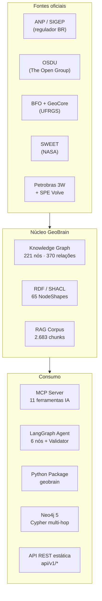

# GeoBrain — Wiki

> **Ontologia semântica do domínio de Exploração & Produção (E&P) de petróleo e gás natural no Brasil**, derivada do módulo Dicionário da plataforma Geolytics.

A Wiki é o ponto de partida para entender o GeoBrain — o que ele resolve, como está organizado e como você pode usá-lo (como pesquisador, engenheiro de dados, agente de IA ou colaborador).

---

## TL;DR — em 30 segundos

- **O quê:** Uma base de conhecimento estruturada (grafo de 221 nós + 370 relações + 23 termos ANP + 1.102 siglas + 65 SHACL shapes) sobre o setor de óleo e gás brasileiro.
- **Por quê:** RAG vetorial puro **falha** em perguntas multi-hop (poço → bloco → bacia → regime contratual), em desambiguação estrutural (PAD = contrato ANP **vs.** drilling pad) e em verificação regulatória (SPE-PRMS não reconhece "4P").
- **Como:** 8 camadas semânticas alinhadas (BFO, GeoSciML, O3PO, Petro KGraph, OSDU, ANP, Petrobras, GSO), grafo tipado, validador determinístico e agente LangGraph com guardrail SHACL.
- **Para quem:** Equipes de IA aplicada a O&G, pesquisadores de ontologias, integradores OSDU/WITSML, autores de agentes regulatórios, alunos de geologia/engenharia de petróleo.

> 🌐 **Visualização interativa:** https://thiagoflc.github.io/geobrain
> 📚 **Documentação técnica completa:** [docs/INDEX.md](https://github.com/thiagoflc/geolytics-dictionary/blob/main/docs/INDEX.md)

---

## Por onde começar

Escolha o caminho conforme seu objetivo:

| Quero…                                                                                          | Vá para                                                |
| ----------------------------------------------------------------------------------------------- | ------------------------------------------------------ |
| Entender o que é o GeoBrain e qual problema ele resolve                                         | [[What is GeoBrain]]                                   |
| Compreender as **8 camadas semânticas** e como elas se conectam                                 | [[Semantic Layers]]                                    |
| Ver a arquitetura geral, ETL e fluxo de uma pergunta                                            | [[Architecture]]                                       |
| Instalar, rodar e reproduzir os exemplos                                                        | [[Getting Started]]                                    |
| Conectar agentes de IA (Claude Desktop, Cursor) ao MCP server                                   | [[MCP Server]]                                         |
| Usar o pacote Python `geobrain` em notebooks ou pipelines                                       | [[Python Package]]                                     |
| Subir o grafo no Neo4j e fazer queries Cypher                                                   | [[Neo4j Setup]]                                        |
| Validar afirmações com SPE-PRMS, regime contratual, etc.                                        | [[Semantic Validator]]                                 |
| Validar dados RDF com SHACL (65 NodeShapes)                                                     | [[SHACL Validation]]                                   |
| Construir um agente GraphRAG com LangGraph                                                      | [[LangGraph Agent]]                                    |
| Ver casos de uso reais (multi-hop, desambiguação, crosswalks)                                   | [[Use Cases]]                                          |
| Contribuir com termos, entidades, relações ou shapes                                            | [[Contributing]]                                       |
| Encontrar definições de termos do projeto                                                       | [[Glossary]]                                           |

---

## Diagrama mental (1 minuto)

---

## Convenções desta Wiki

- **Nomes de arquivos com `:linha`** apontam para o repositório. Exemplo: [scripts/generate.js:130](https://github.com/thiagoflc/geolytics-dictionary/blob/main/scripts/generate.js#L130).
- **Termos em maiúsculas** (BFO, OSDU, SHACL) seguem a [[Glossary]].
- **Siglas em primeira menção** vêm sempre desambiguadas (ex.: PAD = *Plano de Avaliação de Descoberta*, contrato ANP — **não** drilling pad).
- **Diagramas Mermaid** são renderizados nativamente pelo GitHub Wiki.
- **Camadas (`L1`–`L7`)** referem-se às 8 camadas semânticas descritas em [[Semantic Layers]].

---

## Status do projeto

- **Versão atual:** veja [CHANGELOG.md](https://github.com/thiagoflc/geolytics-dictionary/blob/main/CHANGELOG.md)
- **Licença código:** MIT
- **Licença dados:** uso livre com atribuição à ANP/SEP
- **CI:** 10 workflows ([.github/workflows/](https://github.com/thiagoflc/geolytics-dictionary/tree/main/.github/workflows))
- **Validação:** 65 NodeShapes SHACL · 0 warnings (após F12) · regressão deterministicamente fixada

---

> Esta Wiki é gerada a partir de `wiki/*.md` no repositório principal. Para republicar após edições, rode `bash wiki/publish.sh` (veja [[Contributing]]).
