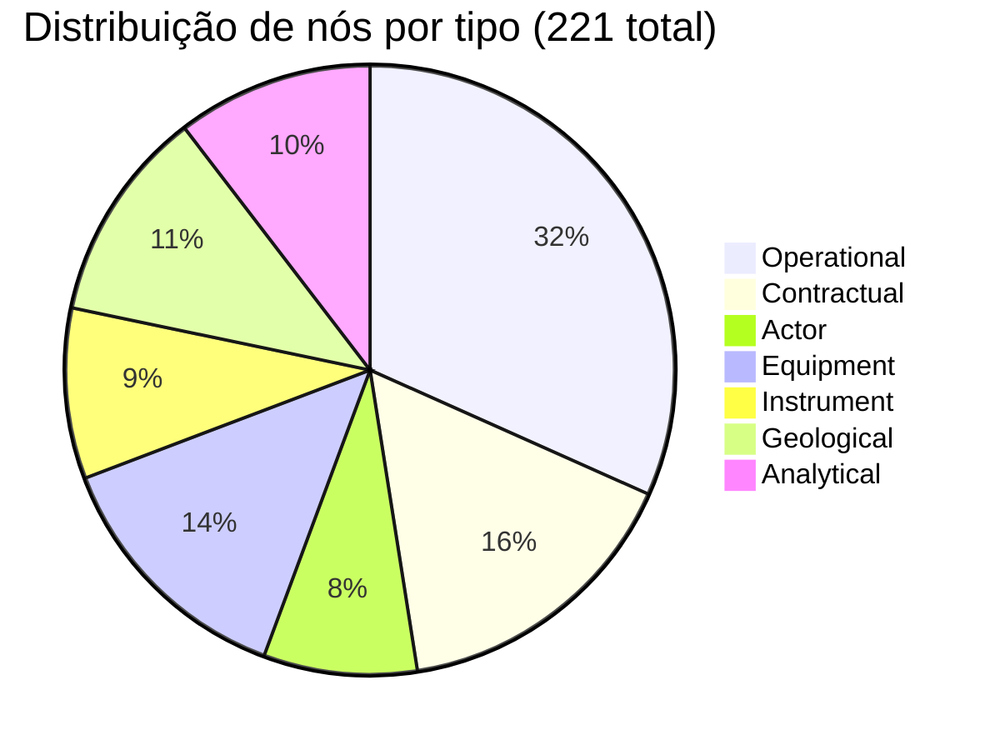
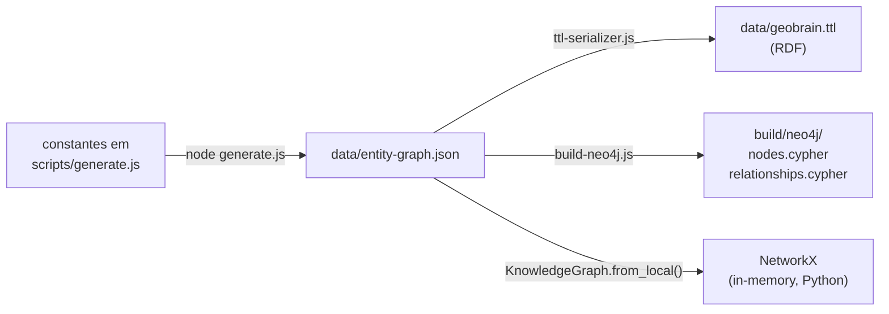

# Knowledge Graph

O coração do GeoBrain. Um grafo tipado de **221 nós + 370 relações** que conecta termos, conceitos, atores, instrumentos e processos de E&P brasileiro.

---

## Modelo de entidades — 6 tipos

Cada nó pertence a exatamente um tipo (label). A escolha do tipo define quais relações são válidas e quais SHACL shapes se aplicam.

| Tipo (label)      | O que representa                                              | Exemplos                                                  |
| ----------------- | ------------------------------------------------------------- | --------------------------------------------------------- |
| **Operational**   | Ativos físicos e processos operacionais                       | `poco`, `bloco`, `bacia-sedimentar`, `reservatorio`       |
| **Geological**    | Conceitos de geologia (formações, eventos, materiais)         | `formacao-marizal`, `reservoir-rock`, `fluid-sample`      |
| **Contractual**   | Instrumentos contratuais e administrativos ANP                | `contrato-ep`, `pad`, `regime-contratual`, `uts`          |
| **Actor**         | Organizações, agências, operadores                            | `anp`, `petrobras`, `mme`, `cnpe`                         |
| **Equipment**     | Equipamentos físicos                                          | `bop`, `xmas-tree`, `casing`, `fpso`                      |
| **Instrument**    | Instrumentos legais, normativos, contratos-modelo             | `lei-9478-1997`, `lei-12351-2010`, `decreto-2705-1998`   |
| **Analytical**    | Métodos analíticos, ensaios, modelos                          | `mem-1d`, `avo-classe-3`, `geomec-026a`                   |

📁 Definição completa: [docs/ENTITIES.md](https://github.com/thiagoflc/geolytics-dictionary/blob/main/docs/ENTITIES.md)

---

## Estrutura de um nó

Exemplo simplificado de [`data/entity-graph.json`](https://github.com/thiagoflc/geolytics-dictionary/blob/main/data/entity-graph.json):

```json
{
  "id": "bloco",
  "label": "Bloco (ANP)",
  "type": "Contractual",
  "description": "Unidade administrativa de exploração da ANP...",
  "geocoverage": ["L5"],
  "petrokgraph_uri": null,
  "osdu_kind": null,
  "bfo_iri": "http://purl.obolibrary.org/obo/BFO_0000027",
  "anp_normative": ["Lei 9.478/1997 art. 25"],
  "synonyms": ["block (en)"],
  "relations": [
    { "to": "anp", "rel": "governed_by" },
    { "to": "rodada-licitacao", "rel": "awarded_via" },
    { "to": "bacia-sedimentar", "rel": "located_in" }
  ]
}
```

### Campos principais

| Campo               | Significado                                                                 |
| ------------------- | --------------------------------------------------------------------------- |
| `id`                | Identificador único kebab-case. Usado em URIs e Cypher.                      |
| `label`             | Nome human-readable (PT-BR).                                                |
| `type`              | Um dos 6 tipos acima.                                                       |
| `description`       | Definição em PT-BR (um parágrafo).                                          |
| `geocoverage`       | Lista de camadas onde o conceito existe.                                    |
| `petrokgraph_uri`   | URI Petro KGraph (camada L3) se houver equivalente.                          |
| `osdu_kind`         | OSDU kind se houver mapping direto.                                          |
| `bfo_iri`           | BFO classification (rara, mas útil para validação ontológica).               |
| `anp_normative`     | Referência normativa (Lei, Decreto, Portaria).                              |
| `synonyms`          | Sinônimos PT/EN.                                                             |
| `relations`         | Arestas saindo deste nó. Cada relação tem `to` e `rel` tipados.              |

---

## Relações tipadas

As relações **não** são genéricas (`relatesTo`). Elas têm semântica precisa:

| Relação                | Domain → Range                                  | Significado                                              |
| ---------------------- | ----------------------------------------------- | -------------------------------------------------------- |
| `governed_by`          | qualquer → Actor                                | Sujeito a fiscalização do ator regulatório.               |
| `awarded_via`          | Contractual → Contractual                       | Atribuído por meio de processo licitatório.               |
| `located_in`           | Operational → Operational/Geological             | Localização espacial.                                    |
| `produces`             | Operational → Geological/Operational            | Produz, gera (poço produz óleo).                          |
| `regulates`            | Actor/Instrument → Contractual                   | Regula, normatiza.                                       |
| `derived_from`         | qualquer → qualquer                             | Sub-classe ou variação.                                  |
| `crosswalk`            | qualquer → qualquer                             | Mapeamento bilateral entre camadas.                      |
| `validates`            | Analytical → Operational                        | Método valida dado.                                      |

> Lista completa: [docs/ONTOLOGY_PREDICATES.md](https://github.com/thiagoflc/geolytics-dictionary/blob/main/docs/ONTOLOGY_PREDICATES.md)

---

## Estatísticas



- **370 relações** distribuídas em ~12 tipos predicados
- **65 SHACL NodeShapes** (uma para cada classe principal + propriedade)
- **~500 cross-URIs** (petrokgraph_uri + osdu_kind + geosciml_uri + gso_uri)

---

## Como o grafo é construído



A mesma fonte alimenta **três representações**:

1. **JSON** (canônico, dev-friendly)
2. **RDF/TTL** (validação SHACL, raciocínio OWL)
3. **Cypher** (queries multi-hop em Neo4j)
4. **NetworkX** (Python, exploração rápida)

---

## Exemplos de queries

### 1. Caminho mínimo: poço → bloco → bacia → regime

```cypher
MATCH path = shortestPath(
  (p:Operational {id:'poco'})-[*]-(r:Contractual {id:'regime-contratual'})
)
RETURN [n IN nodes(path) | n.label] AS hops
```
> Arquivo: [docs/queries/01-poco-bloco-bacia-regime.cypher](https://github.com/thiagoflc/geolytics-dictionary/blob/main/docs/queries/01-poco-bloco-bacia-regime.cypher)

### 2. Entidades sem cobertura Petro KGraph (gaps)

```cypher
MATCH (e:Operational)
WHERE e.petrokgraph_uri IS NULL
RETURN e.id, e.label, e.geocoverage
ORDER BY e.label
```
> Útil para priorizar contribuições upstream à PUC-Rio. Arquivo: [docs/queries/03-entidades-sem-petrokgraph.cypher](https://github.com/thiagoflc/geolytics-dictionary/blob/main/docs/queries/03-entidades-sem-petrokgraph.cypher)

### 3. Cascata regulatória Lei → ANP → SIGEP

```cypher
MATCH path = (l:Instrument {id:'lei-9478-1997'})-[:regulates|:specializes*1..4]->(s)
RETURN path
```
> Arquivo: [docs/queries/05-cascata-regulatoria.cypher](https://github.com/thiagoflc/geolytics-dictionary/blob/main/docs/queries/05-cascata-regulatoria.cypher)

### 4. Litologias CGI ↔ OSDU

```cypher
MATCH (l:Geological)
WHERE l.geosciml_uri IS NOT NULL AND l.osdu_kind IS NOT NULL
RETURN l.label, l.geosciml_uri, l.osdu_kind
```
> Arquivo: [docs/queries/07-litologia-cgi-osdu-crosswalk.cypher](https://github.com/thiagoflc/geolytics-dictionary/blob/main/docs/queries/07-litologia-cgi-osdu-crosswalk.cypher)

---

## Em Python

```python
from geolytics_dictionary import KnowledgeGraph

kg = KnowledgeGraph.from_local()

# Inspecionar um nó
poco = kg.entity("poco")
print(poco.label, poco.type, poco.geocoverage)
# → "Poço" "Operational" ["L4","L5"]

# Vizinhos a 2 hops
neigh = kg.neighbors("poco", hops=2)

# Caminho mínimo
path = kg.shortest_path("poco", "regime-contratual")
# → ['poco', 'bloco', 'contrato-ep', 'regime-contratual']

# Filtrar por tipo
contratuais = [e for e in kg.entities() if e.type == "Contractual"]
```

> Detalhes em [[Python Package]].

---

## Boas práticas ao adicionar entidades

1. **ID em kebab-case**, semanticamente legível: `bloco`, não `blk1`.
2. **`label` em PT-BR**, com sigla entre parênteses se aplicável: `"Plano de Avaliação de Descoberta (PAD)"`.
3. **`geocoverage` honesto** — apenas camadas onde o conceito **realmente** existe formalmente.
4. **`relations[].to` deve resolver** — IDs órfãos quebram CI.
5. **Não duplique** — antes de criar, busque por sinônimo existente. Veja [docs/CONTRIBUTING.md](https://github.com/thiagoflc/geolytics-dictionary/blob/main/docs/CONTRIBUTING.md).

---

> **Próximo:** entender como o grafo é validado em [[SHACL Validation]] ou explorar via [[Neo4j Setup]].
