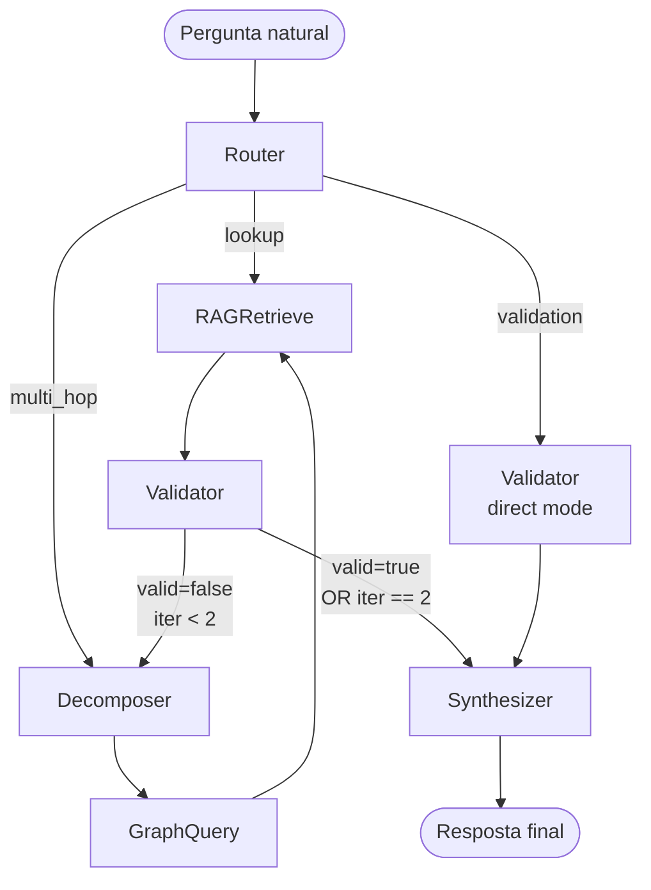
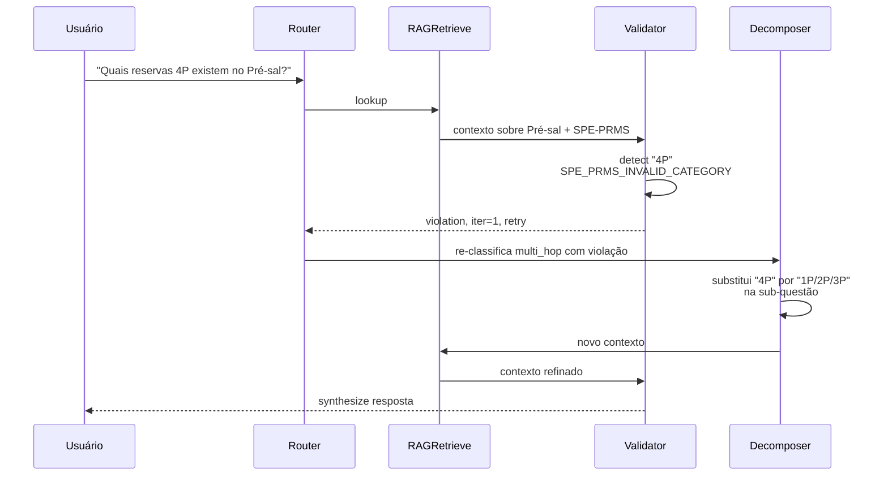

# LangGraph Agent

Agente GraphRAG de referência construído sobre [LangGraph](https://github.com/langchain-ai/langgraph). Demonstra como compor as ferramentas do GeoBrain em um pipeline de **6 nós + Validator como guardrail**.

📁 Diretório: [`examples/langgraph-agent/`](https://github.com/thiagoflc/geolytics-dictionary/tree/main/examples/langgraph-agent)
📁 Documentação técnica completa: [docs/GRAPHRAG.md](https://github.com/thiagoflc/geolytics-dictionary/blob/main/docs/GRAPHRAG.md)

---

## Topologia do DAG



> Cada nó é uma função pura `(state) → state`. O estado (`AgentState`) é um TypedDict que cresce ao longo do DAG.

---

## Os 6 nós (+ entrypoint)

| Nó               | Arquivo                                      | Responsabilidade                                                       |
| ---------------- | -------------------------------------------- | ---------------------------------------------------------------------- |
| **Router**       | `nodes/router.py`                            | Heurística → classifica em `lookup` / `multi_hop` / `validation`       |
| **Decomposer**   | `nodes/decomposer.py`                        | Quebra pergunta multi-hop em sub-questões; aplica SWEET expansion      |
| **GraphQuery**   | `nodes/graph_query.py`                       | NetworkX BFS no entity-graph; emite Cypher se Neo4j configurado         |
| **RAGRetrieve**  | `nodes/rag_retrieve.py`                      | BM25 sobre `ai/rag-corpus.jsonl` (+ embeddings opcionais)               |
| **Validator**    | `nodes/validator.py`                         | Roda Semantic Validator + lógica de retry (até 2 iterações)            |
| **Synthesizer**  | `nodes/synthesizer.py`                       | LLM (Anthropic ou OpenAI) consolida resposta com fontes                |

---

## Estado do agente (`AgentState`)

```python
# state.py (simplificado)
from typing import TypedDict

class AgentState(TypedDict):
    question: str
    classification: str              # "lookup" | "multi_hop" | "validation"
    decomposed: list[str]            # sub-questões
    graph_results: list[dict]        # nós/caminhos encontrados
    rag_results: list[dict]          # chunks recuperados
    draft: str                       # resposta intermediária
    validation: dict                 # {valid, violations, warnings}
    iteration: int                   # contador de retry
    final_answer: str
```

---

## Roteamento — Router

`router.py` usa **heurísticas determinísticas** (sem LLM) baseadas em padrões da pergunta:

```python
# Pseudocódigo simplificado
def router_node(state: AgentState) -> AgentState:
    q = state["question"].lower()

    # Validação explícita
    if any(kw in q for kw in ["é válido", "está correto", "posso afirmar"]):
        return {**state, "classification": "validation"}

    # Multi-hop: contém múltiplas entidades ou predicados
    if count_named_entities(q) >= 2 or " e " in q:
        return {**state, "classification": "multi_hop"}

    # Default: lookup
    return {**state, "classification": "lookup"}
```

> Determinismo intencional: testes do agente são reproduzíveis sem mocks de LLM.

---

## Decomposição — Decomposer

Para perguntas multi-hop, quebra em sub-questões.

Pergunta: *"Qual o regime contratual do BS-500 e quais obrigações de UTS se aplicam?"*

Decomposição:
1. *"Qual o regime contratual do bloco BS-500?"*
2. *"Quais obrigações de UTS estão associadas ao regime de Concessão?"*

Cada sub-questão entra como goal independente no GraphQuery.

📁 Detalhes: `examples/langgraph-agent/nodes/decomposer.py`

---

## GraphQuery — duas estratégias

```python
def graph_query_node(state: AgentState) -> AgentState:
    if NEO4J_URI:
        # Estratégia 1: Cypher real
        results = run_cypher_text2cypher(state["decomposed"])
    else:
        # Estratégia 2: NetworkX local
        results = bfs_local(entity_graph, state["decomposed"])
    return {**state, "graph_results": results}
```

A estratégia 2 (NetworkX) garante que o agente roda **sem infraestrutura** para CI e demos.

---

## Validator — o guardrail

```python
def validator_node(state: AgentState) -> AgentState:
    rep = semantic_validate(state["draft"] or state["question"])
    if not rep.valid and state["iteration"] < 2:
        # Loop back para refinamento
        return {**state, "validation": rep.dict(), "iteration": state["iteration"] + 1}
    return {**state, "validation": rep.dict()}
```

Loop de **até 2 retries** evita custo descontrolado mas dá uma chance ao agente de corrigir antes de responder.

> Detalhes: [[Semantic Validator]].

---

## Synthesizer — único uso de LLM

Único nó que chama LLM. Recebe estado consolidado e gera resposta natural com:
- Inline citations (`[entidade-id]` resolve para link no grafo)
- Layer coverage (informa em que camada a resposta tem suporte)
- Caveat se houver warnings residuais

```python
def synthesizer_node(state: AgentState) -> AgentState:
    llm = _make_llm()  # factory: Anthropic ou OpenAI
    prompt = build_prompt(state)
    answer = llm.invoke(prompt)
    return {**state, "final_answer": answer}
```

`_make_llm()` lê `LLM_PROVIDER` env var para escolher entre Anthropic Claude e OpenAI GPT.

---

## Como rodar

```bash
cd examples/langgraph-agent

# Setup (via uv ou pip)
pip install -r requirements.txt

# Configure LLM provider
export ANTHROPIC_API_KEY=sk-ant-...
# ou
export OPENAI_API_KEY=sk-...

# (Opcional) Neo4j para Cypher real
docker compose up -d   # do raiz do repo
export NEO4J_URI=bolt://localhost:7687

# Rode demo
python run_demo.py
```

Saída típica:
```
Q: Qual o regime contratual do Bloco BS-500?

[Router] classification = multi_hop
[Decomposer] sub-questions = [
  "Qual o regime do BS-500?",
  "Quais UTS aplicáveis?"
]
[GraphQuery] 4 nós encontrados
[RAGRetrieve] 7 chunks recuperados
[Validator] valid=true
[Synthesizer] resposta consolidada

A: O Bloco BS-500 está sob regime de Concessão (Lei 9.478/1997)...
```

---

## Worked example: o caso de uso #1

Pergunta: *"Quais reservas 4P existem no Pré-sal?"*



A resposta final explica que "4P" não existe no SPE-PRMS e oferece as categorias válidas — em vez de inventar dado.

---

## Casos de uso documentados

> Em [docs/USE_CASES.md](https://github.com/thiagoflc/geolytics-dictionary/blob/main/docs/USE_CASES.md):

1. **Regime ANP** — multi-hop poço → bloco → regime
2. **WITSML TVD/MD** — desambiguação de profundidade
3. **AVO Classe 4** — categoria sísmica fora do padrão
4. **Janela mud weight MEM** — pergunta geomecânica P2.7
5. **SPE-PRMS vs ambiental** — desambiguação "reserva"
6. **Crosswalk OSDU** — conceito ANP → OSDU kind

---

## Padrões importantes

### 🟢 Heurísticas antes de LLM

Routing e decomposition são **regra-baseados**. Determinismo + testabilidade.

### 🟢 LLM apenas em Synthesizer

Único custo de inferência. Único ponto de não-determinismo.

### 🟢 Validator como gate

Toda resposta passa pelo Validator. Sem bypass.

### 🟢 Retry budgetado

Máximo 2 retries — limite hard-coded para garantir terminação e custo.

---

## Estendendo o agente

### Adicionar um nó

1. Crie `nodes/meu_no.py` com `def meu_no(state) -> state`.
2. Registre em `agent.py`:
   ```python
   graph.add_node("meu_no", meu_no)
   graph.add_edge("graph_query", "meu_no")
   graph.add_edge("meu_no", "rag_retrieve")
   ```
3. Atualize `state.py` se precisar de campo novo.

### Trocar o LLM provider

Edite `_make_llm()` em `agent.py`:

```python
def _make_llm():
    if os.environ.get("LLM_PROVIDER") == "anthropic":
        return ChatAnthropic(model="claude-opus-4-7-20251101")
    return ChatOpenAI(model="gpt-4o")
```

---

## Performance

- **Latência típica:** ~2-4 segundos (com Anthropic Claude Sonnet)
  - Router: < 5 ms
  - Decomposer: < 50 ms
  - GraphQuery (NetworkX): ~100 ms
  - RAGRetrieve (BM25): ~50 ms
  - Validator: < 5 ms
  - Synthesizer (LLM): ~2 s

- **Latência com Neo4j:** +200 ms (Cypher round-trip)

---

## Testes

```bash
cd examples/langgraph-agent
pytest tests/ -v
```

CI em [.github/workflows/test-langgraph.yml](https://github.com/thiagoflc/geolytics-dictionary/blob/main/.github/workflows/test-langgraph.yml). Roda CPU-only, sem embeddings (deterministicamente fixado).

---

> **Próximo:** entender os componentes individuais — [[Semantic Validator]], [[MCP Server]], [[Neo4j Setup]]. Ou ver casos de uso reais em [[Use Cases]].
