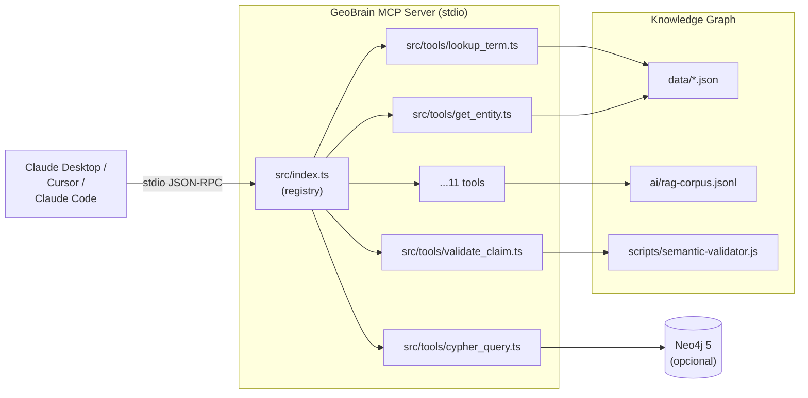

# MCP Server

O **GeoBrain MCP Server** expõe a base de conhecimento como **11 ferramentas de IA** acessíveis a qualquer cliente compatível com [Model Context Protocol](https://modelcontextprotocol.io) (Claude Desktop, Cursor, Claude Code CLI, etc.).

📁 Diretório: [`mcp/geobrain-mcp/`](https://github.com/thiagoflc/geolytics-dictionary/tree/main/mcp/geobrain-mcp)
📁 Entrypoint: [`mcp/geobrain-mcp/src/index.ts`](https://github.com/thiagoflc/geolytics-dictionary/blob/main/mcp/geobrain-mcp/src/index.ts)
📦 Dependências: `@modelcontextprotocol/sdk`, `zod`

---

## TL;DR — em 3 passos

```bash
# 1. Build
cd mcp/geobrain-mcp && npm install && npm run build

# 2. Configure (Claude Desktop ou similar)
# Edite ~/Library/Application Support/Claude/claude_desktop_config.json:
{
  "mcpServers": {
    "geobrain": {
      "command": "node",
      "args": ["/CAMINHO/ABSOLUTO/mcp/geobrain-mcp/dist/index.js"]
    }
  }
}

# 3. Reinicie o Claude Desktop
```

A partir daí, qualquer chat tem `@geobrain.*` disponível.

---

## As 11 ferramentas

| Ferramenta                | O que faz                                                                                  | Camada principal |
| ------------------------- | ------------------------------------------------------------------------------------------ | ---------------- |
| `lookup_term`             | Busca termo no glossário ANP por PT/EN, retorna cross-URIs e descrição                    | L5               |
| `expand_acronym`          | Expande sigla O&G (ANP, BOP, FPSO, UTS, PAD…)                                              | L5/L6            |
| `get_entity`              | Recupera nó do grafo + vizinhos imediatos (1-hop)                                          | L4-L7            |
| `get_entity_neighbors`    | BFS multi-hop (1..2) com filtragem opcional por tipo de relação                             | L4-L7            |
| `validate_claim`          | Roda Semantic Validator contra texto natural                                                | L3-L6            |
| `cypher_query`            | Executa Cypher contra Neo4j local (requer `NEO4J_URI`)                                     | Multi            |
| `search_rag`              | BM25 sobre `ai/rag-corpus.jsonl` (~2.683 chunks)                                           | All              |
| `list_layers`             | Enumera as 8 camadas semânticas com cobertura                                              | Meta             |
| `crosswalk_lookup`        | Encontra termos equivalentes entre camadas (ANP → OSDU, CGI → OSDU…)                       | Cross            |
| `lookup_lithology`        | Busca em CGI Simple Lithology (437 conceitos) + OSDU mapping                                | L1b              |
| `lookup_geologic_time`    | Busca em CGI Geologic Time Scale                                                           | L1b              |

---

## Diagrama: como o MCP se encaixa



---

## Anatomia de uma tool

Exemplo: `lookup_term` (simplificado)

```typescript
// src/tools/lookup_term.ts
import { z } from "zod";
import { glossary } from "../data/loader.js";

export const lookup_term = {
  name: "lookup_term",
  description: "Search Brazilian O&G glossary by PT/EN term. Returns canonical entity + cross-layer URIs.",
  inputSchema: z.object({
    query: z.string().min(1).describe("Term to search (PT or EN)"),
    fuzzy: z.boolean().default(false),
  }),
  handler: async ({ query, fuzzy }: { query: string; fuzzy: boolean }) => {
    const results = glossary.filter(g =>
      g.label.toLowerCase().includes(query.toLowerCase()) ||
      g.synonyms?.some(s => s.toLowerCase().includes(query.toLowerCase()))
    );
    return {
      content: [{ type: "text", text: JSON.stringify(results, null, 2) }],
    };
  },
};
```

Cada tool é registrada em `src/index.ts`:

```typescript
import { lookup_term } from "./tools/lookup_term.js";
import { validate_claim } from "./tools/validate_claim.js";
// ... outras

const server = new Server({ name: "geobrain", version: "0.1.0" });
[lookup_term, validate_claim /* ... */].forEach(tool => server.registerTool(tool));
```

---

## Exemplos de uso (em Claude Desktop)

### 1. Lookup simples

```
Você: O que é "Cessão Onerosa"?
Claude: [chama @geobrain.lookup_term { query: "Cessão Onerosa" }]
        Cessão Onerosa é um regime contratual brasileiro de E&P
        instituído pela Lei 12.276/2010 com volume máximo de 5
        bilhões de boe... [resposta enriquecida com geocoverage:
        ["L5"], normative: "Lei 12.276/2010", …]
```

### 2. Multi-hop via Neo4j

```
Você: Qual o regime contratual aplicável aos blocos da Bacia de Santos?
Claude: [chama @geobrain.cypher_query]
        MATCH (b:Operational {label:'Bacia de Santos'})<-[:located_in]-
              (block:Contractual {type:'bloco'})-[:awarded_via]->
              (rod:Contractual)-[:governs]->(reg:Contractual)
        RETURN block.id, reg.label
```

### 3. Validação inline

```
Você: Posso afirmar que existem 4P de reservas no campo de Buzios?
Claude: [chama @geobrain.validate_claim { text: "4P de reservas..." }]
        ❌ Não. SPE-PRMS reconhece apenas 1P, 2P, 3P (proved/probable/possible)
        e categorias de contingent (C1C, C2C, C3C). "4P" não é categoria
        válida no padrão. Você provavelmente quis dizer 3P...
```

### 4. Crosswalk

```
Você: Qual o equivalente OSDU do termo "Bloco" da ANP?
Claude: [chama @geobrain.crosswalk_lookup { from: "L5", id: "bloco", to: "L4" }]
        Não existe equivalente OSDU direto. "Bloco" é um conceito
        contratual brasileiro (L5). O conceito mais próximo
        seria osdu:reference-data--BasinType (mas é geológico, não contratual).
```

---

## Configuração avançada

### Ambiente

| Variável         | Default                  | Uso                                                |
| ---------------- | ------------------------ | -------------------------------------------------- |
| `GEOBRAIN_DATA`  | `<repo>/data`            | Caminho para `data/*.json`                         |
| `GEOBRAIN_AI`    | `<repo>/ai`              | Caminho para `rag-corpus.jsonl` etc.               |
| `NEO4J_URI`      | (não-set: tool desabilitada) | Conecta `cypher_query` ao Neo4j. Ex.: `bolt://localhost:7687` |
| `NEO4J_USER`     | `neo4j`                  | Username Neo4j                                     |
| `NEO4J_PASSWORD` | `geobrain123`            | Senha Neo4j                                        |
| `MCP_LOG_LEVEL`  | `info`                   | `debug` para diagnosticar tools                    |

### Configuração JSON (Claude Desktop)

```json
{
  "mcpServers": {
    "geobrain": {
      "command": "node",
      "args": ["/Users/eu/geobrain/mcp/geobrain-mcp/dist/index.js"],
      "env": {
        "NEO4J_URI": "bolt://localhost:7687",
        "NEO4J_PASSWORD": "geobrain123"
      }
    }
  }
}
```

---

## Como testar uma tool isoladamente

```bash
# Inicia o server em modo dev
cd mcp/geobrain-mcp
npm run dev

# Em outro terminal, manda uma chamada JSON-RPC manualmente
echo '{"jsonrpc":"2.0","id":1,"method":"tools/call","params":{"name":"lookup_term","arguments":{"query":"PAD"}}}' \
  | node dist/index.js
```

---

## Ferramentas em desenvolvimento (roadmap)

- `entity_diff` — comparar duas entidades para diff semântico
- `validate_batch` — rodar validate_claim sobre lista de claims
- `path_explanation` — explicar em PT-BR o caminho de Cypher resultante
- `osdu_kind_lookup` — buscar OSDU kind por categoria

Issues: [github.com/thiagoflc/geolytics-dictionary/issues](https://github.com/thiagoflc/geolytics-dictionary/issues)

---

## Padrões importantes

### 🟢 Determinismo das tools

Todas as tools são determinísticas (mesma entrada → mesma saída). Sem chamadas a APIs externas em runtime. Sem LLM dentro das tools.

### 🟢 Schemas Zod

Validação de input via Zod. Erros de input retornam mensagens claras antes do handler rodar.

### 🟢 stdio transport

MCP via stdio é o padrão recomendado pelo protocolo. Sem network overhead. O processo é spawned pelo client.

### 🟢 Bundling

Build via `tsc` para `dist/`. Sem bundler externo (Vite/webpack). Distribuível via npm publish.

---

## Troubleshooting

| Sintoma                                       | Causa                                              | Fix                                                |
| --------------------------------------------- | -------------------------------------------------- | -------------------------------------------------- |
| Claude Desktop "Server crashed"               | Path incorreto no JSON                             | Use **absolute path** para `dist/index.js`         |
| Tools não aparecem                            | Build não rodou                                    | `cd mcp/geobrain-mcp && npm run build`             |
| `cypher_query` falha com `ECONNREFUSED`        | Neo4j não está rodando                             | `docker compose up`                                |
| `lookup_term` retorna vazio                   | `GEOBRAIN_DATA` aponta para diretório errado       | Confirme caminho ou unset para usar default         |
| TypeError em runtime                          | Versão antiga do node (< 18)                       | Upgrade para Node 20 LTS                           |

---

> **Próximo:** ver as tools em ação dentro do [[LangGraph Agent]] ou no [[Python Package]].
