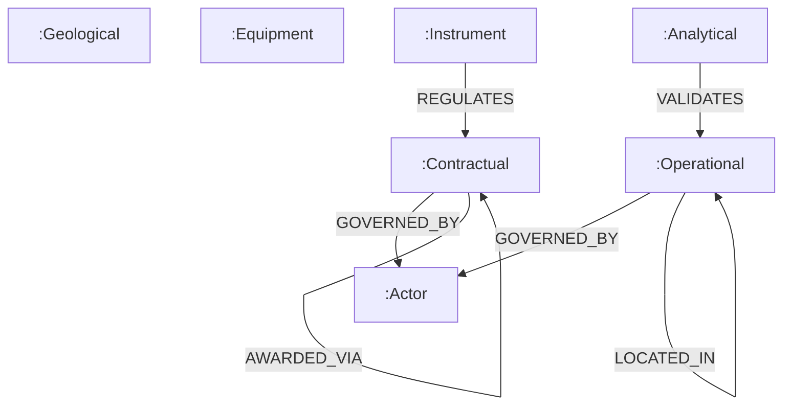

# Neo4j Setup

Subir o grafo de conhecimento no **Neo4j 5 Community** para queries Cypher multi-hop, exploração no Browser e backend para o agente LangGraph.

📁 Compose: [`docker-compose.yml`](https://github.com/thiagoflc/geolytics-dictionary/blob/main/docker-compose.yml)
📁 Builder: [`scripts/build-neo4j.js`](https://github.com/thiagoflc/geolytics-dictionary/blob/main/scripts/build-neo4j.js)
📁 Queries: [`docs/queries/*.cypher`](https://github.com/thiagoflc/geolytics-dictionary/tree/main/docs/queries)

---

## Em 4 comandos

```bash
# 1. Gerar Cypher loaders a partir do entity-graph
node scripts/build-neo4j.js

# 2. Subir Neo4j + loader (em background)
docker compose up -d

# 3. Acessar Browser
open http://localhost:7474
# login: neo4j / senha: geobrain123

# 4. Verificar contagem
docker exec geobrain-neo4j cypher-shell -u neo4j -p geobrain123 \
  "MATCH (n) RETURN count(n)"
# → ~221
```

---

## O que está no `docker-compose.yml`

```yaml
services:
  neo4j:
    image: neo4j:5-community
    ports:
      - "7474:7474"   # HTTP Browser
      - "7687:7687"   # Bolt protocol
    environment:
      NEO4J_AUTH: neo4j/geobrain123
      NEO4J_PLUGINS: '["apoc"]'
    volumes:
      - neo4j-data:/data
      - ./build/neo4j:/var/lib/neo4j/import
    healthcheck:
      test: ["CMD", "wget", "--spider", "http://localhost:7474"]
      interval: 10s
      retries: 12

  loader:
    image: neo4j:5-community
    depends_on:
      neo4j:
        condition: service_healthy
    volumes:
      - ./build/neo4j:/var/lib/neo4j/import
    command: >
      cypher-shell -a bolt://neo4j:7687 -u neo4j -p geobrain123
      -f /var/lib/neo4j/import/nodes.cypher
      -f /var/lib/neo4j/import/relationships.cypher
```

> O **loader** é um sidecar que aguarda o Neo4j ficar saudável e roda os Cypher de carga.

---

## Como funciona o `build-neo4j.js`

Lê `data/entity-graph.json` e emite dois arquivos:

```
build/neo4j/
├── nodes.cypher           # ~221 MERGE statements
└── relationships.cypher   # ~370 CREATE statements
```

Pseudocódigo:
```js
// scripts/build-neo4j.js
const graph = require('../data/entity-graph.json');

graph.nodes.forEach(n => {
  emitNode(`MERGE (n:${n.type} {id:'${esc(n.id)}'})
           ON CREATE SET n += ${propMap(n)}`);
});

graph.relations.forEach(r => {
  emitRel(`MATCH (a {id:'${r.from}'}), (b {id:'${r.to}'})
          MERGE (a)-[:${r.rel.toUpperCase()}]->(b)`);
});
```

Uso de `MERGE` em vez de `CREATE` torna o load idempotente — pode rodar múltiplas vezes sem duplicar.

---

## Modelo de grafo no Neo4j



> Labels = tipos do grafo. Relação types em UPPERCASE (convenção Cypher).

Cada nó tem propriedades:
- `id` (kebab-case)
- `label` (human-readable)
- `description`
- `geocoverage` (lista)
- `petrokgraph_uri`, `osdu_kind`, etc.

---

## Queries de exemplo

### Multi-hop: poço → bloco → bacia → regime

```cypher
MATCH path = shortestPath(
  (p:Operational {id:'poco'})-[*]-
  (r:Contractual {id:'regime-contratual'})
)
RETURN [n IN nodes(path) | n.label] AS hops
```

### Cobertura por camada

```cypher
MATCH (n)
UNWIND n.geocoverage AS layer
RETURN layer, count(*) AS nodes_in_layer
ORDER BY layer
```

### Entidades sem mapping OSDU (gaps de crosswalk)

```cypher
MATCH (n) WHERE n.osdu_kind IS NULL AND 'L5' IN n.geocoverage
RETURN n.label, n.geocoverage
ORDER BY n.label
```

### Cascata regulatória (Lei → ANP → SIGEP)

```cypher
MATCH path = (lei:Instrument {id:'lei-9478-1997'})
            -[:REGULATES|:SPECIALIZES*1..4]->(s)
RETURN path
```

> 10 queries comentadas em PT-BR: [docs/queries/](https://github.com/thiagoflc/geolytics-dictionary/tree/main/docs/queries)

---

## Conectar via driver Python

```python
from neo4j import GraphDatabase

driver = GraphDatabase.driver(
    "bolt://localhost:7687",
    auth=("neo4j", "geobrain123"),
)

with driver.session() as s:
    result = s.run("MATCH (n:Contractual) RETURN n.id, n.label LIMIT 10")
    for r in result:
        print(r["n.id"], r["n.label"])

driver.close()
```

---

## Conectar via MCP

A tool `cypher_query` do MCP Server conecta automaticamente se `NEO4J_URI` estiver setada:

```json
{
  "mcpServers": {
    "geobrain": {
      "command": "node",
      "args": ["/path/to/dist/index.js"],
      "env": {
        "NEO4J_URI": "bolt://localhost:7687",
        "NEO4J_USER": "neo4j",
        "NEO4J_PASSWORD": "geobrain123"
      }
    }
  }
}
```

Em Claude Desktop, basta:
```
@geobrain.cypher_query "MATCH (n:Contractual) RETURN n.label"
```

---

## Acessando do agente LangGraph

```bash
export NEO4J_URI=bolt://localhost:7687
cd examples/langgraph-agent && python run_demo.py
```

Sem `NEO4J_URI`, o agente cai em fallback NetworkX in-memory (mais lento mas suficiente para demos).

---

## Limpeza & rebuild

```bash
# Stop + remove containers
docker compose down

# Stop + remove containers + volume (apaga dados)
docker compose down -v

# Rebuild Cypher loader e re-up
node scripts/build-neo4j.js
docker compose up -d
```

---

## Plugins APOC

[`docker-compose.yml`](https://github.com/thiagoflc/geolytics-dictionary/blob/main/docker-compose.yml) habilita APOC:

```yaml
NEO4J_PLUGINS: '["apoc"]'
NEO4J_dbms_security_procedures_unrestricted: apoc.*
```

Útil para:
- `apoc.path.expandConfig` — expansões customizadas
- `apoc.export.cypher.all` — backup
- `apoc.text.fuzzyMatch` — busca fuzzy

---

## Performance

- **Load inicial:** ~2 s (~221 nós + ~370 rels)
- **Query simples** (1 hop): < 5 ms
- **Multi-hop até 4 níveis:** < 20 ms
- **Memória heap:** 512 MB inicial, 1 GB max — generoso para um grafo deste tamanho

---

## Troubleshooting

| Sintoma                                          | Causa                                       | Fix                                                       |
| ------------------------------------------------ | ------------------------------------------- | --------------------------------------------------------- |
| `unable to connect to bolt://localhost:7687`     | Container não subiu                          | `docker compose ps` → verificar status                    |
| Loader exit 1 com `Authentication failed`        | Mudou senha mas volume tem cache antigo     | `docker compose down -v` + recriar                        |
| Browser pede mudar senha no primeiro login       | Comportamento default                       | Configure `NEO4J_AUTH=neo4j/geobrain123` (já está)       |
| `MATCH` retorna 0 resultados                      | Loader não rodou                             | `docker logs geobrain-loader` → ver erros                  |
| Cypher lento                                     | Falta de índice                              | `CREATE INDEX FOR (n:Contractual) ON (n.id)`               |

---

## Boas práticas

### 🟢 Crie índices

```cypher
CREATE INDEX entity_id IF NOT EXISTS FOR (n) ON (n.id);
CREATE INDEX contractual_id IF NOT EXISTS FOR (n:Contractual) ON (n.id);
```

### 🟢 Use `MERGE` em loaders

Idempotência garantida.

### 🟢 Sempre filtre por type

`MATCH (n:Contractual)` é muito mais rápido que `MATCH (n)`.

### 🟢 LIMIT em queries exploratórias

Evita "explosão" de resultados em multi-hop.

---

> **Próximo:** explorar com [[Use Cases|casos de uso]] ou ver [[REST API]] como alternativa sem Neo4j.
