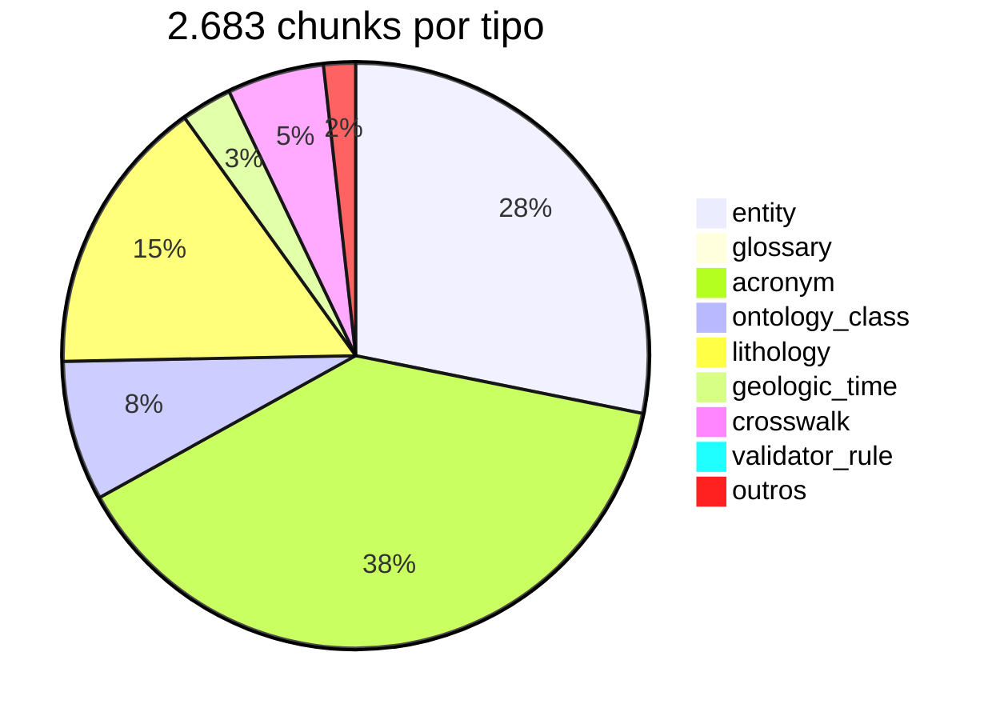

# RAG Corpus

A pasta [`ai/`](https://github.com/thiagoflc/geolytics-dictionary/tree/main/ai) contém dados pré-processados para alimentar pipelines de IA — **corpus RAG**, system prompts, mapas de ontologia e exemplos few-shot.

---

## Conteúdo de `ai/`

| Arquivo                            | Tamanho | Para que serve                                                              |
| ---------------------------------- | ------- | --------------------------------------------------------------------------- |
| `rag-corpus.jsonl`                 | ~1.7 MB | **Corpus principal**: 2.683 chunks pré-processados para embeddings/BM25     |
| `system-prompt-en.md`              | ~6 KB   | System prompt em inglês (~700 tokens)                                       |
| `system-prompt-ptbr.md`            | ~12 KB  | System prompt PT-BR (~800 tokens) — recomendado                             |
| `ontology-map.json`                | ~17 KB  | Mapa de camadas + hierarquia de classes (contexto compacto para LLM)        |
| `text2cypher-fewshot.jsonl`        | ~49 KB  | 80 exemplos `(pergunta, cypher)` para fine-tuning Text2Cypher                |
| `text2sparql-fewshot.jsonl`        | ~18 KB  | Variante SPARQL                                                              |
| `graph-schema.md`                  | ~15 KB  | Schema do entity-graph em prosa (para LLMs lerem)                            |
| `graph-schema-sparql.md`           | ~13 KB  | Schema RDF/OWL em prosa                                                      |

---

## `rag-corpus.jsonl` — formato

Um chunk por linha:

```jsonl
{"id":"glossary-bloco","text":"Bloco (ANP). Unidade administrativa de exploração da ANP, instituída pela Lei 9.478/1997...","type":"glossary","metadata":{"layer":"L5","entity_id":"bloco","sources":["Lei 9.478/1997 art. 25"]}}
{"id":"entity-poco","text":"Poço (Wellbore). Estrutura física vertical ou direcional...","type":"entity","metadata":{"layer":["L4","L5"],"type":"Operational","petrokgraph_uri":"...","osdu_kind":"osdu:work-product-component--Wellbore:1.0.0"}}
{"id":"acronym-PAD","text":"PAD pode significar: 1) Plano de Avaliação de Descoberta (instrumento contratual ANP, L5); 2) Drilling Pad (plataforma física, L4)...","type":"acronym","metadata":{"acronym":"PAD","ambiguous":true}}
```

### Tipos de chunk

| `type`             | O que contém                                                            |
| ------------------ | ----------------------------------------------------------------------- |
| `glossary`         | Termo + descrição (do `data/glossary.json`)                              |
| `entity`           | Nó do grafo + descrição + cross-URIs                                     |
| `acronym`          | Sigla + todas expansões + contextos                                     |
| `relation_path`    | Trecho descrevendo um caminho típico (ex.: poço → bloco → bacia)         |
| `ontology_class`   | Classe O3PO/Geomec + hierarquia                                          |
| `lithology`        | Conceito CGI Simple Lithology                                            |
| `geologic_time`    | Período geológico (com Pré-sal brasileiro como nota)                     |
| `crosswalk`        | Mapping entre camadas (ANP↔OSDU, CGI↔OSDU…)                              |
| `validator_rule`   | Regra do Semantic Validator (ID + descrição)                             |

### Distribuição



---

## Como carregar em LangChain

```python
from langchain.schema import Document
import json

docs = []
with open('ai/rag-corpus.jsonl') as f:
    for line in f:
        chunk = json.loads(line)
        docs.append(Document(
            page_content=chunk['text'],
            metadata={'id': chunk['id'], 'type': chunk['type'], **chunk['metadata']}
        ))

# Indexar com FAISS + OpenAI Embeddings
from langchain.vectorstores import FAISS
from langchain.embeddings import OpenAIEmbeddings

vs = FAISS.from_documents(docs, OpenAIEmbeddings())
results = vs.similarity_search("regime contratual partilha de produção", k=5)
```

---

## Como carregar em LlamaIndex

```python
from llama_index.core import Document, VectorStoreIndex
import json

documents = []
with open('ai/rag-corpus.jsonl') as f:
    for line in f:
        c = json.loads(line)
        documents.append(Document(text=c['text'], metadata={'id': c['id'], **c['metadata']}))

index = VectorStoreIndex.from_documents(documents)
query_engine = index.as_query_engine()
response = query_engine.query("Quais são as obrigações de UTS no PE-1?")
```

---

## BM25 simples (sem embeddings)

```python
from rank_bm25 import BM25Okapi
import json

corpus = []
with open('ai/rag-corpus.jsonl') as f:
    for line in f:
        corpus.append(json.loads(line))

texts = [c['text'].split() for c in corpus]
bm25 = BM25Okapi(texts)

query = "regime contratual partilha de produção".split()
scores = bm25.get_scores(query)
top = sorted(zip(corpus, scores), key=lambda x: -x[1])[:5]
for c, s in top:
    print(f"{s:.2f}", c['id'], c['text'][:80])
```

> Variante usada **internamente** pelo MCP tool `search_rag` e pelo nó `RAGRetrieve` do agente.

---

## System prompts

### `system-prompt-ptbr.md` (recomendado)

Otimizado para Claude/GPT-4 atuando como agente GeoBrain. Estrutura:

```markdown
# Você é o agente GeoBrain
## Papel
## Camadas semânticas (L1..L7)
## Ferramentas disponíveis (lookup, validate, cypher)
## Heurísticas de routing
## Validador como guardrail (sempre aplicar)
## Política de citações
## Exemplos few-shot
```

~800 tokens. Carregue como system message:

```python
with open('ai/system-prompt-ptbr.md') as f:
    system_prompt = f.read()

response = anthropic.messages.create(
    model="claude-opus-4-7-20251101",
    system=system_prompt,
    messages=[{"role": "user", "content": "..."}],
)
```

---

## `ontology-map.json` — contexto compacto para LLM

Versão sumarizada do grafo + camadas, otimizada para caber em prompt sem tokens demais:

```json
{
  "layers": {
    "L1": {"name": "BFO + GeoCore", "concepts": ["material entity", "process", "quality", ...]},
    "L1b": {"name": "GeoSciML / CGI", "size": 437},
    ...
  },
  "entity_types": ["Operational", "Geological", "Contractual", "Actor", "Equipment", "Instrument", "Analytical"],
  "relation_types": ["governed_by", "located_in", "awarded_via", "regulates", ...],
  "key_concepts": {
    "L5": ["bloco", "pad", "contrato-ep", "uts", "regime-contratual", ...]
  }
}
```

Útil para system prompts de até 1.500 tokens onde o grafo completo não caberia.

---

## Few-shot Text2Cypher

`text2cypher-fewshot.jsonl` — 80 pares para in-context learning:

```jsonl
{"question":"Quais blocos estão na Bacia de Santos?","cypher":"MATCH (b:Contractual {type:'bloco'})-[:located_in]->(bs:Geological {label:'Bacia de Santos'}) RETURN b.label, b.id"}
{"question":"Liste os equipamentos da árvore de natal molhada","cypher":"MATCH (e:Equipment)-[:part_of]->(:Equipment {id:'xmas-tree'}) RETURN e.label"}
```

Use os primeiros 5-10 exemplos como contexto in-prompt para um LLM converter perguntas em Cypher.

---

## Few-shot Text2SPARQL

Variante para usuários com triplestore RDF (Apache Jena, Stardog, Blazegraph):

```jsonl
{"question":"List all Operational entities with PetroKGraph URI","sparql":"PREFIX geo: <https://geobrain.org/ontology#> SELECT ?e ?label WHERE { ?e a geo:Operational ; rdfs:label ?label ; geo:petrokgraph_uri ?uri . }"}
```

---

## Padrões importantes

### 🟢 Determinismo

`rag-corpus.jsonl` é gerado por `scripts/generate.js`. Mesma fonte → mesmo corpus.

### 🟢 Metadata rica

Cada chunk carrega layer, type, sources. Permite filtragem pré-RAG (ex.: "apenas chunks da L5").

### 🟢 Tipos heterogêneos no mesmo corpus

`glossary`, `entity`, `acronym`, `relation_path` num único arquivo simplifica integração. Apps filtram com `type` em metadata.

### 🟢 PT-BR primeiro

Descrições em português. Inglês fica em campo `synonyms` ou em arquivos `*-en.md` quando necessário.

---

## Como atualizar

Não edite `ai/rag-corpus.jsonl` à mão. É **gerado**. Para adicionar conteúdo:

1. Adicione nova entidade em `scripts/generate.js` (`ENTITY_NODES`).
2. Rode `node scripts/generate.js`.
3. Verifique novo chunk em `ai/rag-corpus.jsonl`.

Para mudar **chunking strategy** (tamanho de chunk, tipo de pré-processamento):
1. Edite a função `buildRagCorpus()` em `scripts/generate.js`.
2. Atualize testes `tests/test_rag_ontology_chunks.test.js`.
3. CI verifica que o corpus regenerado bate com o esperado.

---

## Roadmap

- [ ] Versões com embeddings pré-computados (Anthropic, OpenAI, BGE-M3)
- [ ] Chunks multimodais (incluindo diagramas SVG dos docs)
- [ ] Variante translinguagem (PT/EN paralelo)
- [ ] Densidade de chunk ajustável (256/512/1024 tokens)

---

## Troubleshooting

| Sintoma                                       | Causa                                | Fix                                              |
| --------------------------------------------- | ------------------------------------ | ------------------------------------------------ |
| BM25 retorna 0 resultados                     | Query muito específica                | Use sinônimos PT/EN; tokens menos raros          |
| Embeddings ruins (similarity ≈ 0)              | Modelo não suporta PT bem            | Use `text-embedding-3-large` ou BGE-M3 multi-lingual |
| RAG retorna chunks de camadas erradas          | Falta filter em metadata             | Adicione `where: lambda d: d.metadata['layer'] == 'L5'` |

---

> **Próximo:** rodar o agente que consome este corpus em [[LangGraph Agent]] ou usar via [[MCP Server]].
