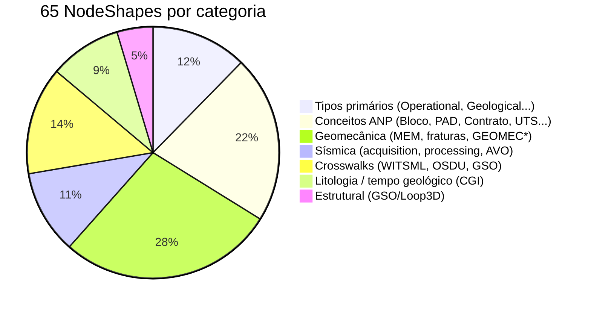

# SHACL Validation

SHACL (*Shapes Constraint Language*, W3C Rec.) é o padrão para validar grafos RDF. O GeoBrain mantém **65 NodeShapes** que verificam estrutural e ontologicamente a base de conhecimento a cada commit.

📁 Documentação completa: [docs/SHACL.md](https://github.com/thiagoflc/geolytics-dictionary/blob/main/docs/SHACL.md)
📁 Shapes: [`data/geolytics-shapes.ttl`](https://github.com/thiagoflc/geolytics-dictionary/blob/main/data/geolytics-shapes.ttl) (~134 KB)

---

## O que SHACL valida (e o Validator semântico não)

| Aspecto                                | Semantic Validator        | SHACL                          |
| -------------------------------------- | ------------------------- | ------------------------------ |
| Tipos de dado (xsd:string, xsd:date)   |                           | ✅                             |
| Cardinalidades (`minCount`, `maxCount`)|                           | ✅                             |
| Domain/range de propriedades            |                           | ✅                             |
| Enumerações fechadas                   | ✅ (em texto)              | ✅ (em RDF)                    |
| Closed shapes (sem propriedades extras) |                           | ✅                             |
| Regras semânticas (SPE-PRMS, regime)   | ✅                         | ✅ (parcial via `sh:in`)        |
| Texto natural                           | ✅                         |                                |

> Em síntese: **SHACL valida o grafo**; **Semantic Validator valida claims em texto**.

---

## Rodar a validação

### Localmente

```bash
pip install -r scripts/requirements.txt
python scripts/validate-shacl.py
```

Saída típica:
```
✓ Loading data: data/geolytics.ttl
✓ Loading shapes: data/geolytics-shapes.ttl
✓ Validating with pyshacl...
✓ Conformance: True
✓ 0 violations, 0 warnings
```

### Via Node.js wrapper

```bash
node scripts/validate-shacl.js
```

### Em CI

[`.github/workflows/validate-ontology.yml`](https://github.com/thiagoflc/geolytics-dictionary/blob/main/.github/workflows/validate-ontology.yml) roda `pyshacl` em todo PR:

```yaml
- name: SHACL validation
  run: python scripts/validate-shacl.py --strict
```

---

## Anatomia de uma NodeShape

Exemplo simplificado para `geo:Bloco` (camada L5):

```turtle
geo:BlocoShape a sh:NodeShape ;
  sh:targetClass geo:Contractual ;
  rdfs:label "Bloco (ANP) shape" ;

  # Propriedades obrigatórias
  sh:property [
    sh:path rdfs:label ;
    sh:datatype rdf:langString ;
    sh:minCount 1 ;
  ] ;

  sh:property [
    sh:path geo:layer ;
    sh:in ("L5") ;          # apenas L5 permitido
    sh:minCount 1 ;
  ] ;

  sh:property [
    sh:path geo:governed_by ;
    sh:class geo:Actor ;     # range constraint
    sh:minCount 1 ;          # obrigatório
  ] ;

  sh:property [
    sh:path geo:awarded_via ;
    sh:class geo:Contractual ;
    sh:minCount 0 ;
    sh:maxCount 1 ;
  ] ;

  # Closed: nenhuma propriedade fora desta lista
  sh:closed true ;
  sh:ignoredProperties (rdf:type rdfs:comment dcterms:source) .
```

> A partir desta shape, qualquer instância `geo:Contractual` que faltar `geo:layer`, ou tiver `geo:layer "L4"`, ou faltar `geo:governed_by`, é flagged.

---

## As 65 NodeShapes — categorias



---

## Padrões usados

### 🟢 Closed shapes

`sh:closed true` previne propriedades não previstas na ontologia. Captura erros de digitação:
- `geo:locatedIn` (errado) vs `geo:located_in` (correto)
- `geo:layerCoverage` (errado) vs `geo:geocoverage` (correto)

### 🟢 `sh:in` para enumerações

Camadas, tipos, regimes contratuais — todos via `sh:in`:

```turtle
sh:property [
  sh:path geo:regime ;
  sh:in ( "concessão" "partilha-de-produção" "cessão-onerosa" ) ;
] ;
```

### 🟢 Reference paths

Validação de domain/range usando `sh:class`:

```turtle
sh:property [
  sh:path geo:governed_by ;
  sh:class geo:Actor ;   # range deve ser Actor
] ;
```

### 🟢 Soft warnings vs. hard errors

Algumas shapes usam `sh:Warning` em vez de `sh:Violation`:

```turtle
sh:property [
  sh:path geo:osdu_kind ;
  sh:minCount 0 ;
  sh:severity sh:Warning ;
  sh:message "Conceito sem mapeamento OSDU — oportunidade de crosswalk" ;
] ;
```

> A política F12 zerou todas as warnings legítimas. Restantes são informativas.

---

## Baseline determinístico

[`tests/test_shacl_warnings_baseline.py`](https://github.com/thiagoflc/geolytics-dictionary/blob/main/tests/test_shacl_warnings_baseline.py) congela o **número exato** de warnings esperados. Qualquer drift (subiu de 0 → 1) bloqueia o PR.

Isso evita "warnings que se acumulam silenciosamente" — um anti-padrão clássico de ontologias mal-mantidas.

---

## Integração com o agente

O nó `validator_node` do LangGraph **não roda SHACL em runtime** (custo demais para cada turno). SHACL é o gate de **build**: garante que o grafo entregue ao agente esteja consistente.

Em runtime, o agente confia que:
- Toda entidade tem `geocoverage`
- Toda relação tem domain/range válidos
- Toda enumeração está fechada

E foca em validações **textuais** (semantic validator). Ver [[Semantic Validator]].

---

## Adicionando uma nova shape

1. **Decida o `sh:targetClass`** — qual classe a shape valida?
2. **Liste propriedades obrigatórias** com `sh:minCount 1`.
3. **Liste enumerações** com `sh:in`.
4. **Decida se é closed** — em geral, `true` para classes bem definidas.
5. **Adicione em `data/geolytics-shapes.ttl`** (geração automática via `scripts/generate.js`).
6. **Atualize teste de baseline** se mudar contagem de warnings.

Mais detalhes: [docs/SHACL.md](https://github.com/thiagoflc/geolytics-dictionary/blob/main/docs/SHACL.md).

---

## Histórico

- **F11**: 183 warnings (baseline inicial, herdado)
- **F12**: 183 → 0 ([PR #39](https://github.com/thiagoflc/geolytics-dictionary/pull/39))
- **Regressão protegida**: `test_shacl_warnings_baseline.py` agora exige `len(warnings) == 0`.

---

## Troubleshooting

| Erro                                                    | Causa típica                                         | Fix                                       |
| ------------------------------------------------------- | ---------------------------------------------------- | ----------------------------------------- |
| `MinCountConstraintComponent` em `geo:governed_by`     | Entidade sem actor regulador                         | Adicione relação `governed_by`            |
| `ClosedConstraintComponent` em propriedade `geo:fooo`  | Typo numa edição manual                              | Corrija o nome da propriedade             |
| `InConstraintComponent` em `geo:layer`                 | Layer fora do enum                                    | Use uma camada válida (L1..L7)            |
| `ClassConstraintComponent` em `geo:located_in`         | Range inválido (ex.: aponta para Actor em vez de Operational) | Corrija a relação                  |

---

> **Próximo:** ver o validador em ação no [[LangGraph Agent]] ou explorar o pipeline em [[ETL Pipeline]].
