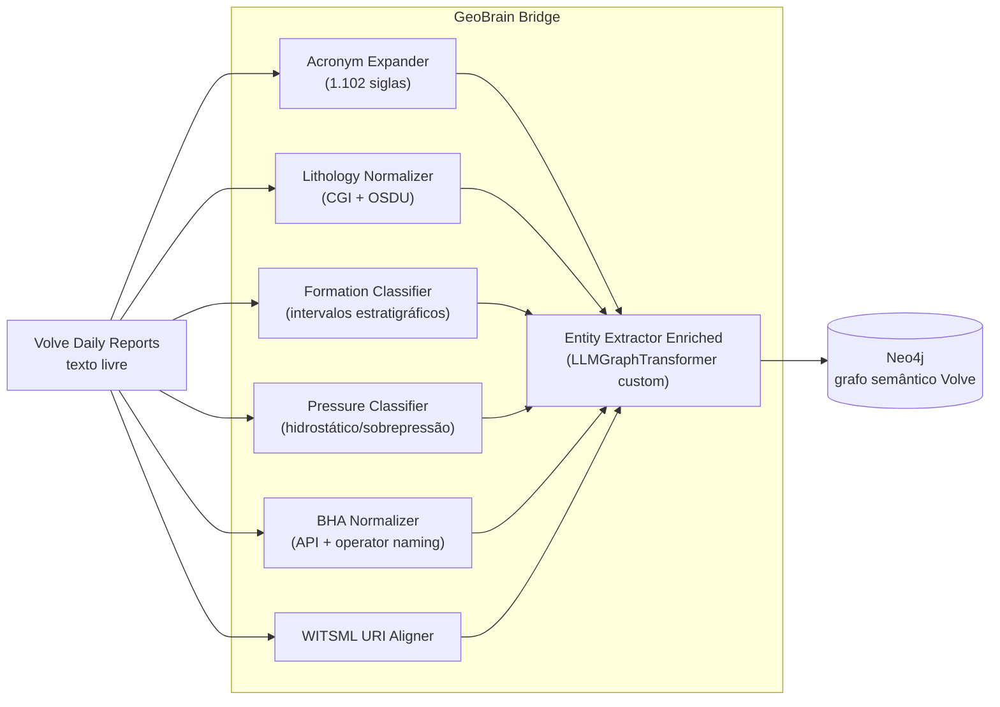

# SPE Volve Integration

A **bridge de enriquecimento semântico** entre o conjunto público SPE Volve (relatórios diários de perfuração) e a ontologia GeoBrain. Demonstra como aplicar o vocabulário GeoBrain a um dataset real de E&P.

📁 Diretório: [`integrations/spe-volve/`](https://github.com/thiagoflc/geolytics-dictionary/tree/main/integrations/spe-volve)
🚢 Implementado em F12 ([commit 84c76fc](https://github.com/thiagoflc/geolytics-dictionary/commit/84c76fc))

> **SPE Volve dataset**: relatórios diários e dados de subsuperfície do Volve field (Equinor) liberados pela SPE para pesquisa. ~5GB de dados textuais e tabulares.

---

## Por que existe

Pesquisadores que tentam construir grafo a partir de relatórios Volve via LLM puro encontram três problemas:

1. **Litologias inconsistentes** — "shale", "shaly sandstone", "claystone" precisam normalizar para CGI Simple Lithology.
2. **BHA terminology drift** — operadores usam siglas diferentes para o mesmo componente (PDC, FH, SS — Single Shoulder).
3. **Idade geológica** — relatórios mencionam "Upper Jurassic" mas grafo precisa de URI canônico CGI.

A bridge SPE Volve **enriquece** o LLMGraphTransformer (LangChain) com normalizadores GeoBrain antes da extração. Resultado: grafo Neo4j semanticamente consistente.

---

## Arquitetura



---

## Os 10 módulos

| Módulo                                | Caminho                                           | Responsabilidade                                                       |
| ------------------------------------- | ------------------------------------------------- | ---------------------------------------------------------------------- |
| `entity_extractor_enriched.py`        | `ingestion/`                                      | LLMGraphTransformer custom com tipos expandidos                        |
| `lithology_normalizer.py`             | `ingestion/`                                      | Normaliza menções de litologia para CGI + OSDU                         |
| `formation_classifier.py`             | `ingestion/`                                      | Classifica menção de formação para intervalo estratigráfico + idade   |
| `pressure_classifier.py`              | `ingestion/`                                      | Infere regime de pressão (hidrostático, sobrepressão, subnormal)        |
| `phase_role_enricher.py`              | `ingestion/`                                      | Atribui fase HC (óleo, gás, água) a equipamentos/operações             |
| `witsml_uri_aligner.py`               | `ingestion/`                                      | Liga objetos WITSML do Volve ao entity-graph do GeoBrain               |
| `bha_normalizer.py`                   | `ingestion/`                                      | Canonicaliza tipos de componentes BHA                                   |
| `inject_geolytics_rag.py`             | `ingestion/`                                      | Augmenta relatórios com RAG context para enriquecimento via LLM         |
| `acronym_expander.py`                 | `nlp/`                                            | Expande siglas usando o índice de 1.102 do GeoBrain                     |
| `agent/__init__.py`                   | `agent/`                                          | LangGraph integration (config para o desafio Volve)                     |

---

## Tipos de nós e relações expandidos

`entity_extractor_enriched.py` define o que o LLMGraphTransformer pode extrair:

### Nós (categorias)

| Categoria              | Exemplos                                             | Camada GeoBrain |
| ---------------------- | ---------------------------------------------------- | --------------- |
| `Wellbore`             | Volve well names                                     | L4 OSDU         |
| `Lithology`            | Shale, Sandstone, Limestone (canonicalized)          | L1b CGI         |
| `DrillingFluid`        | OBM, WBM, KCl-polymer                                | L4              |
| `DrillingEvent`        | Loss, kick, stuck, twist-off                         | L6 (3W aligns)  |
| `FormationAge`         | Upper Jurassic, Triassic, ...                        | L1b CGI         |
| `StratigraphicInterval`| Brent Group, Hugin Formation                         | L1b CGI         |
| `BHAComponentType`     | PDC bit, MWD, RSS                                    | L4 WITSML       |
| `Organization`         | Equinor, ExxonMobil                                  | L6              |

### Relações

- `HAS_LITHOLOGY` — Wellbore → Lithology
- `DETECTED_IN` — DrillingEvent → Wellbore (em qual TVD)
- `CORRELATES_WITH` — StratigraphicInterval → StratigraphicInterval
- `HAS_AGE` — StratigraphicInterval → FormationAge
- `USES_FLUID` — Wellbore → DrillingFluid
- `OPERATED_BY` — Wellbore → Organization
- `CONTAINS_BHA` — Wellbore → BHAComponentType

---

## Pipeline de processamento

```python
# integrations/spe-volve/runner.py (esquemático)
from langchain.experimental.graph_transformers import LLMGraphTransformer

from .ingestion.entity_extractor_enriched import EnrichedExtractor
from .ingestion.lithology_normalizer import normalize_lithology
from .ingestion.bha_normalizer import normalize_bha
# ... etc

def process_report(report_text: str):
    # 1. Pre-process: expandir siglas, normalizar litologias e BHA
    text = expand_acronyms(report_text)
    text = normalize_lithology(text)
    text = normalize_bha(text)

    # 2. Inject GeoBrain RAG context
    context = inject_geolytics_rag(text)

    # 3. Extract com LLMGraphTransformer enriquecido
    transformer = EnrichedExtractor(llm=llm, allowed_nodes=NODES, allowed_relationships=RELS)
    graph_doc = transformer.convert_to_graph_documents([Document(page_content=text + context)])

    # 4. Pos-process: align WITSML URIs
    aligned = align_witsml_uris(graph_doc)

    # 5. Persist no Neo4j
    write_to_neo4j(aligned)
```

---

## Worked example

Trecho do relatório Volve (real, simplificado):
```
"Drilling 8 1/2" hole. Encountered 50' of shaly sandstone with
intercalated mudstones at 2890m MD. Picked up MWD/LWD assembly with
PDC bit. Mud weight 1.42 sg, ECD 1.55 sg."
```

### Sem bridge:
LLMGraphTransformer extrai nós como `"shaly sandstone"`, `"mudstones"`, `"PDC bit"`. Cada um vira um nó textual sem URI canônica.

### Com bridge:

| Mention                  | Normalização GeoBrain                                                                                  |
| ------------------------ | ------------------------------------------------------------------------------------------------------ |
| `"shaly sandstone"`      | `cgi:lithology:shaly_sandstone` (URI canônico) + OSDU `osdu:reference-data--LithologyType:Sandstone`   |
| `"mudstones"`            | `cgi:lithology:mudstone`                                                                                |
| `"PDC bit"`              | `witsml:Bit/PDC` + GeoBrain entity `bit-pdc`                                                            |
| `"MWD/LWD assembly"`     | `witsml:LoggingWhileDrilling`                                                                           |
| `"ECD 1.55 sg"`           | Trigger pressure classifier → flag de overbalance moderada                                              |

Resultado: grafo Neo4j com URIs canônicos, validado por SHACL, queryable em multi-hop.

---

## Como rodar

```bash
cd integrations/spe-volve

# Setup
pip install -r requirements.txt

# Configure LLM
export OPENAI_API_KEY=sk-...

# (Pré-requisito) Neo4j ativo
docker compose up -d   # do raiz do repo

# Roda contra um relatório de exemplo
python runner.py --input examples/sample_dgr.txt
```

Saída no Browser Neo4j:
```cypher
MATCH (w:Wellbore)-[:HAS_LITHOLOGY]->(l:Lithology)
WHERE w.name = 'NO 15/9-F-1'
RETURN w.name, l.label, l.cgi_uri
```

---

## Casos de teste

`integrations/spe-volve/tests/`:
- `test_lithology_normalizer.py` — 50+ casos PT/EN
- `test_bha_normalizer.py` — siglas vs nomes completos
- `test_pressure_classifier.py` — regimes hidrostático/sobre/sub
- `test_acronym_expander.py` — desambiguação contextual

CI roda em [`.github/workflows/test-langgraph.yml`](https://github.com/thiagoflc/geolytics-dictionary/blob/main/.github/workflows/test-langgraph.yml).

---

## Padrões importantes

### 🟢 Bridge antes de extração

Pre-processar o texto com normalizadores **antes** do LLMGraphTransformer reduz alucinação e padroniza URIs.

### 🟢 Tipos closed pelo extractor

`allowed_nodes` e `allowed_relationships` no LLMGraphTransformer **fecham** o tipo de saída. LLM não inventa categorias novas.

### 🟢 Crosswalks bilaterais

Lithology mapping é bilateral: dado CGI URI, recupera OSDU kind; dado OSDU kind, recupera CGI URI.

### 🟢 Não substitui o agente — alimenta-o

Após extração, o grafo Neo4j enriquecido fica disponível para queries do LangGraph Agent. Mesma topologia. Dados melhores.

---

## Roadmap

- [ ] Aplicar a outros datasets públicos (NPD Volve, Force-2020 Lithofacies)
- [ ] Crosswalk bidirectional WITSML 1.4.x ↔ WITSML 2.0
- [ ] Confidence scoring por mention
- [ ] Integração com SPE PetroBowl Q&A datasets

---

## Lições aprendidas

A integração F12 corrigiu três code-review issues comuns em projetos similares:

1. **Strict-mode JSON parsing** — não tolerar entries malformadas; loga e segue.
2. **URI escape em regex** — `cgi:lithology:shaly_sandstone` precisa escape em regex Python (caractere `:`).
3. **Idempotência do MERGE** — sempre `MERGE` em vez de `CREATE` para tolerar reruns.

Detalhes: [PR #40 commits](https://github.com/thiagoflc/geolytics-dictionary/pull/40).

---

> **Próximo:** ver mais [[Use Cases|casos de uso]] ou explorar [[Knowledge Graph|o grafo de conhecimento]].
