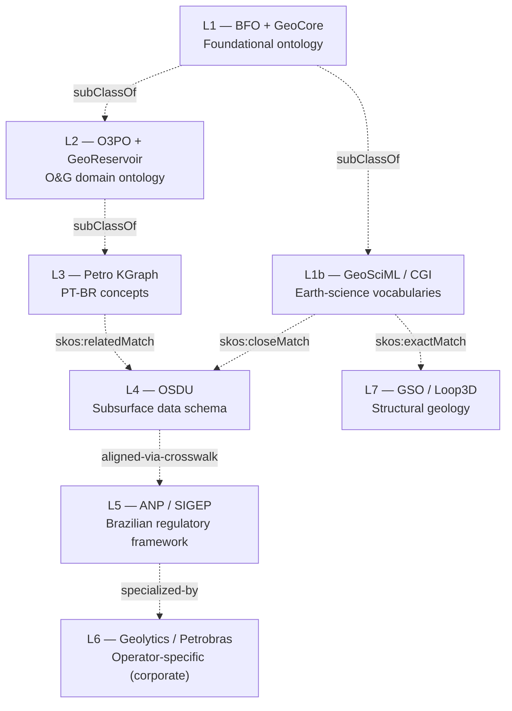

# 8 Camadas Semânticas

A arquitetura central do GeoBrain organiza o conhecimento em **8 camadas independentes mas alinhadas** (BFO → GSO). Cada termo carrega o atributo `geocoverage: ["L3","L4","L5"]`, indicando em **quais camadas** ele existe formalmente.

> 💡 **Por que camadas?** Diferentes públicos precisam de diferentes vocabulários. O regulador (ANP) usa "Bloco" e "Contrato"; OSDU usa `Wellbore` e `Wellbore.kind`; BFO usa `BFO_0000040 (material entity)`. Camadas permitem servir todos sem perder o link.

---

## Resumo das camadas

| Camada | Nome                                 | Origem                              | Foco                                 | Quantidade típica |
| ------ | ------------------------------------ | ----------------------------------- | ------------------------------------ | ----------------- |
| **L1** | BFO + GeoCore                        | UFRGS/BDI + Geosiris                | Ontologia formal de alto nível       | ~80 classes       |
| **L1b**| GeoSciML / CGI                       | CGI/IUGS                            | Litologia, tempo geológico, falhas   | 437 + 213 termos  |
| **L2** | O3PO + GeoReservoir                  | UFRGS/BDI                           | Domínio O&G genérico                 | ~120 classes      |
| **L3** | Petro KGraph                         | PUC-Rio / PetroNLP                  | Conceitos PT-BR de O&G               | 539 conceitos     |
| **L4** | OSDU                                 | The Open Group                      | Schema de dados IT                   | ~150 kinds        |
| **L5** | ANP / SIGEP                          | ANP — Lei 9.478/1997                | Marco regulatório brasileiro         | 23 termos         |
| **L6** | Geolytics / Petrobras                | Interno + Petrobras 3W              | Operacional corporativo              | ~80 entidades     |
| **L7** | GSO / Loop3D                         | ARDC / GeoScience Australia         | Estrutural (falhas, dobras, contatos)| 213 classes       |

---

## Diagrama: como as camadas se relacionam



> Linhas tracejadas representam alinhamentos `skos:exactMatch`, `skos:closeMatch` ou `subClassOf`. Não são herança rígida — são **bridges semânticas**.

---

## Camada por camada — explicação didática

### L1 · BFO + GeoCore — *Por que ela existe?*

Toda ontologia precisa de uma "raiz" para responder perguntas como:
*"Um Poço é uma `coisa material`, um `processo`, ou um `evento`?"*

**BFO** (Basic Formal Ontology) responde: poço é `material entity` (BFO_0000040). Perfuração é `process` (BFO_0000015). Resultado de uma análise é `quality` (BFO_0000019).

**GeoCore** especializa BFO para geociências (GeologicalUnit, GeologicalEvent, etc.).

📁 **Onde mora:** `data/ontopetro.json` (módulo `bfo`), `data/geolytics-vocab.ttl`

🔗 **Exemplo de uso:** Validar consistência entre módulos. Se "PerfuracaoDePoco" está marcado como `material entity` em vez de `process`, o validador rejeita.

---

### L1b · GeoSciML / CGI — *Vocabulário de geociências*

CGI (Commission for the Management and Application of Geoscience Information) mantém vocabulários internacionais para:

- **Lithology** — 437 conceitos (granito, calcário, arenito…)
- **Geologic time** — escala cronoestratigráfica completa (Pré-Cambriano → Quaternário)
- **Fault type** — falha normal, transcorrente, inversa
- **Stratigraphic rank** — formação, grupo, membro
- **Contact type** — discordância, contato litológico

📁 **Onde mora:** `data/cgi-lithology.json`, `data/cgi-geologic-time.json`, `data/cgi-fault-type.json`, etc.

🔗 **Crosswalk útil:** `data/cgi-osdu-lithology-map.json` — 152 mapeamentos bilaterais CGI ↔ OSDU.

---

### L2 · O3PO + GeoReservoir — *Domínio O&G "neutro"*

Onde estão os conceitos genéricos de E&P, sem viés de fornecedor ou regulador:

- `Reservoir`, `Trap`, `SealRock`, `MigrationPath`
- `WellLog`, `LoggingTool`, `CoreSample`
- `Geomechanics_1D_Model`, `MEM` (Mechanical Earth Model)

L2 é a "lingua franca" entre acadêmicos e indústria internacional.

📁 **Onde mora:** `data/ontopetro.json` (módulos `o3po`, `geomec`), `data/geomechanics.json`

---

### L3 · Petro KGraph — *Conceitos em português brasileiro*

Mantida pelo grupo PetroNLP da PUC-Rio, é a maior coleção pública de termos de O&G em PT-BR (539 conceitos). Alinhamento via campo `petrokgraph_uri`.

🔗 **Crosswalk:** todo termo em `data/glossary.json` ou `data/entity-graph.json` com cobertura PT-BR carrega `petrokgraph_uri`.

---

### L4 · OSDU — *Schema de dados IT*

OSDU é o padrão de dados subsuperficiais adotado por majors (Shell, Equinor, ExxonMobil…). Define `kinds` como `osdu:work-product-component--Wellbore:1.0.0`.

📁 **Crosswalks no GeoBrain:**
- `data/witsml-rdf-crosswalk.json` — 25 classes WITSML 2.0 → `geo:`
- `data/prodml-rdf-crosswalk.json` — 15 classes PRODML 2.x → `geo:`
- `data/anp-osdu-wellstatus-map.json` — status ANP ↔ OSDU
- `data/cgi-osdu-lithology-map.json` — litologia CGI ↔ OSDU

🔗 **Por que importa:** integradores OSDU recebem termos ANP e precisam saber qual `kind` aplicar.

---

### L5 · ANP / SIGEP — *Brasil-específico*

A camada onde nasce o GeoBrain. **11 conceitos não existem em nenhuma outra camada:**

| Termo                       | Por quê é único?                                                              |
| --------------------------- | ----------------------------------------------------------------------------- |
| **Bloco**                   | Unidade administrativa de exploração ANP, não tem equivalente OSDU direto.    |
| **PAD**                     | Plano de Avaliação de Descoberta — instrumento contratual brasileiro.          |
| **Contrato E&P**            | Concessão / Partilha / Cessão Onerosa (Lei 9.478/1997, Lei 12.351/2010).      |
| **Rodada de Licitação**     | Leilão público de áreas de E&P (R1 a R17).                                    |
| **UTS**                     | Unidade de Trabalho Sísmico — métrica contratual ANP.                          |
| **Regime Contratual**       | Concessão, Partilha, Cessão Onerosa.                                           |
| **Períodos Exploratórios**  | PE-1, PE-2, PE-3 — fases temporais com obrigações ANP.                         |
| **Processo Sancionador**    | Ritual administrativo da ANP.                                                  |
| **Notificação de Descoberta** | Obrigação legal específica.                                                   |
| **Declaração de Comercialidade** | Marco para passar de exploração → produção.                              |
| **Bacia Sedimentar (catálogo ANP)** | A lista oficial brasileira difere de classificações geológicas globais. |

📁 **Onde mora:** `data/glossary.json`, `data/anp-*.json`, [docs/BRAZIL_SPECIFIC.md](https://github.com/thiagoflc/geolytics-dictionary/blob/main/docs/BRAZIL_SPECIFIC.md)

---

### L6 · Geolytics / Petrobras — *Operacional corporativo*

Modela conceitos específicos de Petrobras (sistemas internos, projetos, parcerias) e o dataset **3W v2.0.0** (CC-BY 4.0) — 27 sensores, 10 eventos críticos, 14 equipamentos de Xmas-tree.

Inclui também o módulo **Geomechanics Corporate** (47 entidades GEOMEC*, crosswalk L2↔L6, SHACL shapes 23–30).

📁 **Onde mora:** `data/geomechanics-corporate.json`, `data/threew-*.json`, `data/gestao-projetos-parcerias.json`, `data/systems.json`

---

### L7 · GSO / Loop3D — *Geologia estrutural*

Geological Structures Ontology — 213 classes para falhas, dobras, contatos, foliações. Mantida pelo ARDC (Australian Research Data Commons) / GeoScience Australia.

📁 **Onde mora:** `data/gso-faults.json`, `data/gso-folds.json`, `data/gso-contacts.json`, `data/gso-foliations.json`, `data/fracture_to_gso.json`

🔗 **Crosswalk útil:** `data/fracture_to_gso.json` mapeia tipos de fratura do MEM (camada L2/L6) para classes GSO formais.

---

## Como navegar entre camadas — exemplo prático

> *"Quero achar o termo OSDU equivalente a 'Bloco' da ANP."*

1. Abra [`data/glossary.json`](https://github.com/thiagoflc/geolytics-dictionary/blob/main/data/glossary.json) → busque `"id": "bloco"`.
2. Inspecione `geocoverage`: `["L5"]`. Termo é exclusivamente brasileiro — **não há L4 direto**.
3. Inspecione `osdu_kind`: vazio. Confirma ausência de equivalente direto.
4. Inspecione `relations`: `bloco → governed_by → ANP`. A ponte para OSDU passa por *unidade administrativa de E&P*, mas precisa de **mapping customizado**.

Em outras palavras: o GeoBrain **te diz a verdade**: alguns conceitos brasileiros não têm equivalente OSDU. Em vez de inventar um, ele documenta o gap. Esse é o valor.

---

## Como o agente LangGraph usa as camadas

O nó **Router** decide o caminho conforme a camada relevante:

```
Pergunta envolve apenas L5 (ANP)?         → caminho lookup direto
Pergunta requer L4↔L5 crosswalk?          → caminho graph_query
Pergunta envolve validação de SPE-PRMS?   → caminho validator obrigatório
```

Veja [[LangGraph Agent]] para o DAG completo.

---

> **Próximo:** entender a [[Architecture|arquitetura geral]] e o [[Knowledge Graph|grafo de conhecimento]].
