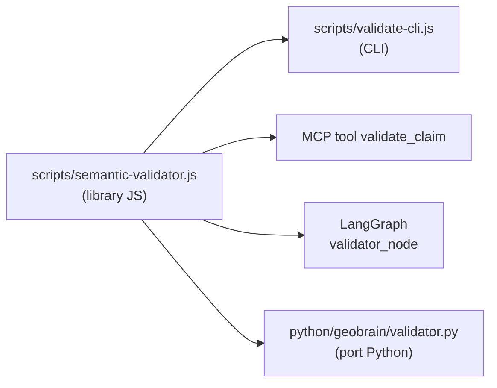
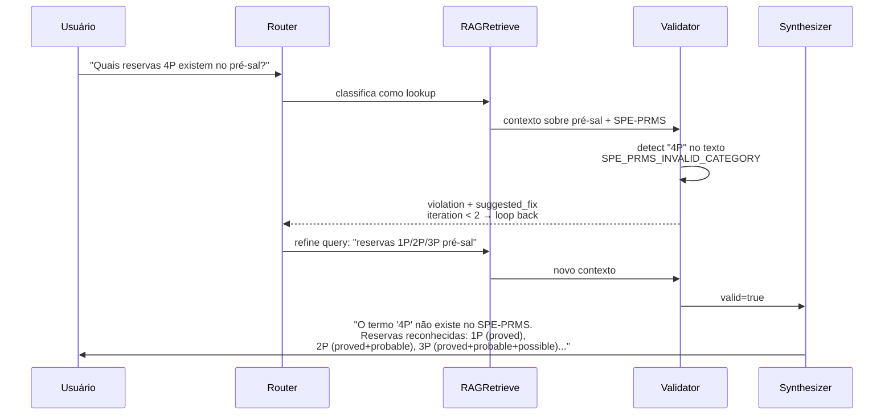

# Semantic Validator

Um validador determinístico que verifica afirmações em **linguagem natural** contra regras de domínio O&G. Sem LLM. Sem flutuação. Mesma entrada → mesmo resultado.

---

## Por que existe?

LLMs alucinaram nestes três tipos de erro com frequência:

1. **Categorias SPE-PRMS inexistentes** — "Reserva 4P do Campo X" (não existe; SPE-PRMS reconhece apenas 1P, 2P, 3P, C1C, C2C, C3C).
2. **Confusão semântica** — "Reserva REBIO" referida como reserva de óleo (REBIO é Reserva Biológica ambiental, não jazida de petróleo).
3. **Regimes contratuais inválidos** — "Concessão sob regime de leilão direto" (regime válido tem que ser um de Concessão, Partilha de Produção ou Cessão Onerosa).

O Validator captura esses três casos e mais ~10 outras regras antes de a resposta chegar ao usuário.

---

## Interface tripla

A mesma lógica é exposta em três formas:



---

## Uso rápido

### CLI

```bash
node scripts/validate-cli.js "Reserva 4P do Campo de Buzios"
```

Saída:
```json
{
  "valid": false,
  "violations": [
    {
      "rule": "SPE_PRMS_INVALID_CATEGORY",
      "severity": "error",
      "evidence": "4P",
      "suggested_fix": "Use uma categoria válida: 1P, 2P, 3P, C1C, C2C ou C3C",
      "source_layer": "L4-SPE-PRMS"
    }
  ],
  "warnings": []
}
```

### Python

```python
from geolytics_dictionary import Validator

v = Validator()
report = v.validate("Reserva 4P do Campo de Buzios")
report.valid                  # False
report.violations[0].rule     # "SPE_PRMS_INVALID_CATEGORY"
```

### MCP (em Claude Desktop ou Cursor)

```
@geobrain validate_claim "Reserva 4P do Campo de Buzios"
```

### Como nó LangGraph

```python
from agents.validator_node import validator_node

state = {"draft": "A reserva 4P do Campo de Buzios..."}
state = validator_node(state)
state["validation"]  # {"valid": False, "violations": [...]}
```

---

## Catálogo de regras

> Fonte: [`scripts/semantic-validator.js`](https://github.com/thiagoflc/geolytics-dictionary/blob/main/scripts/semantic-validator.js)
> Catálogo público em JSON: [`api/v1/validate-rules.json`](https://thiagoflc.github.io/geobrain/api/v1/validate-rules.json)

| Regra                              | Severity   | O que detecta                                                                                |
| ---------------------------------- | ---------- | -------------------------------------------------------------------------------------------- |
| `SPE_PRMS_INVALID_CATEGORY`        | error      | Categorias inválidas como 4P, 5P, 1Q                                                          |
| `RESERVA_AMBIGUITY`                | warning    | Mistura de "reserva" ambiental (REBIO, RPPN, APA) com reserva petrolífera                     |
| `REGIME_CONTRATUAL_INVALID`        | error      | Regimes fora de {Concessão, Partilha de Produção, Cessão Onerosa}                            |
| `TIPO_POCO_ANP_INVALID`            | error      | Tipos de poço fora da taxonomia ANP                                                           |
| `BACIA_SEDIMENTAR_NOT_LISTED`      | warning    | Bacia não consta no catálogo ANP (pode ser geológica internacional)                          |
| `ACRONYM_AMBIGUOUS`                | warning    | Sigla com múltiplos sentidos sem contexto desambiguador (ex.: PAD)                           |
| `PERIODO_EXPLORATORIO_INVALID`     | error      | Períodos fora de {PE-1, PE-2, PE-3}                                                          |
| `ANP_NORMATIVE_BROKEN_REFERENCE`   | warning    | Lei/Decreto referenciado não consta no grafo                                                  |
| `OSDU_KIND_MISSING`                | info       | Termo sem mapeamento OSDU (oportunidade de crosswalk)                                         |
| `LAYER_COVERAGE_INCONSISTENT`      | warning    | `geocoverage` declarado não corresponde aos cross-URIs presentes                             |
| `DEPRECATED_GEOMEC_TERM`           | warning    | Termo geomecânico marcado como obsoleto (use o substituto)                                    |
| `LITHOLOGY_NOT_IN_CGI`             | info       | Litologia descrita não consta em CGI Simple Lithology                                         |

> **Severity matter:**
> - `error` → bloqueia (PR/agente recusa).
> - `warning` → aceita mas anota.
> - `info` → comentário informativo.

---

## Anatomia de uma regra

```js
// scripts/semantic-validator.js
function checkSpePrms(text) {
  const VALID = ["1P","2P","3P","C1C","C2C","C3C"];
  const INVALID = /\b([4-9])P\b/i;
  const m = text.match(INVALID);
  if (m) {
    return {
      rule: "SPE_PRMS_INVALID_CATEGORY",
      severity: "error",
      evidence: m[0],
      suggested_fix: `Use uma categoria válida: ${VALID.join(", ")}`,
      source_layer: "L4-SPE-PRMS",
    };
  }
  return null;
}
```

Cada regra:
- É uma função pura `(text, context) → Violation | null`
- Tem `rule_id` único (chave em `validate-rules.json`)
- Documenta `source_layer` (regra vem de qual camada/padrão)
- Sugere `suggested_fix` (reparo automático em alguns casos)

---

## Worked example: o que acontece dentro do agente

Pergunta do usuário: *"Quais reservas 4P existem no pré-sal?"*

**Sem validador**: LLM gera "As reservas 4P do pré-sal incluem... [conteúdo plausível mas falso]".

**Com validador no DAG**:



Em vez de mentir, o agente **explica** o erro. Isso é o guardrail.

---

## Validador como ferramenta MCP

Configurado em `mcp/geobrain-mcp/src/index.ts`, a tool `validate_claim`:

```ts
{
  name: "validate_claim",
  description: "Validate a claim about Brazilian O&G domain semantically",
  inputSchema: { text: z.string().min(1) },
  handler: async ({ text }) => {
    const result = validate(text);
    return { content: [{ type: "text", text: JSON.stringify(result, null, 2) }] };
  }
}
```

Em Claude Desktop, com o MCP server conectado, qualquer chat passa a ter:
```
@geobrain.validate_claim "Bloco BM-S-9 sob regime de Cessão Onerosa..."
→ { "valid": true, "violations": [], "warnings": ["regime correto, sem alertas"] }
```

> Setup: [[MCP Server]].

---

## Relação com SHACL

Os dois validadores cobrem **objetos diferentes**:

| Aspecto             | Semantic Validator                    | SHACL                                        |
| ------------------- | ------------------------------------- | -------------------------------------------- |
| Entrada             | Texto livre                           | Grafo RDF                                    |
| Output              | Lista de violações                    | Validation report (RDF)                      |
| Engine              | Node.js puro                          | `pyshacl`                                    |
| Quando rodar        | Em runtime, dentro do agente          | Em CI, ao validar a base                     |
| Camada              | L3-L6 (semântica de claims)           | Estrutural (cardinalidade, tipos)            |

Ambos compõem o guardrail completo. Ver [[SHACL Validation]].

---

## Adicionando uma nova regra

1. Edite [`scripts/semantic-validator.js`](https://github.com/thiagoflc/geolytics-dictionary/blob/main/scripts/semantic-validator.js):
   ```js
   function checkMyRule(text) {
     // ... regex ou parser
     if (matches) return { rule: "MY_NEW_RULE", severity: "warning", ... };
     return null;
   }

   const RULES = [checkSpePrms, checkRegime, /* ... */, checkMyRule];
   ```

2. Adicione caso de teste em [`tests/validator.test.js`](https://github.com/thiagoflc/geolytics-dictionary/blob/main/tests/validator.test.js):
   ```js
   test("MY_NEW_RULE catches X", () => {
     const r = validate("texto que dispara X");
     assert.strictEqual(r.violations[0].rule, "MY_NEW_RULE");
   });
   ```

3. Atualize `api/v1/validate-rules.json` (gerado por `generate.js`).

4. Rode:
   ```bash
   node --test tests/validator.test.js
   node scripts/generate.js
   ```

5. Documente em [docs/CONTRIBUTING.md](https://github.com/thiagoflc/geolytics-dictionary/blob/main/docs/CONTRIBUTING.md).

---

## Performance

- **~0.5 ms** por claim típico (texto curto, < 200 chars)
- **~5 ms** para texto longo (1000+ chars) com múltiplas regras
- **Sem I/O em runtime** — todas as enumerações são embutidas no bundle

Adequado para uso síncrono dentro de cada turno do agente.

---

## Roadmap

- [ ] Validação multi-língua (EN, ES) com base nos sinônimos do glossário.
- [ ] Validação cruzada com Neo4j (claims que pressupõem caminhos no grafo).
- [ ] Suggested-fix executável (auto-correção opcional).
- [ ] Calibração de severidades por persona.

---

> **Próximo:** validação estrutural via [[SHACL Validation]] ou ver o validador em ação no [[LangGraph Agent]].
