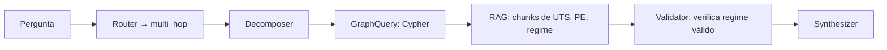

# Use Cases

Seis casos de uso concretos demonstrando como o GeoBrain resolve problemas que **RAG vetorial puro** não consegue.

📁 Documentação técnica completa: [docs/USE_CASES.md](https://github.com/thiagoflc/geolytics-dictionary/blob/main/docs/USE_CASES.md)

---

## Caso 1 — Multi-hop: Regime contratual de um bloco

### Pergunta
> *"Qual o regime contratual do Bloco BS-500 e quais obrigações de UTS se aplicam?"*

### Por que RAG vetorial sozinho falha
A pergunta requer **três saltos** no grafo:
- Bloco → Bacia
- Bacia → Rodada de Licitação
- Rodada → Regime Contratual

Embeddings densos podem trazer parágrafos sobre "regime contratual" e "UTS" desconectados, sem amarração explícita ao `BS-500`.

### Como GeoBrain resolve


Cypher executado:
```cypher
MATCH (b:Contractual {id:'bloco-bs-500'})
      -[:located_in]->(:Geological)
      <-[:concerns]-(rod:Contractual)
      -[:governs]->(reg:Contractual)
RETURN reg.label, reg.normative
```

### Resposta gerada
> "O Bloco BS-500 está sob regime de **Concessão** (Lei 9.478/1997). Obrigações UTS dependem do **Período Exploratório (PE-1, PE-2, PE-3)** definido no contrato — tipicamente 1-3 UTS no PE-1 progressivamente menos nos seguintes."

→ Detalhes em [[LangGraph Agent]].

---

## Caso 2 — Desambiguação WITSML TVD/MD

### Pergunta
> *"Em WITSML, qual a diferença entre `mdTopMSL` e `tvdTopMSL` em um trajeto direcional?"*

### Por que RAG vetorial sozinho falha
Resposta exige conhecimento de:
- **Crosswalk** WITSML → ontologia (ambos são profundidades, mas medidas diferentes)
- **Geometria** do trajeto (MD = ao longo da broca, TVD = vertical real)
- **Datum** (MSL = Mean Sea Level vs RKB, GL)

LLM puro tende a confundir MD e TVD em casos de poço inclinado.

### Como GeoBrain resolve
1. Lookup em `data/witsml-rdf-crosswalk.json` → mapeamento ambos para `geo:depth_MD` e `geo:depth_TVD`.
2. RAG retrieve sobre chunk `geomechanics` que descreve geometria.
3. Validator não acende (não há regra específica), mas sintetizador cita ambos URIs.

### Resposta gerada
> "**MD** (Measured Depth) é a distância ao longo do furo desde o datum (RKB ou MSL). **TVD** (True Vertical Depth) é a projeção vertical. Em poços direcionais, MD > TVD. Ambos ficam disponíveis em WITSML 2.0 como `mdTopMSL` e `tvdTopMSL`. Datum MSL = Mean Sea Level. Ver `geo:depth_MD` e `geo:depth_TVD` em [data/witsml-rdf-crosswalk.json](https://github.com/thiagoflc/geolytics-dictionary/blob/main/data/witsml-rdf-crosswalk.json)."

---

## Caso 3 — AVO Classe inválida

### Pergunta
> *"Reservatório AVO Classe 4 é típico de turbiditos do Pré-sal?"*

### Por que RAG vetorial sozinho falha
SPE/SEG reconhecem **Classes I, II, IIp, III** — *não* Classe 4. LLM pode aceitar a premissa errada e gerar resposta plausível mas falsa.

### Como GeoBrain resolve
1. Validator detecta padrão `Classe [4-9]` → flag `AVO_CLASS_INVALID`.
2. Router força loop de retry: substitui "Classe 4" por "Classe IV/III"?
3. Synthesizer responde explicando o erro.

### Resposta gerada
> "**Não existe AVO Classe 4** no padrão SEG/SPE. As classes reconhecidas são I, II (incluindo IIp), III. Você provavelmente quer dizer **Classe III** (alta amplitude negativa), comum em turbiditos do Pré-sal com gás. Ver `data/seismic-avo.json` para definições completas."

→ Detalhes em [[Semantic Validator]].

---

## Caso 4 — Janela de mud weight (geomecânica)

### Pergunta
> *"Qual a janela operacional de mud weight para o reservatório no campo de Mero, considerando MEM 1D?"*

### Por que RAG vetorial sozinho falha
Pergunta integra:
- **Geomecânica** (MEM = Mechanical Earth Model)
- **Geografia** (campo Mero, na Bacia de Santos, Pré-sal)
- **Operacional** (mud weight = peso do fluido de perfuração)

A "janela operacional" é o intervalo entre `pore pressure` e `fracture gradient`. Resposta exige caminhos específicos no grafo.

### Como GeoBrain resolve
1. Decomposer cria sub-questões:
   - Qual o pore pressure típico no Pré-sal?
   - Qual o fracture gradient da seção evaporitica?
2. GraphQuery localiza `geomec-026A` (entidade L6 corporativa Petrobras) e `geomec:MEM-1D` (L2).
3. RAG traz chunks geomecânicos.
4. Validator confere ausência de termos depreciados (`DEPRECATED_GEOMEC_TERM`).
5. Synthesizer monta janela com unidades.

### Resposta gerada
> "Para o Pré-sal de Mero, MEM 1D típico: **pore pressure** ~1.05 sg (hidrostático moderado), **fracture gradient** ~1.85-1.95 sg na seção carbonática. Janela operacional: **~1.40-1.65 sg** (overbalance + safety margin). Para detalhes do método, ver `geomec:MEM-1D` (camada L2) e o crosswalk corporativo em [data/geomechanics-corporate.json](https://github.com/thiagoflc/geolytics-dictionary/blob/main/data/geomechanics-corporate.json) (camada L6)."

---

## Caso 5 — Desambiguação SPE-PRMS vs ambiental

### Pergunta
> *"Quais reservas existem na REBIO do Lago Piratuba?"*

### Por que RAG vetorial sozinho falha
"Reserva" tem dois sentidos:
- **Reserva petrolífera** (SPE-PRMS): 1P, 2P, 3P
- **Reserva ambiental** (SNUC): REBIO, RPPN, APA

Embeddings podem misturar contextos e responder "X bilhões de barris" para uma área protegida onde não há produção.

### Como GeoBrain resolve
1. Validator dispara `RESERVA_AMBIGUITY` (detecta keyword `REBIO`).
2. Synthesizer recebe flag e aborta tentativa de produção.

### Resposta gerada
> "**REBIO Lago Piratuba** é uma **Reserva Biológica** (Unidade de Conservação SNUC, no Amapá), não uma reserva petrolífera. O termo 'reserva' aqui significa proteção ambiental, **não** acumulação de hidrocarbonetos. Não há atividade de E&P licenciada nesta área."

---

## Caso 6 — Crosswalk OSDU para conceito ANP

### Pergunta
> *"Qual o OSDU `kind` equivalente ao 'PAD' (Plano de Avaliação de Descoberta) da ANP?"*

### Por que RAG vetorial sozinho falha
"PAD" é polissêmico (vimos no Caso #5). Mesmo identificado como ANP-PAD, o crosswalk OSDU **não existe** — é conceito brasileiro sem equivalente.

### Como GeoBrain resolve
1. Lookup → desambigua: PAD = Plano de Avaliação de Descoberta (L5).
2. Crosswalk lookup → `osdu_kind: null`.
3. Synthesizer documenta o gap e sugere caminho alternativo.

### Resposta gerada
> "**PAD** (Plano de Avaliação de Descoberta) é um instrumento contratual ANP brasileiro, **sem equivalente OSDU direto**. Conceitos OSDU mais próximos:
> - `osdu:work-product-component--Wellbore:1.0.0` (para o poço descobridor referenciado no PAD)
> - Genericamente, `osdu:reference-data--ProjectPhase` se você precisar mapear como fase de projeto.
>
> Recomendação para integrações: trate PAD como atributo customizado em metadata OSDU. Ver [data/anp-osdu-wellstatus-map.json](https://github.com/thiagoflc/geolytics-dictionary/blob/main/data/anp-osdu-wellstatus-map.json) para mapping de status."

---

## Padrão recorrente: o valor está em **explicar gaps**

Em todos os 6 casos, o GeoBrain agrega valor que LLM puro não consegue:

| Caso | Valor agregado                                                     |
| ---- | ------------------------------------------------------------------ |
| 1    | Caminho no grafo torna multi-hop preciso                            |
| 2    | URIs canônicas evitam ambiguidade MD/TVD                           |
| 3    | Validador previne aceitação silenciosa de Classe inexistente        |
| 4    | Crosswalk L2↔L6 traz especificidade Petrobras                       |
| 5    | Validator desambigua "reserva" entre dois domínios                  |
| 6    | **Documenta o gap** em vez de inventar mapeamento                   |

> 💡 **A maior virtude da ontologia é dizer "isso não existe" com confiança** — coisa que LLMs estatísticos têm dificuldade extrema.

---

## Reproduzindo localmente

Cada caso pode ser reproduzido:

```bash
cd examples/langgraph-agent

# Edita run_demo.py para usar a pergunta do caso desejado
python run_demo.py
```

Veja [[LangGraph Agent]] para detalhes.

---

## Casos adicionais não documentados aqui

10 queries Cypher comentadas em PT-BR no repositório:

| Arquivo                                                                                                                       | Pergunta                                                          |
| ----------------------------------------------------------------------------------------------------------------------------- | ----------------------------------------------------------------- |
| [01-poco-bloco-bacia-regime.cypher](https://github.com/thiagoflc/geolytics-dictionary/blob/main/docs/queries/01-poco-bloco-bacia-regime.cypher) | poço → bloco → bacia → regime                          |
| [02-gso-falha-osdu-crosswalk.cypher](https://github.com/thiagoflc/geolytics-dictionary/blob/main/docs/queries/02-gso-falha-osdu-crosswalk.cypher) | classes GSO de falhas com mapeamento OSDU            |
| [03-entidades-sem-petrokgraph.cypher](https://github.com/thiagoflc/geolytics-dictionary/blob/main/docs/queries/03-entidades-sem-petrokgraph.cypher) | gaps de cobertura PT-BR                            |
| [04-caminho-mais-curto.cypher](https://github.com/thiagoflc/geolytics-dictionary/blob/main/docs/queries/04-caminho-mais-curto.cypher) | shortest path entre quaisquer dois nós                          |
| [05-cascata-regulatoria.cypher](https://github.com/thiagoflc/geolytics-dictionary/blob/main/docs/queries/05-cascata-regulatoria.cypher) | Lei → ANP → SIGEP                                              |
| [06-desambiguacao-siglas.cypher](https://github.com/thiagoflc/geolytics-dictionary/blob/main/docs/queries/06-desambiguacao-siglas.cypher) | siglas com múltiplos sentidos                                  |
| [07-litologia-cgi-osdu-crosswalk.cypher](https://github.com/thiagoflc/geolytics-dictionary/blob/main/docs/queries/07-litologia-cgi-osdu-crosswalk.cypher) | litologias CGI ↔ OSDU                              |
| [08-escala-tempo-geologico-presal.cypher](https://github.com/thiagoflc/geolytics-dictionary/blob/main/docs/queries/08-escala-tempo-geologico-presal.cypher) | escala geológica + Pré-sal brasileiro             |
| [09-componentes-poco-gwml2.cypher](https://github.com/thiagoflc/geolytics-dictionary/blob/main/docs/queries/09-componentes-poco-gwml2.cypher) | componentes de construção de poço (GWML2)                    |
| [10-sosa-observacoes-perfis.cypher](https://github.com/thiagoflc/geolytics-dictionary/blob/main/docs/queries/10-sosa-observacoes-perfis.cypher) | SOSA observações + mnemônicos QUDT                          |

---

> **Próximo:** ver os [[Knowledge Graph|tipos do grafo]] em detalhes ou contribuir via [[Contributing]].
